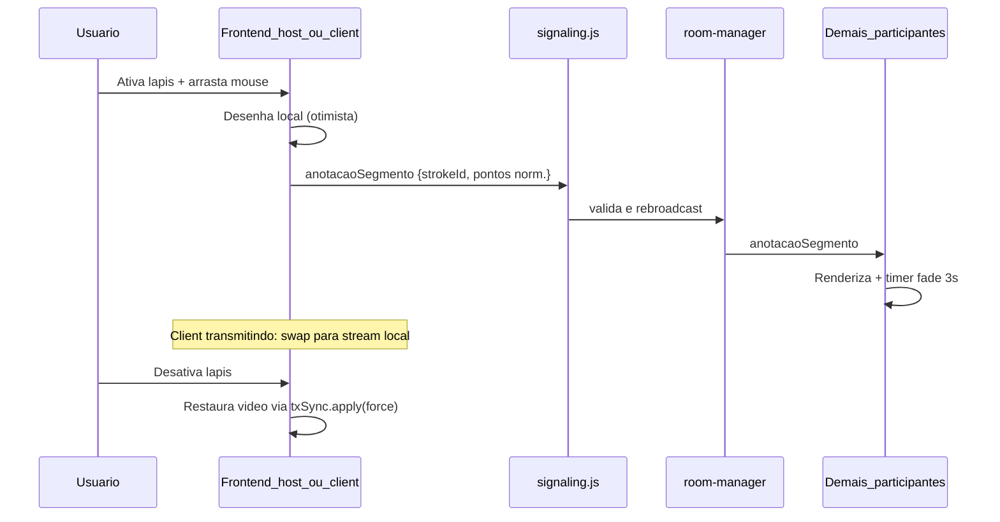

# Plano: Anotações e Desenho Live sobre a Tela

## Contexto técnico (estado atual)

- **Vídeo:** Host usa `#preview-video` em [`public/host/index.html`](e:/Projetos/Trabalho/Screen%20Share/public/host/index.html); client usa `#video-remoto` em [`public/client/index.html`](e:/Projetos/Trabalho/Screen%20Share/public/client/index.html).
- **Botão microfone (referência visual):** `.preview-mic-toggle` — circular, 38px, opacidade 0.4, blur, canto superior esquerdo ([`public/client/style.css`](e:/Projetos/Trabalho/Screen%20Share/public/client/style.css) L124–190; [`public/host/style.css`](e:/Projetos/Trabalho/Screen%20Share/public/host/style.css) L289–334).
- **Client que transmite:** [`src/shared/transmission.js`](e:/Projetos/Trabalho/Screen%20Share/src/shared/transmission.js) fecha o consumer remoto quando `isSelectedSelf` (L350–353) e exibe banners (`sharing` / `selected`) **sem** vídeo local — o client não vê o que está transmitindo hoje.
- **Host que transmite a própria tela:** já faz swap para `media.localScreenStream` ([`src/host/app.js`](e:/Projetos/Trabalho/Screen%20Share/src/host/app.js) L1301–1308) — padrão a replicar no client.
- **Relay WebSocket:** padrão existente em [`server/signaling.js`](e:/Projetos/Trabalho/Screen%20Share/server/signaling.js) + broadcast em [`server/room-manager.js`](e:/Projetos/Trabalho/Screen%20Share/server/room-manager.js) (`broadcastToClients` só atinge clients; desenhos precisam chegar também ao **host**).



---

## Arquitetura proposta

### 1. Módulo compartilhado (novo)

**Arquivo:** [`src/shared/live-annotation.js`](e:/Projetos/Trabalho/Screen%20Share/src/shared/live-annotation.js)

Responsabilidades isoladas (sem tocar WebRTC/mediasoup):

| Função | Detalhe |
|--------|---------|
| Canvas overlay | `<canvas id="live-annotation-canvas">` sobre o vídeo, `z-index: 13` (acima de `.lt-overlay` z-12, abaixo dos botões z-30) |
| Coordenadas normalizadas | Mapear mouse para espaço 0–1 considerando `object-fit: contain` (letterbox) — essencial para alinhamento entre resoluções |
| Captura de traço | `pointerdown/move/up` no canvas; linha vermelha `#e53935`, largura ~3px; `lineCap: round`, `lineJoin: round` |
| Fade 3s | Após `pointerup`, manter opaco 3s → fade CSS/canvas ~400ms → remover stroke |
| Sync | Callbacks `onSegment({ strokeId, points, color, width })` e `onRemoteSegment(payload)` |
| Modo ativo | Toggle; quando ativo: canvas `pointer-events: auto`, cursor `crosshair` na área de desenho; botão `.is-active` |
| Resize | `ResizeObserver` no `#preview-area` + recalcular dimensões do canvas |

**Payload WebSocket (leve, ao vivo):**

```js
// Enviado durante arraste (throttle ~32ms) e no pointerup
{ strokeId, peerId, peerName, points: [{x,y}, ...], color: '#e53935', width: 3, final: false|true }
```

- `strokeId`: `${peerId}-${Date.now()}-${seq}` — permite continuar o mesmo traço entre mensagens.
- Pontos em coordenadas **normalizadas** (0–1) no retângulo do vídeo renderizado.

### 2. Backend — relay sem persistência

**Arquivos a alterar:**

- [`server/signaling.js`](e:/Projetos/Trabalho/Screen%20Share/server/signaling.js) — novo case `anotacaoSegmento`:
  - Requer peer autenticado (host, co-host ou client).
  - Validar: `strokeId` string, `points` array ≤ 30, coordenadas 0–1, `peerId` === remetente.
  - Rate-limit simples por peer (~20 msg/s) — descartar excesso silenciosamente.
- [`server/room-manager.js`](e:/Projetos/Trabalho/Screen%20Share/server/room-manager.js) — novo método `broadcastToRoom(message, exceptPeerId?)` iterando **todos** os peers (padrão de `transmissaoAtiva` L998).

**Não alterar:** banco, auth, mediasoup, gravação, deploy.

### 3. Frontend HTML + CSS

**Arquivos a alterar:**

| Arquivo | Alteração |
|---------|-----------|
| [`public/host/index.html`](e:/Projetos/Trabalho/Screen%20Share/public/host/index.html) | `<canvas id="live-annotation-canvas">` dentro de `#preview-area`; botão `#btn-draw-toggle` com SVG lápis |
| [`public/client/index.html`](e:/Projetos/Trabalho/Screen%20Share/public/client/index.html) | Idem |
| [`public/host/style.css`](e:/Projetos/Trabalho/Screen%20Share/public/host/style.css) | `.preview-draw-toggle` — **canto inferior esquerdo** (`bottom/left: var(--space-md)`), mesmas dimensões/opacidade/transição do `.preview-mic-toggle`; estado `.is-active` (cor accent, opacidade 1) |
| [`public/client/style.css`](e:/Projetos/Trabalho/Screen%20Share/public/client/style.css) | Idem + regra dentro de `.preview-float-stack` se necessário para não conflitar |

Posicionamento do lápis: **inferior esquerdo** (diferente do mic que fica superior esquerdo). Canvas ocupa `inset: 0` da preview-area, `pointer-events: none` quando inativo.

### 4. Integração Host — [`src/host/app.js`](e:/Projetos/Trabalho/Screen%20Share/src/host/app.js)

- Importar `createLiveAnnotation` de `live-annotation.js`.
- Inicializar com refs: `previewArea`, `videoEl: els.preview`, `canvas`, `btnDraw`, `getPeerId`, `getPeerName`.
- `signaling.send('anotacaoSegmento', payload)` no callback de segmento.
- Handler em `handleMessage`: `if (msg.type === 'anotacaoSegmento') liveAnnotation.receive(msg.payload)`.
- Visibilidade do botão: `sessionReady && ui._flags.hasPreview` (mesma lógica de quando há vídeo na preview).
- **Sem mudança de preview:** host já exibe stream local quando é a fonte selecionada.

### 5. Integração Client — [`src/client/app.js`](e:/Projetos/Trabalho/Screen%20Share/src/client/app.js)

Mesma integração do host **+ lógica de preview local ao ativar lápis:**

```js
let drawPreviewActive = false;

function getClientLocalPreviewStream() {
  const fromDisplay = clientDisplayStream?.getVideoTracks?.()?.[0];
  if (fromDisplay?.readyState === 'live') return clientDisplayStream;
  const fromMedia = media?.localScreenStream?.getVideoTracks?.()?.[0];
  if (fromMedia?.readyState === 'live') return media.localScreenStream;
  return null;
}

function applyClientDrawPreview() {
  const stream = getClientLocalPreviewStream();
  if (!drawPreviewActive || !stream) return;
  els.video.srcObject = stream;
  els.video.play?.().catch(() => {});
  // Ocultar banners que cobrem a preview
  els.stateSharing.hidden = true;
  els.stateSelected.hidden = true;
  els.stateWatching.hidden = true;
}

async function exitClientDrawPreview() {
  drawPreviewActive = false;
  els.video.srcObject = null;
  const tx = txSync.lastActiveTransmission || txSync._desiredTx;
  if (tx) await txSync.apply(tx, { force: true });
}
```

**Regras:**

| Situação | Comportamento |
|----------|---------------|
| Lápis **inativo** | Comportamento **100% atual** (TransmissionSync, banners, consumer remoto) |
| Lápis **ativo** + client **transmitindo** (tem stream local) | Swap temporário para stream local; ocultar overlays; permitir desenhar sobre a própria transmissão |
| Lápis **ativo** + client **só assistindo** | Mantém vídeo remoto já exibido; desenha normalmente |
| `transmissaoAtiva` chega com lápis ativo + stream local | Após `txSync.apply`, chamar `applyClientDrawPreview()` para não perder o preview local |
| Desativar lápis | `exitClientDrawPreview()` restaura estado via `txSync.apply(..., { force: true })` |

**Não modificar** [`src/shared/transmission.js`](e:/Projetos/Trabalho/Screen%20Share/src/shared/transmission.js) — flag e re-aplicação ficam só em `client/app.js` (menor risco).

### 6. Build

Após editar `/src`: `npm run build` (gera bundles em `/public/*/app.bundle.js`).

---

## Impacto e riscos

| Área | Risco | Mitigação |
|------|-------|-----------|
| WebRTC / mediasoup | Baixo — desenho não passa pelo SFU | Relay só via WebSocket |
| Client preview swap | Médio — conflito com txSync | Flag `drawPreviewActive`; re-aplicar local preview após cada `txSync.apply`; restore com `force: true` ao desativar |
| Performance | Médio — muitos segmentos | Throttle 32ms; limite de pontos/msg; rate-limit no servidor |
| Lower thirds | Baixo | Canvas z-13 acima do LT (z-12); LT continua `pointer-events: none` |
| Gravação | Nenhum (fora de escopo) | Desenhos efêmeros não entram no compositor |
| Fullscreen | Baixo | Canvas dentro de `#preview-area` acompanha resize |
| Co-host | Baixo | Mesmo app host/client; relay inclui todos os peers |

**Erros fora do escopo (apenas informar ao final):** nenhum identificado durante análise; revisar após implementação se algum lint/build falhar.

---

## Arquivos — resumo

| Ação | Arquivo |
|------|---------|
| **Criar** | `src/shared/live-annotation.js` |
| **Alterar** | `public/host/index.html`, `public/client/index.html` |
| **Alterar** | `public/host/style.css`, `public/client/style.css` |
| **Alterar** | `src/host/app.js`, `src/client/app.js` |
| **Alterar** | `server/signaling.js`, `server/room-manager.js` |
| **Atualizar mapas** | `docs/FRONTEND_MAP.md` (novo módulo + fluxo), `docs/BACKEND_MAP.md` (evento WS `anotacaoSegmento`) |
| **Não alterar** | DB, auth, deploy, mediasoup, recording, transmission.js |

---

## Como testar

1. `npm run build` + reiniciar servidor.
2. **Host + 2 clients:** host seleciona fonte de um client; ambos ativam lápis e desenham — todos veem linhas vermelhas alinhadas; somem após ~3s.
3. **Client transmitindo (não selecionado):** ativar lápis → deve ver **própria tela** no `#video-remoto` (não só banner); desenhar; desativar lápis → volta ao banner "Transmitindo — aguardando seleção".
4. **Client selecionado pelo host:** ativar lápis → vê própria transmissão; desativar → volta ao banner "Sua tela está sendo exibida".
5. **Client espectador:** ativar lápis sobre stream remoto; desativar → vídeo remoto intacto.
6. **Host compartilhando própria tela:** desenhar sobre preview local.
7. **Resize / fullscreen:** traços permanecem alinhados ao vídeo.
8. **WebRTC regression:** confirmar áudio/vídeo/ mute / troca de fonte funcionam com lápis inativo.

---

## Ordem de implementação

1. `live-annotation.js` (canvas, coords, fade, API)
2. HTML + CSS (botão + canvas)
3. Backend relay (`broadcastToRoom` + `anotacaoSegmento`)
4. Integração host (`app.js`)
5. Integração client (`app.js` + preview local)
6. Build + testes manuais
7. Atualizar seções impactadas nos mapas FRONTEND e BACKEND
