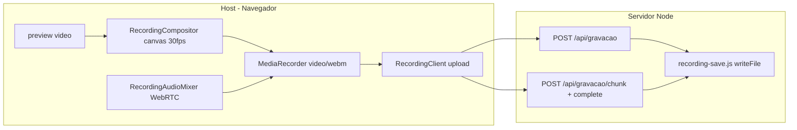

# Análise: gravação em MP4 vs WebM

## Estado atual (confirmado nos mapas e código)

A gravação **não passa pelo Mediasoup/SFU**. É um pipeline **100% no navegador do Host**, independente da transmissão ao vivo:

| Camada | Arquivo | Papel no formato |
|--------|---------|------------------|
| Codec/container | [`src/shared/recording-client.js`](e:/Projetos/Trabalho/Screen%20Share/src/shared/recording-client.js) | Define `mimeType` via `_pickMimeType()` — hoje só candidatos `video/webm` (VP9/VP8 + Opus) |
| Composição de vídeo | [`src/shared/recording-compositor.js`](e:/Projetos/Trabalho/Screen%20Share/src/shared/recording-compositor.js) | Canvas → `captureStream(30)` — **agnóstico de container** |
| Mix de áudio | [`src/shared/recording-audio-mixer.js`](e:/Projetos/Trabalho/Screen%20Share/src/shared/recording-audio-mixer.js) | Web Audio → `MediaStreamTrack` — **agnóstico de container** |
| Nome do arquivo | [`src/shared/recording-filename.js`](e:/Projetos/Trabalho/Screen%20Share/src/shared/recording-filename.js) | Força extensão `.webm`; `isValidRecordingFilename()` rejeita qualquer outra |
| Orquestração | [`src/host/app.js`](e:/Projetos/Trabalho/Screen%20Share/src/host/app.js) | `getRecordingStream()` → `recorder.start()` → `recorder.upload()` |
| Persistência | [`server/recording-save.js`](e:/Projetos/Trabalho/Screen%20Share/server/recording-save.js) | Grava bytes brutos; valida nome terminando em `.webm` |
| Upload fragmentado | [`server/recording-chunk-store.js`](e:/Projetos/Trabalho/Screen%20Share/server/recording-chunk-store.js) | `Buffer.concat` de partes — **agnóstico de formato** (funciona para qualquer binário já válido) |

**O que NÃO muda com MP4:** transmissão WebRTC, lower-thirds (continuam `.webm`), banco SQLite, NGINX, deploy, autenticação, pasta UNC (`SHARESCREEN_RECORDINGS_DIR`).

**O que muda:** apenas o blob gerado pelo `MediaRecorder` e a extensão/validação do nome.

---

## É possível definir MP4?

### Opção A — Trocar `MediaRecorder` para MP4 no cliente (menor diff)

Adicionar candidatos MP4 em `_pickMimeType()`, por exemplo:

- `video/mp4;codecs=avc1.42E01E,mp4a.40.2` (H.264 + AAC)
- `video/mp4`

E ajustar [`recording-filename.js`](e:/Projetos/Trabalho/Screen%20Share/src/shared/recording-filename.js) para `.mp4`.

**Viabilidade técnica:** parcial. Chrome/Edge recentes no Windows **podem** suportar `MediaRecorder` com MP4; Firefox e versões antigas do Chrome **frequentemente não**. O projeto não tem hoje nenhum fallback nem detecção de formato.

**Arquivos a alterar (mínimo):**
- Abrir: `recording-client.js`, `recording-filename.js`
- Alterar: os mesmos (+ eventual hint na UI do host em `public/host/index.html` / `app.js` se quiser expor escolha)

### Opção B — Formato configurável com fallback WebM (recomendada se for implementar)

- Setting no host (localStorage ou config) escolhe `webm` ou `mp4`
- `_pickMimeType()` tenta MP4; se `MediaRecorder.isTypeSupported()` falhar, volta para WebM
- `recording-filename.js` usa extensão coerente com o mime efetivo
- Upload envia header opcional `X-Recording-Format` para validação no servidor

**Impacto:** baixo no servidor; médio no frontend; **não quebra hosts sem suporte a MP4** se o fallback estiver correto.

### Opção C — Gravar WebM e converter para MP4 no servidor (ffmpeg)

O projeto **não possui ffmpeg** no pipeline de gravação (decisão documentada em [`RELATORIO-SISTEMA-TRANSMISSAO-LOCAL.md`](e:/Projetos/Trabalho/Screen%20Share/RELATORIO-SISTEMA-TRANSMISSAO-LOCAL.md): evitar transcode no servidor para live). Para gravação, seria um módulo novo pós-upload.

**Impacto:** alto — dependência externa, tempo de finalização, CPU no servidor `cgrafsysvm`, tratamento de falhas de conversão, possível necessidade de arquivo temporário grande na UNC.

---

## Impacto por área do sistema

| Área | Impacto |
|------|---------|
| Transmissão ao vivo (Mediasoup) | **Nenhum** — pipeline separado |
| Áudio ao vivo nos clients | **Nenhum** |
| Gravação (compositor + mixer + prefs) | **Baixo** — streams são format-agnostic; só o encoder muda |
| Upload simples (&lt; 8 MB) | **Nenhum** — já usa `application/octet-stream` |
| Upload chunked (&gt; 8 MB) | **Nenhum** — reconcatena bytes do arquivo final |
| Validação de nome no servidor | **Médio** — hoje hardcoded `.webm` |
| Lower-thirds / admin LT | **Nenhum** — continuam WebM |
| Banco / deploy / NGINX | **Nenhum** |
| Fluxos de QA documentados | **Alto** — todos os testes referenciam `.webm` |
| Editores / players corporativos | **Variável** — MP4 pode melhorar compatibilidade com Windows/PowerPoint; WebM é melhor em Chrome/VLC |

---

## Riscos principais

1. **Suporte inconsistente do navegador (crítico)**  
   `MediaRecorder` com MP4 não é universal. Em um host com Chrome antigo ou Firefox, a gravação pode falhar silenciosamente ou cair em codec não suportado. **Sem fallback, quebra gravação.**

2. **Qualidade e performance diferentes**  
   WebM usa VP9/VP8; MP4 usaria H.264 via encoder do navegador. Bitrate configurado (`videoBitsPerSecond` em `recording-client.js`) pode se comportar diferente; canvas 30fps + H.264 pode aumentar CPU no PC do host em gravações longas.

3. **Áudio: Opus → AAC**  
   O mix de áudio (múltiplas fontes WebRTC, prefs de eco, client padrão) continua igual, mas o codec de saída muda. Sincronização A/V e qualidade podem variar entre navegadores.

4. **Padrão de nome customizado**  
   Usuários com pattern salvo em localStorage recebem `.webm` automaticamente ([`recording-filename.js` L52-54](e:/Projetos/Trabalho/Screen%20Share/src/shared/recording-filename.js)). Mudança de formato exige alinhar pattern + validação + preview na UI.

5. **Gravações longas (&gt; 8 MB)**  
   O chunking de upload não é o problema (reconcatena o arquivo completo). O risco é o mesmo de hoje: memória no browser com chunks de 1s acumulados até `stop()`.

6. **Transcoding server-side**  
   Garante MP4 universalmente, mas introduz: latência pós-gravação, falhas de ffmpeg, espaço em disco dobro temporário, e necessidade de instalar/manter ffmpeg no servidor de produção.

7. **Regressão nos fluxos sensíveis já corrigidos**  
   Histórico recente ([`docs/cursor_audio_sharing_solution.md`](e:/Projetos/Trabalho/Screen%20Share/docs/cursor_audio_sharing_solution.md)) mostra que gravação + áudio é área frágil. Qualquer mudança no `MediaRecorder` exige reteste de: host próprio, client remoto, `excludeOwnSystem`, client padrão de áudio, ponte Meet, badge no compositor, pasta UNC customizada, upload chunked.

---

## Dá para garantir integridade total de todas as funcionalidades?

**Não com uma troca simples para MP4.** Motivos:

- O formato depende do **navegador do Host**, não do servidor — não há controle total.
- Não existe hoje teste automatizado de gravação por formato.
- MP4 nativo e WebM têm perfis de compatibilidade diferentes; "funciona no meu Chrome" não cobre todos os hosts da LAN.
- Transcoding server-side aproxima MP4 universal, mas adiciona novo ponto de falha e não preserva automaticamente o comportamento atual (tempo de "Gravação salva", tamanho, sync).

**O que seria necessário para máxima segurança:**
1. Opção B (configurável + fallback WebM obrigatório)
2. Matriz de testes manual nos browsers usados em produção (Chrome versão instalada nos PCs de treinamento)
3. Validar reprodução do `.mp4` nos destinos finais (players, editores, pasta UNC)
4. Manter WebM como default até validação completa

---

## Recomendação

| Objetivo | Abordagem |
|----------|-----------|
| Só quer arquivos que abram no Windows sem VLC | **Opção B** — MP4 opcional com fallback WebM; menor risco |
| MP4 obrigatório para todos os hosts | **Opção C** — WebM interno + ffmpeg no servidor; maior esforço e infra |
| Troca direta WebM → MP4 | **Não recomendado** — alto risco de quebra em browsers sem suporte |

**Escopo mínimo se aprovado (Opção B):**
- Abrir/alterar: `recording-client.js`, `recording-filename.js` (e opcionalmente `src/host/app.js` + hint na UI)
- Não alterar: `recording-compositor.js`, `recording-audio-mixer.js`, `recording-chunk-store.js`, `mediasoup`, DB, deploy
- Mapas: atualizar `FRONTEND_MAP.md` / `BACKEND_MAP.md` **somente** se houver setting de formato ou validação nova no servidor

**Atualização de mapas:** não necessária para esta análise. Seria necessária apenas se implementar configuração de formato ou transcoding.

---

## Como testar (se implementar Opção B)

1. Host Chrome em produção → gravar 30s → confirmar `.mp4` na UNC
2. Repetir com gravação &gt; 8 MB (upload chunked)
3. Testar com client remoto selecionado + prefs de áudio (excluir sistema, client padrão)
4. Testar em browser sem suporte MP4 → deve gravar `.webm` com toast informativo
5. Reproduzir arquivo nos players usados pelo time (Windows Media Player, VLC, editor de vídeo)
6. Confirmar que transmissão ao vivo e áudio dos clients permanecem idênticos durante/após gravação
