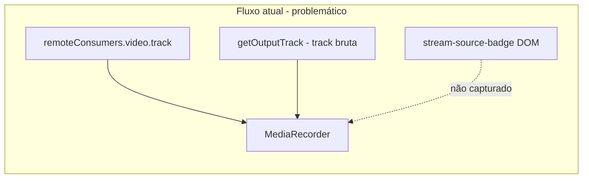
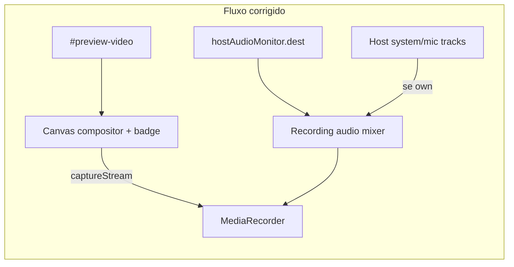

# Auditoria e correção da gravação da transmissão

## Diagnóstico (estado atual)

Fluxo atual: [`src/host/app.js`](src/host/app.js) → `getRecordingStream()` → [`src/shared/recording-client.js`](src/shared/recording-client.js) (`MediaRecorder`) → upload via `/api/gravacao`.



### Problemas encontrados

| # | Problema | Evidência | Impacto |
|---|----------|-----------|---------|
| 1 | **Badge não gravado** | `#stream-source-badge` é overlay DOM ([`public/host/index.html`](public/host/index.html) L231); `MediaRecorder` grava apenas `MediaStreamTrack` | Gravação sem identificação da fonte visível nos viewers |
| 2 | **Áudio errado para clients remotos** | `hostAudioMonitor.getOutputTrack()` retorna a **primeira** track bruta do consumer ([`host-audio-monitor.js`](src/shared/host-audio-monitor.js) L152-157), não o mix DSP de `dest` que alimenta `#preview-audio` | Áudio da gravação ≠ áudio transmitido/ouvido pelos viewers; filtros, gate e mix ignorados |
| 3 | **Bug na tela própria do Host** | Em `getRecordingStream()` ([`app.js`](src/host/app.js) L1237-1246), com `own=true` ainda pode entrar áudio do monitor e retornar stream **só com áudio** (sem vídeo), quebrando `RecordingClient.start()` | Gravação falha ou fica sem vídeo quando Host transmite e há outros clients com áudio |
| 4 | **Áudio do Host ausente quando ele é a fonte** | `hostAudioMonitor` exclui `hostPeerId`; `getRecordableStream()` devolve `localScreenStream` (sistema do `getDisplayMedia`, sem mic publicado separadamente) | Gravação não reflete o áudio transmitido do Host (sistema + microfone) |
| 5 | **Preview sem vídeo na própria tela** | Em `runTransmission()` ([`app.js`](src/host/app.js) L977-982), ao selecionar o Host fecha o consumer mas **não** liga `localScreenStream` ao `#preview-video` | Compositor não pode espelhar fielmente o que é exibido |
| 6 | **`audioMuted` silencia a gravação** | L1244: `!audioMuted` impede inclusão de áudio | Mute do painel não deveria remover áudio do arquivo (escopo escolhido: igual à transmissão) |

### O que **não** será alterado

- Backend: [`server/recording-save.js`](server/recording-save.js), [`server/recording-chunk-store.js`](server/recording-chunk-store.js)
- Client viewer, lower-thirds, sinalização, banco, deploy
- Regras de UI (botões, estados `ui-state.js`), exceto lifecycle da gravação

---

## Solução proposta



### 1. Novo módulo [`src/shared/recording-compositor.js`](src/shared/recording-compositor.js)

Responsabilidade única: compor vídeo + badge para gravação.

- `start({ videoEl, fallbackStream, badgeText, visible })` → `{ stream, stop }`
- Loop `requestAnimationFrame`: desenha frame do `<video>` (ou vídeo auxiliar com `fallbackStream`) no canvas na resolução intrínseca
- Desenha badge no topo central replicando o visual de [`.stream-source-badge`](public/shared/components.css) (gradiente, borda, tipografia)
- `canvas.captureStream(30)` como track de vídeo
- `stop()` cancela RAF e libera recursos

### 2. Novo módulo [`src/shared/recording-audio-mixer.js`](src/shared/recording-audio-mixer.js)

Monta **uma** track de áudio = transmissão recebida pelos viewers:

- **Sempre:** track mixada de `hostAudioMonitor.getMixedOutputTrack()` (novo método — ver item 3), com `resume()` antes de gravar
- **Quando Host é a fonte selecionada (`own`):** conectar também tracks publicadas do Host:
  - áudio do sistema: `localScreenStream` ou `producers.system.track`
  - microfone: `producers.microphone.track` / `getLocalMicrophoneTrack()`
- Usar `AudioContext.createMediaStreamDestination()` dedicado à gravação (não alterar o grafo do monitor)
- Respeitar `mutedClients` (gain 0 nos canais silenciados) reutilizando a mesma lógica de mute do monitor
- **Ignorar** `audioMuted` do painel (só afeta monitoramento)
- `stop()` desconecta nós e fecha o contexto de gravação

### 3. Ajuste pontual em [`src/shared/host-audio-monitor.js`](src/shared/host-audio-monitor.js)

Adicionar método público:

```js
getMixedOutputTrack() {
  this._ensureAudioContext();
  this._refreshDirectOutput();
  const t = this.dest?.stream?.getAudioTracks()?.[0];
  return t?.readyState === 'live' ? t : null;
}
```

Não alterar `getOutputTrack()` existente (evita efeitos colaterais fora da gravação).

### 4. Refatorar gravação em [`src/host/app.js`](src/host/app.js)

**Arquivos abertos:** `app.js`, `recording-client.js` (apenas interface), `host-audio-monitor.js`, `recording-compositor.js`, `recording-audio-mixer.js`

**Alterações:**

| Função / trecho | Motivo |
|-----------------|--------|
| `runTransmission()` ramo `own` | Ligar `media.localScreenStream` ao `#preview-video` para preview e compositor alinhados |
| `getRecordingStream()` | Substituir lógica atual por compositor + mixer; corrigir bug `own` |
| `iniciarGravacao()` | Iniciar compositor/mixer antes de `recorder.start()`; guardar refs em `recordingCapture` |
| `pararGravacao()` / `beforeunload` | Chamar `recordingCapture.stop()` após `recorder.stop()` |
| Variável módulo `let recordingCapture = null` | Lifecycle do compositor/mixer |

Nova lógica de `getRecordingStream()`:

1. Validar `estado.selecionado` e fonte ativa (`ui._flags.hasPreview`, não pausado)
2. Vídeo: compositor usando `els.preview` + fallback `media.localScreenStream`
3. Badge: `estado.selecionado.displayName` (mesma condição de `updatePreviewOverlays`)
4. Áudio: `RecordingAudioMixer.build({ hostAudioMonitor, media, own, mutedClients })`
5. Retornar `new MediaStream([videoTrack, audioTrack].filter(Boolean))`

### 5. [`src/shared/recording-client.js`](src/shared/recording-client.js)

Sem mudança estrutural. Opcional: aceitar `audioBitsPerSecond` no `start()` se necessário para melhor sync Opus (ajuste mínimo, só se testes indicarem).

### 6. Atualização de mapa

Atualizar **somente** a seção de Gravação em [`docs/FRONTEND_MAP.md`](docs/FRONTEND_MAP.md) — novos módulos `recording-compositor.js` e `recording-audio-mixer.js`.

---

## Riscos e mitigação

| Risco | Mitigação |
|-------|-----------|
| CPU extra no Host (canvas 30fps) | Só ativo durante gravação; `stop()` imediato ao parar |
| Drift áudio/vídeo | Uma track de cada tipo no mesmo `MediaRecorder`; mixer com `AudioContext` estável |
| Troca de fonte durante gravação | Mantém comportamento atual (stream fixo no início); documentar no resumo |
| Chrome sem `captureStream` em canvas | Fallback: gravar track de vídeo crua + badge ausente, com log de aviso |

---

## Como testar

1. `npm run build` e reiniciar servidor
2. **Client remoto selecionado:** iniciar gravação → verificar WebM com vídeo do client, badge com nome, áudio do client + outros participantes sincronizados
3. **Host como fonte:** compartilhar tela com sistema + mic → gravar → verificar vídeo da captura, badge com nome do Host, áudio sistema + mic + outros clients
4. **Mute de client na sidebar:** client silenciado não deve aparecer no áudio gravado
5. **Mute do painel (alto-falante):** gravação deve manter áudio
6. **Parar gravação:** arquivo salvo via upload; preview e transmissão continuam normais
7. **Alternar fonte com gravação ativa:** confirmar que não quebra (grava fonte do momento do start)

---

## Escopo fora desta entrega (informar ao final, sem corrigir)

- Gravação server-side / FFmpeg
- Inclusão do lower-third (`#lt-overlay`) na gravação — não solicitado
- Reconexão de chunks após queda de rede (Fase 8 do relatório técnico existente)
