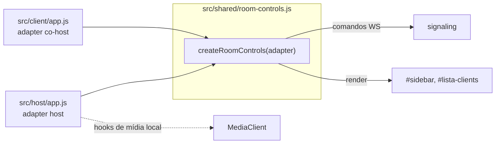

# Corrigir a funcionalidade de co-host

## Diagnóstico

O backend **já está quase pronto**. O guard `isHostOrCoHost` em [server/signaling.js](server/signaling.js) autoriza co-hosts em praticamente todos os comandos de sala:

```234:234:server/signaling.js
  const isHostOrCoHost = (p) => p && (p.role === 'host' || p.isCoHost);
```

Ele cobre `selecionarClient`, `pausarTransmissao`, `retomarTransmissao`, `limparTransmissao`, `definirQualidade`, `definirClientMute`, `definirControleExibicao`, `definirFiltroAudioClient`, `definirModoPonteMeet`, `definirModoSalaCompartilhada` e quadro branco.

O buraco é no frontend. [src/client/app.js](src/client/app.js) apenas exibe um toast:

```2625:2630:src/client/app.js
  if (msg.type === 'promovidoCoHost') {
    showToast('Funcoes de co-host estao disponiveis apenas no painel host', 'info');
  }
  if (msg.type === 'demovidoCoHost') {
    showToast('Voce nao e mais co-host desta sala', 'info');
  }
```

A sensação de que "só habilita troca de telas" vem de `definirCoHost` também adicionar o peer a `displayControllerIds` em [server/signaling.js](server/signaling.js) (linhas 453-476), o que ativa o menu de fontes em fullscreen via `applyDisplayControlUpdate`.

A sidebar HTML **já existe** em [public/client/index.html](public/client/index.html) (linhas 585-724) com os mesmos IDs do host e carregando `/shared/host-style.css`, mas nenhum handler JS a liga.

### Defeitos de robustez encontrados na pesquisa

- **Co-host se perde em toda reconexão.** `isCoHost` vive só na instância `Peer`. Em [server/room-manager.js](server/room-manager.js) (linhas 974-1014) um client reconectando ganha um **peerId novo** e o peer antigo é destruído, então a flag some silenciosamente.
- **Auto-promoção corrompe o papel do client.** Quando o host principal cai, qualquer peer com `isCoHost` vira `role = 'host'`:

```1074:1087:server/room-manager.js
    if (isPrimaryHost) {
      const coHost = [...this.peers.values()].find((p) => p.isCoHost);
      if (coHost) {
        coHost.role = 'host';
        coHost.isCoHost = false;
```

  Um client em `/client/` passa a ser `role: 'host'`, perde a flag `isCoHost` (some a sidebar) e vira alvo da regra de host único em `addPeer` (linha 939), que fecharia seu WS com code 4000 quando um host real entrasse — derrubando a transmissão dele.
- **Vazamento de token.** `promovidoCoHost` entrega o `hostToken` ao client, e esse token dá acesso irrestrito a `/api/gravacao`, `/api/link-externo`, `/api/browse-dir` via `requireAuthOrHostToken`. Resquício do fluxo legado de redirect para `/host/?cohost=true`, hoje sem uso.
- **Escalada lateral.** Um co-host pode promover outros co-hosts (`definirCoHost` aceita `isHostOrCoHost`), contrariando o requisito de que só o host habilita/desabilita.
- **`showToast` só renderiza erros.** Em [src/shared/toast.js](src/shared/toast.js) linha 17: `if (type !== 'error') return;`. Os toasts atuais de co-host são invisíveis.

## Arquitetura



`room-controls.js` não importa `media` nem faz captura. Tudo que depende de mídia local entra por **hooks** do adapter, então o host mantém seu comportamento e o client fornece hooks vazios.

Contrato proposto:

```js
export function createRoomControls({
  doc,                      // ownerDocument (suporta popout do host)
  getSignaling, getMedia, getSelfPeerId, getHostPeerId,
  capabilities: { recording, whiteboard, hostAudio, externalLink, modes, popout },
  hooks: {
    canCommand,             // host: canHostCommand(); client: ws pronto + isCoHost
    onSelectionCleared,     // host: media.detachMedia(...); client: no-op
    onQualityChanged,       // host: media.applyLiveVideoQuality(); client: no-op
    decorateCard,           // host: VU local, badge de áudio de gravação
    notify                  // feedback ao usuário
  }
}) // -> { mount, unmount, rebind, applyRoomSnapshot, applyLegacyEstado, setMuted, destroy }
```

## Fase 0 — Endurecer o servidor

Arquivos: [server/signaling.js](server/signaling.js), [server/room-manager.js](server/room-manager.js)

- **Persistir co-host por identidade estável.** Adicionar `room.coHostIdentities = new Set()` com chave `userId` quando houver login, senão `agentHostname|displayName` normalizado. Em `addPeer`, restaurar `isCoHost` e a entrada em `displayControllerIds` quando a identidade bater. Em `definirCoHost` com `ativo:false`, remover a identidade. Isso mantém o co-host após qualquer reconexão/rejoin.
- **Restringir `definirCoHost` a `peer.role === 'host'`** (exclui co-hosts client, preserva o painel legado `/host/?cohost=true`). Validar que o alvo existe, é `role === 'client'` e não é o próprio host.
- **Tornar a operação idempotente.** Se `target.isCoHost === !!ativo`, retornar sem enviar `promovidoCoHost`/`demovidoCoHost` nem chamar `notifyHostState()`. Evita churn de broadcast quando o host clica repetidamente.
- **Remover `hostToken` do payload de `promovidoCoHost`.** Passa a enviar apenas `{ nome }`. O client não redireciona mais para o painel host.
- **Corrigir a sucessão em `removePeer`** (linhas 1074-1087): escolher preferencialmente um sucessor com `role === 'host'`. Se só houver co-hosts client, **não mutar `role` nem `isCoHost`** — apenas não finalizar a sala, registrando `room.actingHostPeerId = coHost.id`. Ajustar `buildRoomSnapshot` (linha 841) e `buildRoomState` (linha 560) para usar o acting host como fallback de `snapshot.host` quando `getHostPeer()` for `undefined`.
- **Confirmar que nada nesse caminho toca mídia.** Nem promover, nem despromover, nem a sucessão devem chamar `cleanupPeerMedia`, `closeProducer`, `selectClient` ou `broadcastActiveProducer`.

## Fase 1 — Extrair `src/shared/room-controls.js` (host sem mudança de comportamento)

Novo arquivo `src/shared/room-controls.js`. Mover de [src/host/app.js](src/host/app.js), preservando a lógica:

- Roster e cards: `renderLista` (1796-1920), `buildSourceCard` (1126-1206), `updateTransmissionCard` (1769-1783), `sortClientsForDisplay`, `isHostPeer`, `getSidebarParticipants`. Reaproveita `buildDisplaySourceCard` e `getSourceCardState` de [src/shared/source-cards.js](src/shared/source-cards.js), que já renderiza o badge `co-host`.
- Comandos de transmissão: `selecionar` (1922-1946) e os handlers de `btn-limpar`, `btn-playpause`, `btn-pausar`, `btn-retomar` (3148-3196). A chamada `media.detachMedia({ videoEl: els.preview })` do `btn-limpar` sai por `hooks.onSelectionCleared`.
- Habilitação de botões: `syncControlButtons` (778-824) restrito às flags de sala, reusando `UiStateMachine` de [src/shared/ui-state.js](src/shared/ui-state.js) (`canPause`/`canResume`). Os botões de gravação continuam no host.
- Menu de contexto: `openContextMenu` (4870-4913), `closeContextMenu`, `toggleDisplayControl` (1343-1360), `toggleClientMute` (1338-1341) e os handlers de `ctx-cohost` (4921-4926) e `ctx-troca-telas` (4928-4933). O item `ctx-cohost` fica oculto quando `capabilities.canManageCoHosts` for falso.
- Qualidade: só a parte de sala de `applyHostQuality` (660-679) — `savePresetId`, `updateQualityHint` e `definirQualidade`. A parte de mídia (`media.setVideoQuality` + `applyLiveVideoQuality`) sai por `hooks.onQualityChanged`.
- VU remotos: `updateCardVuMeters` (1409-1436), `updateDominantSpeakerIndicators` (1398-1407), `updateTransmissionSectionVu` (1362-1369). O VU local do host (`syncLocalHostVu`, 1371-1396) **fica no host** e entra via `hooks.decorateCard`.
- Ingestão de estado: `applyParticipantState` e o consumo de roster do snapshot, usando `resolveRoomClients` / `reconcileRoomClients` / `hasAuthoritativeRoomRoster`, que já existem em [src/shared/transmission.js](src/shared/transmission.js) (linhas 59-164).

Todo acesso a DOM passa por `doc.getElementById` a partir de `doc` (não `document` global), preservando o suporte a popout do host.

**Critério de aceite desta fase: o host funciona exatamente como antes.** Nenhum comportamento novo, nenhum `msg.type` novo. Rodar `npm run build` e `npm run check`.

## Fase 2 — Ativar a sidebar no client (sem afetar transmissão)

Arquivos: [src/client/app.js](src/client/app.js), [public/client/index.html](public/client/index.html)

- **Limpar o HTML fora de escopo.** Remover de [public/client/index.html](public/client/index.html) o `#btn-gravacao-toggle` (linha 626) e todo o bloco `#details-recording` (692-715), mais os legados ocultos `#btn-gravar`/`#btn-parar-gravar` (645-646). Sem eles, nenhuma rota REST protegida por `hostToken` é alcançável pelo co-host.
- **Estado de co-host no client.** Nova variável `isCoHost`, derivada de duas fontes para sobreviver a reconexão: a mensagem `promovidoCoHost`/`demovidoCoHost` e o snapshot (`parsed.peers.find(p => p.id === peerId)?.isCoHost` / `permissions.isCoHost`, já presentes em `getPublicInfo`, linhas 219-224 de room-manager). O snapshot é a fonte autoritativa.
- **Montar/desmontar.** Substituir os toasts das linhas 2625-2630 por `applyCoHostState(bool)`, que faz apenas: remover/adicionar `hidden` em `#sidebar`, alternar `sidebar-open` em `els.clientMain` (a regra `.app-main.sidebar-open` já existe em `host-style.css` linhas 48-50), e chamar `roomControls.mount()` / `roomControls.unmount()`.
- **Garantia de não afetar a transmissão.** O caminho de promoção/despromoção **não pode** chamar `teardownClientSession`, `rejoinSession`, `media.*` de captura, nem tocar em `signaling`. É estritamente UI + listeners. A troca de layout também não altera tracks: `getDisplayMedia` é independente do tamanho do elemento de preview.
- **Fullscreen.** Se `doc.fullscreenElement` estiver ativo no momento da promoção, adiar o toggle de layout para o evento `fullscreenchange`, evitando reflow durante apresentação.
- **Roster.** Em `applyRoomSnapshot` (1988-2039), passar o snapshot para `roomControls.applyRoomSnapshot(parsed)`. Hoje `parsed.peers` é descartado.
- **Handler `estado`.** Adicionar branch em `handleServerMessage` para `estado`, que o servidor já envia a co-hosts (`getHostAndCoHostPeers`, room-manager 675-677). Necessário para o modo `SHARESCREEN_LEGACY_ROOM_SYNC=1`, em que o roster só chega por essa mensagem.
- **Rebind pós-rejoin.** Em `rejoinSession` (2299-2400) e `executeJoinAndStart`, chamar `roomControls.rebind({ signaling, media, peerId })` — `media` é recriado no rejoin e o módulo precisa da referência nova.
- **Feedback visível.** Corrigir o silêncio do `showToast` para não-erros: ou permitir `type: 'success' | 'info'` em [src/shared/toast.js](src/shared/toast.js), ou usar um banner próprio na sidebar. Sem isso o usuário não vê a promoção.

## Fase 3 — Paridade dos controles restantes

- **Filtros de áudio de participantes.** Adicionar ao [public/client/index.html](public/client/index.html) o item `#ctx-audio` no `#custom-context-menu` (hoje só tem `ctx-cohost` e `ctx-troca-telas`, linhas 780-788) e o modal `#audio-filters-modal`, copiando de [public/host/index.html](public/host/index.html) (881-1068) **sem** a seção `#audio-self-monitor-section`, que é exclusiva do host. Extrair para `room-controls.js` apenas o caminho remoto (`sendAudioFiltersToClient` → `definirFiltroAudioClient`, host 4948-4957); o caminho host-local (`applyHostMicFilterPrefs`) permanece em `src/host/app.js`.
- **Modos de sala.** Adicionar `#chk-meet-bridge-live` e `#chk-shared-room-mode` à sidebar do client e extrair `sendMeetBridgeLiveMode` (4585-4594) e `sendSharedRoomMode` (4616-4623). Cuidado: `sendSharedRoomMode` chama `media.setSharedRoomMode` — isso sai por hook, pois o client tem `MediaClient` próprio e o efeito local é legítimo para ele também.
- **`applySharedRoomPresetToClients`** (4625-4635) depende de `applyHostMicFilterPrefs` no mic do host; no client o preset se aplica só aos demais participantes via `definirFiltroAudioClient`.

## Fase 4 — Quadro branco (última, maior risco)

`iniciarQuadroBranco` (host 941-971) usa `media.publishSyntheticVideoStream`, o que **substitui o producer de vídeo do peer**. No co-host client, isso conflita com o compartilhamento de tela dele. Implementar só depois das fases anteriores estáveis, com regra explícita: se o co-host já estiver publicando tela, exigir confirmação e restaurar a captura ao parar o quadro. Se o custo/risco não compensar, manter `#btn-quadro-branco` ausente da sidebar do client.

## Fase 5 — Verificação

- Novo `scripts/cohost-smoke.js` (no padrão de [scripts/audio-policy-smoke.js](scripts/audio-policy-smoke.js)) cobrindo, contra o `RoomManager`/signaling em memória: promoção idempotente; persistência de `isCoHost` através de reconexão com peerId novo; rejeição de `definirCoHost` vindo de um co-host client; ausência de `hostToken` no payload; sucessão quando o host principal sai sem alterar `role` de client co-host; e que nenhuma dessas operações altera `selectedPeerId`, `transmissionPaused` ou fecha producers.
- Rodar `npm run build`, `npm run check`, `npm run test:smoke`, `npm run test:quality`, `npm run test:audio-policy`.
- Roteiro manual com host + 2 clients: promover client A com transmissão do client B ao vivo e confirmar que o vídeo não pisca em nenhum peer; A seleciona, pausa, retoma, muta e troca qualidade; despromover A durante a transmissão; promover/despromover 5 vezes seguidas; derrubar a rede de A e reconectar verificando que a sidebar volta; fechar o painel host e confirmar que a transmissão sobrevive e A continua com os controles.