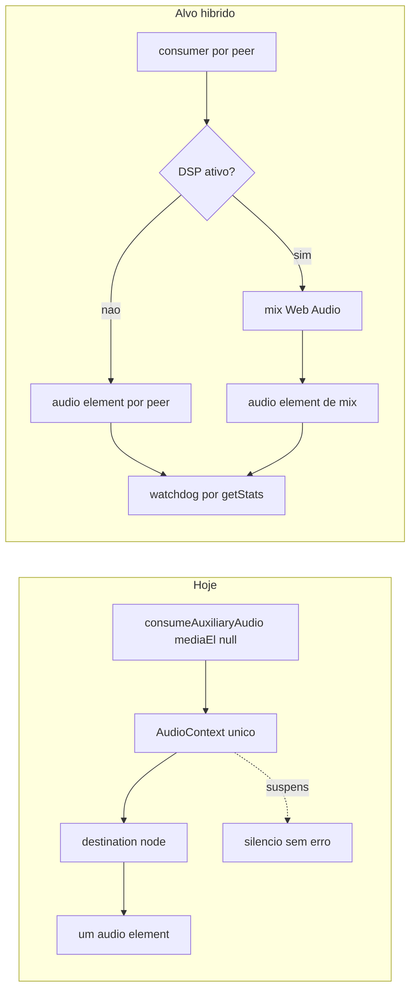

## Diagnóstico

Há duas falhas independentes, mais um conjunto de defeitos secundários.

**1. Publicação: o microfone está soldado ao compartilhamento de tela (client)**

`publishClientMedia` exige stream de tela, publica vídeo primeiro e só depois chega ao áudio:

```1723:1754:src/client/app.js
  if (!media || !hasPendingDisplayStream()) {
    throw new Error('Captura de tela indisponivel — selecione a tela novamente');
  }
  ...
  await mediaPublisher.publishVideo(clientDisplayStream, publishPrefs);
  ...
  if (publishPrefs.microphone || publishPrefs.systemAudio) {
```

Consequências: quem não compartilha tela nunca publica mic; espectadores nem criam send transport (`if (!viewerOnly) { await media.ensureSendTransport(); }` em [src/client/app.js](src/client/app.js):2038); e o early-return `if (media?.hasVideoProducer?.()) return;` (linha 1708) pula a etapa de áudio em re-publicações. O host publica mic de forma independente no join, então essa metade já é estruturalmente correta.

O servidor **não** precisa de mudança para isso: `case 'produzir'` aceita qualquer host/client sem exigir vídeo ([server/signaling.js](server/signaling.js):353) e `broadcastAudioSources()` roda em todo produce de áudio ([server/room-manager.js](server/room-manager.js):1510). Opus está corretamente declarado no router.

**2. Reprodução: mix Web Audio único com falha silenciosa**

Todo áudio remoto é consumido sem elemento (`consumeAuxiliaryAudio` passa `mediaEl: null`, [src/shared/media-client.js](src/shared/media-client.js):1049) e roteado por um único `AudioContext` → `MediaStreamAudioDestinationNode` → um `<audio>`. Se o contexto estiver suspenso, a track do destination node continua `readyState === 'live'` e `play()` resolve — então `recoverOutputIfSilent()` declara tudo saudável e o aviso de autoplay nunca aparece:

```188:197:src/shared/host-audio-monitor.js
    const hasLiveOutput =
      mixedTrack?.readyState === 'live' ||
      this.stream.getAudioTracks().some((t) => t.readyState === 'live');
```

Agrava: `installAudioUnlock` usa `{ once: true }` e é consumido pelo primeiro clique (botão de login/join), quando o monitor ainda é `null`; e `_refreshDirectOutput()` força `el.muted = false`, brigando com o mute do host.

**3. Defeitos secundários**

- `pickAntiEchoSources` mantém só uma fonte por peer (mic > system): mic e áudio de aba do mesmo peer nunca coexistem na reprodução.
- `_startNoiseGateLoop` compara `ch.rawLevel` (linear, com dois escritores em escalas diferentes) contra limiares em dB — pode silenciar um peer permanentemente.
- `near-field-analyzer.js` aloca `new Uint8Array(fftSize)` para `getByteFrequencyData` (deveria ser `frequencyBinCount`; o próprio smoke test usa `fftSize / 2`).
- Se o módulo ML não carregar com `nearFieldGate` ativo, o gate fica dependente só do score near-field e pode fechar em silêncio (fail-closed).
- `public/client/index.html` tem markup morto duplicado do host (`host-chk-microphone`, marcado) que não está ligado a nada — o usuário vê "Microfone" ativo enquanto a pref real vem de `#chk-microphone`.



---

## Fase 1 — Publicação desacoplada (conferência plena)

**[src/shared/media-client.js](src/shared/media-client.js)**
- Novo `async ensureMicrophonePublication(prefs)`: garante `ensureSendTransport()` e chama `publishMicrophone`, idempotente, serializado por `_runAudioMediaOp`, e retorna o motivo em caso de falha (permissão, device, produce).
- Em `publishMicrophone`, parar de reacquirir mic a cada chamada quando `needsAgcOff` (hoje `let track = needsAgcOff ? null : ...` força novo `getUserMedia` e acumula tracks em `localMicTracks`): reusar o track quando as constraints efetivas não mudaram.
- `needsAgcOff` deve desligar **apenas** `autoGainControl`, nunca `echoCancellation`/`noiseSuppression`.

**[src/client/app.js](src/client/app.js)**
- Sempre `await media.ensureSendTransport()` no join, inclusive `viewerOnly`.
- Extrair o bloco de áudio de `publishClientMedia` para `syncClientMicPublication()`, chamado: no join (todos os papéis), na troca do checkbox de mic, ao salvar settings, e após `rejoinSession`.
- Remover o acoplamento de áudio ao early-return de vídeo; manter a exigência de display stream só no caminho de vídeo.
- Renomear a semântica de `chk-viewer-only` para "não compartilhar tela" (continua publicando mic).

**[src/host/app.js](src/host/app.js)**
- `onHostAudioPrefsChange` e o join passam a usar `ensureMicrophonePublication`; garantir republicação após reconexão de WS.

**[config/default.js](config/default.js)** e [server/room-manager.js](server/room-manager.js)
- `audio.dualPublishPolicy: 'allow-both'`, com `enforceDualPublishPolicy` deixando mic e system coexistirem. O anti-eco do publicador passa a depender de `suppressLocalAudioPlayback: true` na captura de aba (já existe em [src/shared/audio-policy.js](src/shared/audio-policy.js):122).

## Fase 2 — Reprodução híbrida

Reescrever a saída de `HostAudioMonitor` ([src/shared/host-audio-monitor.js](src/shared/host-audio-monitor.js)):

- Container oculto no DOM (`<div id="remote-audio-sinks" hidden>`) com um `<audio autoplay playsinline>` por canal `peerId:source`, `srcObject = new MediaStream([consumer.track])`. Substitui os elementos dummy `muted` desanexados.
- Caminho padrão: elemento do canal desmutado, `volume = masterVolume * peerVolume`; `play()` por elemento, e `NotAllowedError` de qualquer um dispara `onAutoplayBlocked`.
- Caminho DSP: apenas quando `_hasAnyFilter(channelKey)`; aí o elemento do canal vira `muted = true` (só mantém o decode) e o áudio sai pelo mix no `<audio>` de saída.
- `_ensureAudioContext`: recriar se `state === 'closed'`; após `resume()`, se `state !== 'running'`, cair para o caminho direto e sinalizar bloqueio.
- Substituir `recoverOutputIfSilent` por watchdog real com `consumer.getStats()` (`inbound-rtp.packetsReceived`, `totalAudioEnergy`) + `element.paused/muted/volume` + `ctx.state`, em vez de `readyState`.
- Novo `setMasterMuted(bool)`; `_refreshDirectOutput` deixa de forçar `el.muted = false`. [src/host/app.js](src/host/app.js):2219-2221 passa a usar `setMasterMuted`.

**[src/shared/audio-manager.js](src/shared/audio-manager.js)** — `installAudioUnlock` deixa de usar `{ once: true }`: permanece armado e só se desregistra quando o callback confirmar reprodução efetiva.

## Fase 3 — Não ouvir a si mesmo, ouvir todos os outros

- Guarda em `_addChannel`: recusar canal se `peerId === excludePeerId` ou se `producerId` coincidir com `media.producers.{microphone,system,mixed}.id`. O bloqueio do servidor em `consume()` continua como segunda barreira.
- `allowDualPeerAudio: true` no monitor do host e do client, para que mic + áudio de aba do mesmo peer sejam ouvidos juntos.
- Manter `echoCancellation`/`noiseSuppression` sempre ligados na captura de mic.

## Fase 4 — Corrigir os gates DSP

- [src/shared/near-field-analyzer.js](src/shared/near-field-analyzer.js): `freqData = new Uint8Array(analyserNode.frequencyBinCount)`.
- [src/shared/mic-dsp.js](src/shared/mic-dsp.js): fail-open — se `loadAudioMlModule` ou `createSpeechVadController` falhar, desativar o gate (`gateGainNode.gain = 1`) e logar, em vez de deixar o portão dependente só do score near-field.
- [src/shared/host-audio-monitor.js](src/shared/host-audio-monitor.js): `_startNoiseGateLoop` só roda quando `noiseGate`/`micSensitivity` estiverem explicitamente ligados, e passa a medir dB de um `AnalyserNode` próprio do canal — eliminando a comparação linear-vs-dB e o conflito de escritores de `ch.rawLevel`.
- Manter `speechGate`/`nearFieldGate`/`noiseSuppressionMl` desligados nos defaults de publicação.

## Fase 5 — UI e diagnóstico

- [public/client/index.html](public/client/index.html): remover o bloco duplicado com `host-chk-*` do sidebar do client (markup morto e enganoso). HTML em `public/` é fonte; só os `*.bundle.js` são gerados.
- Botão "Ativar áudio" persistente enquanto a reprodução não for confirmada pelo watchdog (host e client).
- Log de diagnóstico por canal via `audioTrace`: `packetsReceived`, `totalAudioEnergy`, `ctx.state`, `el.paused/muted/volume`.

## Fase 6 — Verificação

- Estender [scripts/audio-policy-smoke.js](scripts/audio-policy-smoke.js): `allow-both` publica as duas fontes; `allowDualPeerAudio` preserva mic+system do mesmo peer; auto-exclusão por `producerId` próprio; `frequencyBinCount` no near-field.
- `npm run build` e `npm run check`.
- Matriz manual: host + 2 clients compartilhando + 1 espectador. Verificar que cada participante ouve todos os outros, ninguém ouve a si mesmo, mute individual e mute geral funcionam, e o áudio sobrevive a rejoin e a troca de transmissão.