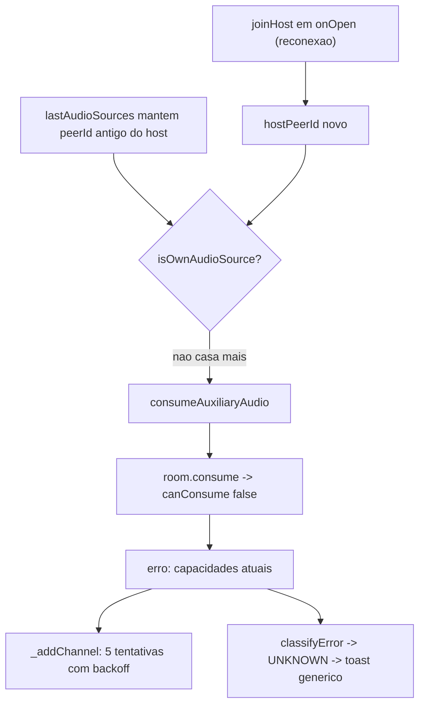

## Diagnostico

O toast e o erro de console tem a mesma origem. Toda falha de handler no servidor volta como `erro` para o peer:

```175:181:server/signaling.js
      } catch (err) {
        logger.error('Erro na sinalização', { type: msg.type, error: err.message });
        enviar({
          type: 'erro',
          payload: { mensagem: err.message || 'Erro interno' }
        });
```

No host, qualquer `erro` nao classificado cai em `errors.handleServerMessage` (`src/host/app.js:2632`), e `classifyServerMessage` em [src/shared/error-manager.js](src/shared/error-manager.js) nao tem regra para falhas de consumo, entao o codigo final e `UNKNOWN`, cuja frase e exatamente "Ocorreu um erro inesperado. Tente novamente em instantes.".

A mensagem "Nao e possivel consumir este producer com as capacidades atuais" e lancada quando `router.canConsume()` falha (`server/room-manager.js:1536`), o que na pratica significa producer inexistente ou ja fechado (nao incompatibilidade de codec, ja que audio e sempre Opus).

Como o erro aparece com o host sozinho, o producer pedido so pode ser um producer antigo do proprio host. A causa direta: `joinHost` roda em todo `onOpen` do WebSocket, inclusive reconexao (`src/host/app.js:2882`), e reseta `lastAppliedSnapshotKey`, `lastAppliedActiveVideoKey`, `lastAppliedRoomVersion` e `pendingRoomSnapshot`, mas **nao** reseta `lastAudioSources`, `lastAppliedAudioSig` nem `estado.clients`. Depois da reconexao o `hostPeerId` e novo, entao as entradas antigas (que carregam o peerId anterior do proprio host) deixam de ser filtradas por `excludePeerId`/`ownProducerIds` e viram alvo de consumo.



Defeitos secundarios que alimentam o mesmo problema:

- `getProducerIds()` nao ignora producers fechados (`server/room-manager.js:166`), entao `roomState.clients[].producerIds` e `transmission.producerIds` podem anunciar ids mortos, enquanto `getAudioSources()` (que filtra `producer.closed`) nao os anuncia.
- `buildHostAudioSources()` (`src/host/app.js:1537`) reconstroi fontes a partir de `estado.clients[].producerIds`, e `applyParticipantState` propositalmente faz merge de clients antigos para nao encolher a lista (`src/host/app.js:2029`), preservando ids mortos.
- `_addChannel` retenta 5 vezes com backoff exponencial (~6s) mesmo quando o producer nunca voltara, gerando varios `erro` por falha (`src/shared/host-audio-monitor.js:1039`).
- `_consumeOne` rejeita por heuristica de texto sem correlacionar producerId, entao uma falha de audio pode rejeitar um consumo de video em voo (filas `_audioMediaOps` e `_videoMediaOps` correm em paralelo), virando toast em `applyTransmission`:

```1108:1119:src/shared/media-client.js
      const onErro = (msg) => {
        if (msg.type !== 'erro') return;
        const text = String(msg.payload?.mensagem || '').toLowerCase();
        const consumeRelated =
          text.includes('consumir') ||
          text.includes('producer') ||
          text.includes('capacidades') ||
          text.includes('transport');
```

- Agravante da sessao anterior: `sampleTrackRms` retorna `0` quando nao consegue medir (AudioContext suspenso sem gesto, exatamente o cenario de carga de pagina). `evaluateMicPublishHealth` le esse `0` como "publicado em silencio" e dispara `republish-raw`, trocando o producerId do microfone logo apos o join e invalidando ids recem-distribuidos. Alem disso `_verifyAndRecoverMicPublish` roda dentro de `_runAudioMediaOp` e bloqueia `consumeAuxiliaryAudio` por 1,2s no join.

## Correcoes

### 1. Servidor: nunca anunciar nem aceitar producer morto
- [server/room-manager.js](server/room-manager.js): em `getProducerIds()`, retornar `null` para slot cujo producer esteja `closed`.
- Em `consume()`, separar os casos: se nao existir producer com aquele id em nenhum peer, lancar erro com mensagem propria (`Producer de audio indisponivel`) e marcar como transitorio; manter a mensagem de capacidades apenas para incompatibilidade real. Logar em `warn` com `peerId`/`producerId`, nao em `error`.

### 2. Servidor: erro correlacionavel
- [server/signaling.js](server/signaling.js): no `catch` do `ws.on('message')`, incluir `tipo: msg.type` e `producerId: msg.payload?.producerId` no payload de `erro`.

### 3. Cliente: erro de midia nao e "erro inesperado"
- [src/shared/error-manager.js](src/shared/error-manager.js): em `classifyServerMessage`, mapear mensagens com "consumir"/"producer"/"capacidades" para `MEDIASOUP_FAILED`; em `isTransientServerError`, tratar producer indisponivel/proprio producer como transitorio (somente log tecnico, sem toast), ja que o monitor se recupera sozinho.

### 4. Cliente: correlacionar rejeicao por producerId
- [src/shared/media-client.js](src/shared/media-client.js): em `_consumeOne`, se `msg.payload.producerId` existir, so rejeitar quando for igual ao producerId pedido; manter a heuristica de texto apenas como fallback.

### 5. Host: invalidar cache de audio no join e lembrar peerIds proprios
- [src/host/app.js](src/host/app.js): em `joinHost`, resetar `lastAudioSources = []`, `lastAppliedAudioSig = ''`, `pendingHostAudioSync = null` e limpar `estado.clients`.
- Manter um `ownPeerIds` (Set) acumulando todos os `hostPeerId` usados pela pagina e passar em `hostAudioNormalizeOptions()` e na construcao do `HostAudioMonitor`.
- [src/shared/audio-sources.js](src/shared/audio-sources.js) e [src/shared/audio-policy.js](src/shared/audio-policy.js): aceitar `ownPeerIds` (alem de `excludePeerId`) em `isOwnAudioSource`/`normalizeRemoteAudioSources`/`resolvePlaybackSources`.
- Aplicar o mesmo tratamento simetrico no cliente em [src/client/app.js](src/client/app.js) (`lastAudioSources` + `clientAudioNormalizeOptions`), que tem o mesmo padrao em `rejoinSession`.

### 6. Host: nao ressuscitar producerIds de estado obsoleto
- `buildHostAudioSources()` deve ser usado apenas como fallback antes de existir lista do servidor. Introduzir flag `hasServerAudioList` (setada no handler `fontesAudio` e em `applyRoomSnapshot`) e, quando verdadeira, usar somente a lista autoritativa, inclusive quando vazia.

### 7. Monitor: parar de perseguir producer morto
- [src/shared/host-audio-monitor.js](src/shared/host-audio-monitor.js): em `_addChannel`, se o erro indicar producer indisponivel/capacidades, nao retentar; registrar o producerId em um Set de ids invalidos com TTL curto (limpo a cada novo `fontesAudio`), remover o canal pendente e pedir estado fresco uma vez. Retentativas continuam apenas para timeout/transport.

### 8. Saude do microfone: medicao inconclusiva nao republica
- [src/shared/mic-publish-health.js](src/shared/mic-publish-health.js): `sampleTrackRms` retorna `null` quando nao pode medir (sem AudioContext ou contexto que nao entrou em `running`); `evaluateMicPublishHealth` passa a tratar energia desconhecida como inconclusiva (`ok`) em vez de silencio.
- [src/shared/media-client.js](src/shared/media-client.js): mover `_verifyAndRecoverMicPublish` para fora da secao serializada (agendar apos a publicacao) para nao bloquear `consumeAuxiliaryAudio` por 1,2s durante o join.

### 9. Verificacao
- Estender [scripts/audio-policy-smoke.js](scripts/audio-policy-smoke.js): classificacao de erro de consumo, filtro por `ownPeerIds`, energia inconclusiva e `getProducerIds` ignorando producer fechado.
- Rodar `npm run check`, `npm run test:smoke` e `npm run build`.
- Matriz manual: host sozinho com refresh repetido (sem toast e sem erro no terminal), queda e volta do WebSocket, host + 1 client falando nos dois sentidos, e client saindo durante fala (host deve limpar o canal sem toast).