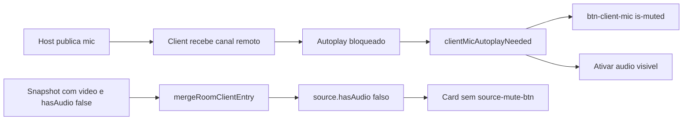

# Corrigir mute visual do client e ícone no card

## Causa

Dois bugs distintos que aparecem juntos ao abrir o client (host já publica mic filtrado → o client quase sempre tem canal remoto na carga).



**Client (ícone + Ativar áudio):** em [`src/client/app.js`](src/client/app.js), `updateClientMicUi()` trata autoplay como mute:

- Mostra `btn-client-mic` se `clientMicAutoplayNeeded` mesmo sem mic publicado.
- Liga `is-muted` se autoplay estiver bloqueado.
- CSS em [`public/client/style.css`](public/client/style.css) força o ícone off quando `.is-muted` (o JS tenta mostrar o ícone on, o CSS ganha).
- `updateActivateAudioUi()` já mostra `#btn-activate-audio` nesse caso — o botão extra está correto; o mic não deveria copiar esse estado.

**Host card:** em [`src/host/app.js`](src/host/app.js) `buildSourceCard` só cria `source-mute-btn` se `source.hasAudio`. Em [`src/shared/transmission.js`](src/shared/transmission.js) `mergeRoomClientEntry` escolhe o lado “mais completo” só por vídeo (`roomClientEntryScore`) e faz `{...secondary, ...primary}`. Um snapshot com vídeo e `hasAudio: false` apaga `hasAudio: true` / producers de áudio do lado mais fraco. `resolveRecordingAudioPeer` já trata áudio via `hasAudio || producerIds.microphone|system|audio`; o card não.

O clique no mic do client hoje também desbloqueia autoplay (`onClientMicClick`); depois da correção esse papel fica só em "Ativar áudio".

## Correção

1. **Desacoplar autoplay do botão de microfone** em [`src/client/app.js`](src/client/app.js):
   - Visibilidade: só `media.hasPublishedMicrophone()`.
   - `is-muted` / ícones / título / `aria`: só `media.isPublishedAudioMuted()`.
   - `onClientMicClick`: mute via `definirClientMute`; não usar o mic para `resume()` de autoplay.
   - Manter `updateActivateAudioUi()` como único unlock de reprodução remota.
   - Aplicar o mesmo desacoplamento em `updateHostMicUi` / `onHostMicClick` em [`src/host/app.js`](src/host/app.js) (`hostMicAutoplayNeeded` não pinta o mic como mutado). Degradação de publish do host (`hostMicPublishDegraded`) permanece no botão do host.

2. **Controle de silenciar no card** — helper único (ex. `peerHasPublishedAudio` em [`src/shared/display-sources.js`](src/shared/display-sources.js) ou [`src/shared/transmission.js`](src/shared/transmission.js)):

```js
c.hasAudio || c.hasMicrophone || c.hasSystemAudio
  || producerIds.microphone || producerIds.system || producerIds.mixed || producerIds.audio
```

Usar em `decorateBody` (mute), `decorateRow` (VU) e no `recAudioBtn` em [`src/host/app.js`](src/host/app.js) (hoje `!client.hasAudio`).

3. **Merge do roster** em `mergeRoomClientEntry`:
   - Somar score por áudio (`hasAudio`, `hasMicrophone`, `producerIds.microphone|system|mixed|audio`).
   - Depois de unir `producerIds`, derivar `hasAudio` / `hasMicrophone` / `hasSystemAudio` da união (chave `null` do snapshot autoritativo continua a remover o slot).

4. **Testes** em [`scripts/room-clients-smoke.js`](scripts/room-clients-smoke.js): entrada com `hasAudio` + `producerIds.microphone` mesclada com snapshot só-vídeo (`hasAudio: false`, sem `microphone`) deve manter o producer de mic e o flag de áudio.

5. **Docs:** uma linha em [`docs/FRONTEND_MAP.md`](docs/FRONTEND_MAP.md): mute do mic ≠ autoplay; "Ativar áudio" só desbloqueia reprodução remota.

6. `npm run check`, `npm run test:smoke`, `npm run build`. Verificar no browser: client com mic ligado abre sem ícone mutado; "Ativar áudio" só se o autoplay estiver bloqueado; card do host mostra silenciar; mute no card e no `btn-client-mic` continuam alinhados via `mutedPeerIds`.

Fonte: `src/*`. Bundles em `public/*` só via build.
