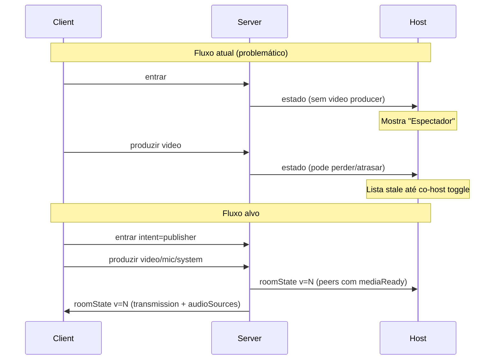
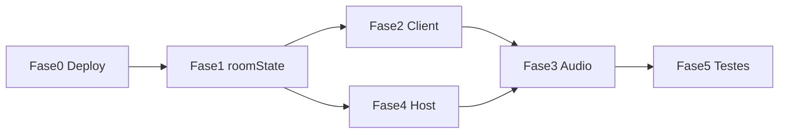

# Plano definitivo: join, late-join e áudio sem eco

## Diagnóstico (por que patches falharam)

Os sintomas que você descreveu são **efeitos colaterais de arquitetura**, não bugs isolados:

| Sintoma | Causa raiz |
|---------|------------|
| Client entra como espectador | Host recebe `estado` no **momento do `entrar`** (sem producer de vídeo) e não há um evento único e confiável de “mídia pronta” depois do `produzir` |
| Co-host marca/desmarca “conserta” | Isso força `notifyHostState` + `solicitarEstado` — exatamente a sincronização que deveria ocorrer automaticamente após publish |
| Mic só funciona com system audio | Mic e system já são producers separados no mediasoup, mas o **fluxo do client** amarra publish ao `publishDisplayStream`, e o **HostAudioMonitor** soma `peer:microphone` + `peer:system` no mesmo output → eco |
| Late-join instável | Três canais paralelos (`estado`, `estadoSala`, `transmissaoAtiva`) competem; [`TransmissionSync`](e:/Projetos/Trabalho/Screen Share/src/shared/transmission.js) e flags espalhadas em [`src/client/app.js`](e:/Projetos/Trabalho/Screen Share/src/client/app.js) (`viewerOnly`, `deferScreenShareOnJoin`, `bootstrapPromise`, etc.) |
| Bundle “não muda nada” | [`preparar-deploy.bat`](e:/Projetos/Trabalho/Screen Share/preparar-deploy.bat) e [`scripts/preparar-pacote-deploy.ps1`](e:/Projetos/Trabalho/Screen Share/scripts/preparar-pacote-deploy.ps1) divergem; [`deploy-producao.bat`](e:/Projetos/Trabalho/Screen Share/deploy-producao.bat) usa `robocopy /MIR` sem proteger `data/` |



---

## Princípios da solução (nova abordagem)

1. **Servidor é dono do estado** — um único evento versionado `roomState` substitui `estado` + `estadoSala` + `transmissaoAtiva`.
2. **Publish antes de “aparecer”** — peer publisher só entra na lista do host como fonte selecionável quando `mediaReady.video === true` (ou após evento explícito `midiaPronta`).
3. **Áudio em três eixos independentes** — vídeo, microfone e system audio têm lifecycle, consume e monitor separados.
4. **Client sem host/app.js** — remover co-host inline do client (sua escolha); elimina ~700KB de bundle host, listeners duplicados e estado global conflitante.
5. **Compatibilidade gradual** — Fase 1 emite `roomState` **em paralelo** aos eventos legados; Fase 2 consome só `roomState`; Fase 3 remove patches (`syncRoomPresenceAfterPublish`, `ensureClientVideoPublished`, etc.).

---

## Fase 0 — Deploy e validação (DEV only, sem tocar produção)

**Objetivo:** garantir que o que for implementado chega completo ao pacote.

### 0.1 Unificar empacotamento
- Fazer [`preparar-deploy.bat`](e:/Projetos/Trabalho/Screen Share/preparar-deploy.bat) delegar para [`scripts/preparar-pacote-deploy.ps1`](e:/Projetos/Trabalho/Screen Share/scripts/preparar-pacote-deploy.ps1) (fonte única de verdade).
- Lista explícita de `src/shared/*.js` usados pelo Node (hoje só [`recording-filename.js`](e:/Projetos/Trabalho/Screen Share/src/shared/recording-filename.js); varrer `server/` por imports ESM).

### 0.2 Proteger produção no robocopy
- Alterar [`deploy-producao.bat`](e:/Projetos/Trabalho/Screen Share/deploy-producao.bat): `/XD data` ou trocar `/MIR` por `/E` + exclusões explícitas para não apagar banco/dados do servidor.
- **Não copiar** `data/` e `users.json` do DEV para o pacote por padrão (remover do PS1 linhas 87–95).

### 0.3 Manifesto de build
- Gerar `pacote-servidor/MANIFEST.json` com `buildId` de [`public/shared/build-id.json`](e:/Projetos/Trabalho/Screen Share/public/shared/build-id.json), hashes de `app.bundle.js` (host/client) e `server/signaling.js`.
- Estender [`verificar-producao.bat`](e:/Projetos/Trabalho/Screen Share/verificar-producao.bat) para validar MANIFEST + presença de handlers novos.

### 0.4 Capacidade 15 peers
- Aumentar `maxClients` de 10 para **15** (ou 20 com margem) em [`config/default.js`](e:/Projetos/Trabalho/Screen Share/config/default.js).
- Documentar requisito de portas UDP RTC e TURN para 15 participantes com áudio.

---

## Fase 1 — Protocolo `roomState` (servidor)

**Arquivos principais:** [`server/room-manager.js`](e:/Projetos/Trabalho/Screen Share/server/room-manager.js), [`server/signaling.js`](e:/Projetos/Trabalho/Screen Share/server/signaling.js)

### 1.1 Modelo de peer enriquecido
Cada peer em `roomState.peers[]` inclui:
```javascript
{
  id, displayName, role, status,
  mediaReady: { video: bool, microphone: bool, system: bool },
  producerIds: { video, microphone, system },
  publishIntent: 'publisher' | 'viewer',  // enviado no entrar
  selectable: bool  // true só se mediaReady.video
}
```

### 1.2 `emitRoomState(reason)` central
- Incrementa `roomVersion` monotônico.
- Monta payload unificado (peers + transmission + audioSources + muted + meetBridge + controleExibicao).
- Envia `roomState` para **todos** os peers conectados (hosts e clients), com campos filtrados por role quando necessário.
- Chamado em: `addPeer`, `removePeer`, `produce`, `closeProducer`, `selectClient`, pause/clear, mute, `setDisplayControl`.

### 1.3 Mensagem `midiaPronta` (client → server)
- Client envia após **confirmar** que video producer está ativo localmente.
- Server valida `peer.hasVideoProducer()` e marca `mediaReady.video = true`.
- Dispara `emitRoomState('media-ready')` — **este é o momento em que o host deve ver a fonte disponível**.

### 1.4 Compatibilidade
- Manter handlers legados (`estado`, `estadoSala`, `transmissaoAtiva`) como thin wrappers que leem o mesmo snapshot interno (1 release de transição).
- Remover append de debug em `sendPeerJoinSnapshot` ([`server/signaling.js`](e:/Projetos/Trabalho/Screen Share/server/signaling.js) ~L90).

### 1.5 Late-join garantido
- No `entrar`: além de `entrou`, enviar `roomState` na versão atual **e** reemitir `transmissaoAtiva` se `hasActiveVideo(transmission)` (belt-and-suspenders durante transição).
- `solicitarEstado` passa a responder só com `roomState` (alias).

---

## Fase 2 — Client: máquina de estados + publish desacoplado

**Arquivos novos:** `src/client/session.js`, `src/client/media-publisher.js`  
**Arquivos refatorados:** [`src/client/app.js`](e:/Projetos/Trabalho/Screen Share/src/client/app.js), [`src/shared/transmission.js`](e:/Projetos/Trabalho/Screen Share/src/shared/transmission.js)

### 2.1 Remover co-host inline do client
- Remover `import { initCoHost, teardownCoHost } from '../host/app.js'`.
- Remover sidebar co-host do [`public/client/index.html`](e:/Projetos/Trabalho/Screen Share/public/client/index.html) (seção host-like).
- Handlers `promovidoCoHost` / `demovidoCoHost` no client: ignorar ou toast informativo (“Use o painel host para funções de co-host”).
- **Resultado:** client bundle cai ~30–40%, elimina listeners duplicados.

### 2.2 State machine explícita
Substituir flags soltas por enum em `session.js`:
```
idle → capturing → joining → publishing → active
                    ↘ viewer_active (sem send transport)
```

Responsabilidades:
- `startPublisherFlow()` — capture → join WS → publish video → publish mic (opcional) → publish system (opcional) → `midiaPronta` → sync UI
- `startViewerFlow()` — join WS → apply roomState → consume remote video/audio
- Um único `SignalingClient` listener para `roomState`

### 2.3 Publish desacoplado (`media-publisher.js`)
Extrair de [`media-client.js`](e:/Projetos/Trabalho/Screen Share/src/shared/media-client.js):
- `publishVideo(stream, prefs)` — só vídeo
- `publishMicrophone(prefs)` — **independente** de vídeo/system; usa `getUserMedia` direto
- `publishSystemAudio(stream)` — **independente** de mic; só se track existir no display stream
- `syncAudioToggles(prefs)` — liga/desliga producers sem republish de vídeo

Regras:
- Falha de system audio **não bloqueia** mic.
- Falha de mic **não bloqueia** vídeo.
- `status: transmitindo` só após `mediaReady.video` confirmado no server.

### 2.4 UI de onboarding simplificada
- Passo 1: nome
- Passo 2: captura de tela (getDisplayMedia)
- Passo 3: toggles independentes (mic / system) com texto claro: “Áudio do sistema depende da caixa do Chrome”
- Passo 4: conectar e publicar (automático após confirmar)
- Remover auto-ativação forçada de mic em `showAudioStep()` ([`app.js`](e:/Projetos/Trabalho/Screen Share/src/client/app.js) ~L669)

### 2.5 Late-join client
- `TransmissionSync` passa a consumir **somente** `roomState.transmission` (via `parseRoomState` em [`transmission.js`](e:/Projetos/Trabalho/Screen Share/src/shared/transmission.js)).
- Remover `pendingTransmission` / `pendingRoomSnapshot` split quando `roomState.version` estiver ativo.
- Retry de `solicitarEstado` com backoff (3 tentativas) se snapshot não chegar em 5s.

### 2.6 Limpeza de patches obsoletos (após Fase 2 validada)
Remover: `syncRoomPresenceAfterPublish`, `ensureClientVideoPublished`, `sincronizarPresenca`, `autoTransmitAfterCapture` — substituídos pelo fluxo `midiaPronta` + `roomState`.

---

## Fase 3 — Áudio: monitor sem eco

**Arquivos:** [`src/shared/host-audio-monitor.js`](e:/Projetos/Trabalho/Screen Share/src/shared/host-audio-monitor.js), [`src/host/app.js`](e:/Projetos/Trabalho/Screen Share/src/host/app.js), [`src/client/app.js`](e:/Projetos/Trabalho/Screen Share/src/client/app.js)

### 3.1 Política de monitoramento (anti-eco)
Nova regra default em `HostAudioMonitor`:
- Por peer remoto, **monitorar no máximo uma fonte de áudio**:
  - Se `microphone` disponível → usar mic (voz)
  - Senão, se `system` disponível → usar system
- Mix de `peer:microphone` + `peer:system` **só se** host habilitar explicitamente (“Monitorar desktop + voz”) — off por default.

### 3.2 DSP por canal, não por peer
- Filtros (`getFilterPrefs`) keyed por `channelKey` (`peerId:source`), não só `peerId`.
- Mic: noise gate/compressor; system: passthrough sem gate agressivo.

### 3.3 Client monitor
- Manter exclusão de `system` no meet-bridge mode.
- Client nunca monitora próprio mic (`excludePeerId`).

### 3.4 Host sync de áudio
- `syncHostAudioMonitor` / `syncClientAudioMonitor` consomem `roomState.audioSources` (lista completa, versionada).
- Remover dependência de corrida `fontesAudio` vs `estado`.

---

## Fase 4 — Host: consumir `roomState` único

**Arquivo:** [`src/host/app.js`](e:/Projetos/Trabalho/Screen Share/src/host/app.js)

- Colapsar handlers `estado`, `estadoSala`, `transmissaoAtiva` em um: `onRoomState(payload)`.
- `renderLista()` usa `peer.selectable` e `peer.mediaReady` — **nunca** classificar como espectador um publisher com `mediaReady.video`.
- [`source-cards.js`](e:/Projetos/Trabalho/Screen Share/src/shared/source-cards.js): `hasVideoAvailable(c)` passa a checar `c.mediaReady?.video || c.producerIds?.video`.
- Reutilizar `TransmissionSync` no host (hoje host tem lógica paralela em `applyTransmission` / `applyRoomSnapshot`).

---

## Fase 5 — Testes de aceitação (DEV)

Matriz mínima antes de qualquer deploy:

| # | Cenário | Critério de sucesso |
|---|---------|---------------------|
| 1 | Client LAN auto-nome, captura, publica | Host vê fonte **disponível** em &lt;3s após publish, sem co-host |
| 2 | Late-join (host já transmitindo) | Client vê vídeo remoto imediatamente; ao publicar, host vê fonte |
| 3 | Mic ON, system OFF | Host ouve mic; sem eco |
| 4 | System ON, mic OFF | Host ouve desktop; sem mic |
| 5 | Mic ON + system ON | Sem eco (monitor usa só mic por default) |
| 6 | 15 clients conectados (simulado) | Server estável; lista e áudio responsivos |
| 7 | Host refresh **não** necessário em nenhum cenário | |
| 8 | Deploy DEV → pacote → verificar-producao | MANIFEST ok, bundles batem buildId |

Testes manuais documentados em `docs/TESTE_ESTABILIDADE_MIDIA.md` (novo, curto).

---

## Ordem de implementação e risco



- **Risco baixo:** Fase 0, Fase 1 com compat legada, remoção co-host client.
- **Risco médio:** Fase 2 state machine (substitui fluxo principal do client).
- **Risco controlado:** Fase 3 anti-eco (comportamento audível — testar com fones).

**Rollback:** flag `config.useLegacyRoomSync = true` mantém eventos antigos até Fase 5 passar.

---

## O que NÃO será alterado (integridade)

- Gravação MP4 / `recording-filename.js` — ortogonal.
- Autenticação PIN / tokens externos.
- nginx / TURN / eturnal — fora do escopo deste plano.
- **Produção (`\\cgrafsysvm\...`)** — nenhuma alteração até Fase 5 completa e sua aprovação explícita.

---

## Entregáveis finais

1. Protocolo `roomState` versionado no server
2. Client refatorado sem `host/app.js`, com publish desacoplado
3. Monitor de áudio anti-eco
4. Scripts de deploy unificados + MANIFEST
5. `maxClients: 15`
6. Documentação de teste + atualização de [`docs/DEPLOY_MAP.md`](e:/Projetos/Trabalho/Screen Share/docs/DEPLOY_MAP.md) e [`docs/SYSTEM_MAP.md`](e:/Projetos/Trabalho/Screen Share/docs/SYSTEM_MAP.md) (somente após merge estrutural)
