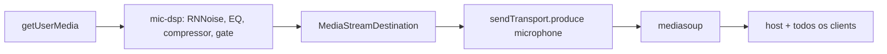

# Filtros de áudio para todos os participantes + microfone padrão na inicialização

## Diagnóstico

A arquitetura já é a correta: o filtro é aplicado **na origem** (o dono do microfone republica a trilha já processada), então todo participante recebe áudio filtrado.



O host manda os prefs via `definirFiltroAudioClient` ([server/signaling.js](server/signaling.js) L491-503), o client recebe `filtroAudioAtualizado` e republica ([src/client/app.js](src/client/app.js) L2401-2407). Esse caminho funciona. Os defeitos são três:

### 1. O verificador de saúde apaga os filtros (causa principal)

`_sampleRawMicEnergy()` lê `graph.meterAnalyser`, que é `nearFieldAnalyser`/`rmsAnalyser` — ambos **antes** do `gateGainNode` ([src/shared/mic-dsp.js](src/shared/mic-dsp.js) L397-405, L427). Já `_samplePublishedMicEnergy()` mede a trilha publicada, **depois** do gate.

Resultado: sempre que um gate (speechGate/VAD, nearFieldGate, noiseGate) está fazendo exatamente o seu trabalho — fechado, com ruído de fundo presente na entrada — o veredito é `republish-raw`:

```26:41:src/shared/mic-publish-health.js
  if (!producerLive) return 'republish';
  const publishedKnown = isKnownEnergy(publishedEnergy);
  const publishedOk = publishedKnown && Number(publishedEnergy) > MIC_ENERGY_THRESHOLD;
  if (publishedOk) return 'ok';
  ...
  const rawOk = rawKnown && Number(rawEnergy) > MIC_ENERGY_THRESHOLD;
  if (rawOk) return 'republish-raw';
```

E aí `_republishRawMicrophone()` fecha o grafo e publica a trilha **crua** ([src/shared/media-client.js](src/shared/media-client.js) L612-625), zerando `_micPublishDegraded` — ou seja, todos os filtros somem para todos os participantes, em silêncio e em definitivo. A checagem roda logo após cada publicação (L627-637) e o watchdog do host repete a cada 5s ([src/host/app.js](src/host/app.js) L1143-1149). O preset "Sala compartilhada" (`speechGate: soft` + RNNoise + nearField) cai nessa armadilha imediatamente.

### 2. Dupla filtragem no monitor do host

`HostAudioMonitor._channelWantsDsp()` reaplica os mesmos prefs sobre a trilha que **já chegou filtrada** ([src/shared/host-audio-monitor.js](src/shared/host-audio-monitor.js) L245-248, L757-764), e o modal do host faz as duas coisas ao mesmo tempo:

```4939:4947:src/host/app.js
function previewAudioFiltersFromUi() {
  const prefs = readAudioFilterPrefsFromUi();
  monitor.setFilterPrefs(client.id, prefs);
  sendAudioFiltersToClient(client, prefs, { force: true });
}
```

O monitor dos clients (`roomAudioMonitor`) nunca chama `setFilterPrefs`, então é passthrough. Ou seja, o host ouve dois passes de DSP e os clients um só — o que faz parecer que "o filtro não chegou".

### 3. Microfone do host morto ao iniciar

`setupMicrophonePicker` dispara `sync()` sem `await` ([src/shared/audio-manager.js](src/shared/audio-manager.js) L374), enquanto `joinHost` lê `els.hostMicSelect?.value` no `onOpen` do WebSocket ([src/host/app.js](src/host/app.js) L2780-2785). O `<select>` ainda está vazio, então publica com `microphoneDeviceId: ''` (padrão do SO). Quando a enumeração termina, `selectEl.value = keepValue` é atribuído programaticamente e **não dispara `change`** — a UI passa a mostrar um microfone diferente do que está realmente capturando. E o early-return trata id vazio como "combina":

```761:772:src/shared/media-client.js
      if (!force && !this._micPublishDegraded && graphOk && this.hasPublishedMicrophone() && ...) {
        const activeId = this._micTrack.getSettings?.().deviceId || '';
        if (!wantDeviceId || !activeId || wantDeviceId === activeId) {
          return { ok: true, reason: null };
        }
      }
```

Trocar de microfone e voltar funciona porque aí `_canReuseMicTrack` falha e há uma recaptura real com deviceId explícito.

---

## Mudanças

### A. Saúde de publicação ciente do gate

**[src/shared/mic-dsp.js](src/shared/mic-dsp.js)** — expor no objeto `graph`: `gateGainNode`, `gateActive` (true quando `speechGate !== 'off'` ou `nearFieldGate !== 'off'` ou `noiseGate` ou `micSensitivity`) e um `outputAnalyser` ligado depois de `gainNode` (medindo a saída real do grafo, não a do producer). Fazer nas duas fábricas (legacy L409-428 e advanced L525-533).

**[src/shared/mic-publish-health.js](src/shared/mic-publish-health.js)** — novo parâmetro `gateOpenObserved` em `evaluateMicPublishHealth`. Regra: se `gateActive` e o gate nunca abriu durante a janela de medição, o silêncio é intencional → `'ok'`. Só considerar `'republish-raw'` por grafo silencioso quando o gate esteve aberto e mesmo assim a saída ficou muda. Manter `ctxBad → 'republish-raw'`.

**[src/shared/media-client.js](src/shared/media-client.js)** — em `_verifyAndRecoverMicPublish` (L639-677), amostrar na mesma janela de 1200ms: energia de saída (`graph.outputAnalyser`), energia pré-gate (`meterAnalyser`) e o máximo de `gateGainNode.gain.value`; passar `gateOpenObserved` ao avaliador.

**Restaurar filtros depois de um fallback** — hoje `_republishRawMicrophone` zera `_micPublishDegraded` e o estado cru fica permanente. Passar a manter `_micPublishDegraded = 'raw-fallback'` e guardar os prefs pendentes, para que `recoverMicPublicationIfNeeded()` (já chamado pelo watchdog do host) refaça a publicação filtrada quando o `AudioContext` voltar a `running` — com limite de tentativas para não entrar em laço.

### B. Monitor do host vira passthrough

**[src/shared/host-audio-monitor.js](src/shared/host-audio-monitor.js)** — `_channelWantsDsp()` passa a retornar sempre `false` (opção `playbackDsp` default `false`). O `<audio>` por canal continua responsável por volume/mute (`_applyChannelOutputState` L293-309), então o host passa a ouvir exatamente a mesma trilha que os clients. `setFilterPrefs`/`getFilterPrefs` continuam existindo apenas como armazenamento dos prefs que a UI do host exibe.

Sem impacto na gravação: `RecordingAudioMixer` já usa `ch.consumer.track` diretamente ([src/shared/recording-audio-mixer.js](src/shared/recording-audio-mixer.js) L30-44).

**[src/host/app.js](src/host/app.js)** — `previewAudioFiltersFromUi` e `closeAudioFiltersModal` continuam chamando `setFilterPrefs` (estado da UI) e `sendAudioFiltersToClient` (aplicação real na origem). Trocar `normalizeAudioFilterPrefsForClient` (L4734-4754, duplicata manual) por `normalizeMicrophoneFilterPrefs` de `mic-dsp.js`, para não haver risco de divergência de campos entre host e client.

### C. Microfone padrão explícito na inicialização

**[src/shared/audio-manager.js](src/shared/audio-manager.js)**
- `listMicrophoneDevices()`: manter `groupId` e sinalizar a entrada `deviceId === 'default'`; resolver o **deviceId concreto** do padrão do SO (o dispositivo com o mesmo `groupId` da entrada `default`; fallback: primeiro da lista).
- `populateMicrophoneSelect()`: quando não houver `deviceId` salvo válido, selecionar esse id concreto (em vez de deixar `''`) e retornar `{ deviceId, devices }`.
- `setupMicrophonePicker()`: retornar `{ refresh, ready, getDeviceId }`, onde `ready` é a promessa do primeiro `sync()`; acrescentar callback `onResolved(deviceId)` para host/client persistirem via `saveCapturePrefs` sem republicar.

**[src/host/app.js](src/host/app.js)** — em `joinHost` (antes de `getHostCapturePrefs()` na L2780) e em `iniciarCompartilhamentoHost` (L2208), aguardar `hostMicPicker.ready` com `Promise.race` e timeout de ~4s, para que a primeira publicação já use o deviceId explícito e não corra com o `getUserMedia` de permissão.

**[src/client/app.js](src/client/app.js)** — mesmo await antes de `ensureClientMicTrack`/`publishClientMedia` (L1327-1336) e no passo de áudio do onboarding (L1157-1164).

**[src/shared/media-client.js](src/shared/media-client.js)** — apertar o early-return de `_ensureMicrophonePublicationUnlocked` (L761-772): comparar `wantDeviceId` com `this._micCaptureDeviceId` e republicar quando diferirem, em vez de aceitar id vazio como equivalente.

### D. Testes e build

- **[scripts/audio-policy-smoke.js](scripts/audio-policy-smoke.js)** — acrescentar asserts em `evaluateMicPublishHealth` (já coberto em L234-292): gate ativo e nunca aberto com energia pré-gate → `'ok'`; gate aberto e saída muda → `'republish-raw'`; `ctxState: 'suspended'` continua `'republish-raw'`.
- Rodar `npm run check` e `npm run test:smoke`, depois `npm run build` para regenerar os bundles em `public/host` e `public/client` (artefatos de build, não fonte).
- Verificação manual: host + 2 clients, aplicar preset com gate, confirmar que os clients seguem ouvindo áudio filtrado após 60s (watchdog) e que o microfone do host funciona no primeiro carregamento sem trocar de dispositivo.
- Atualizar a seção de áudio de [docs/FRONTEND_MAP.md](docs/FRONTEND_MAP.md) com o monitor passthrough.