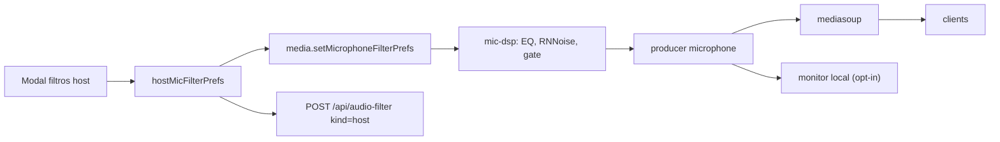
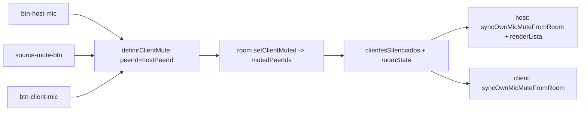

# Filtros de áudio aplicados ao host + monitor do próprio áudio

## Diagnóstico

O modal do card do host abre, mas não chega no microfone dele:

- `sendAudioFiltersToClient` tem early-return quando o alvo é o próprio host (`src/host/app.js` L4883-4885), e o modal nunca chama `media.setMicrophoneFilterPrefs`.
- `monitor.setFilterPrefs` é o único efeito, e o `HostAudioMonitor` é passthrough (`_channelWantsDsp` sempre `false`), além de tratar só áudio remoto.
- O mic do host publica com cadeia fixa `HOST_MIC_PUBLISH_DEFAULTS` + ganho do slider, via `applyHostMicPublishGain` (L370-386), que sobrescreve todo o preset a cada chamada.
- O item "Áudio" deveria estar escondido no card do host (`audioBtn.hidden = isHostCard`, L4826-4827), mas `.ctx-item { display: flex }` em [public/host/style.css](public/host/style.css) L2043 vence o atributo `hidden` — por isso ele aparece e engana.

Fluxo alvo:

## Decisões assumidas

- Ganho: o slider `host-mic-gain-slider` da barra lateral sai; ganho passa a existir só no modal (escolha do usuário).
- Monitor: desligado por padrão e **não persistido** — volta desligado a cada carregamento, para não gerar microfonia inesperada. O restante dos filtros continua persistido.

## Mudanças

### 1. Acesso à trilha publicada — [src/shared/media-client.js](src/shared/media-client.js)

Adicionar `getPublishedMicrophoneTrack()` retornando `this.producers.microphone?.track` apenas quando `readyState === 'live'`. Não reaproveitar `getLocalMicrophoneTrack()` (L247-252), que cai para `this._micTrack` cru — monitorar o cru faria o host ouvir algo diferente dos clients.

### 2. Monitor do próprio áudio — novo [src/shared/self-audio-monitor.js](src/shared/self-audio-monitor.js)

Fábrica `createSelfAudioMonitor({ getTrack, onBlocked })` com `enable()`, `disable()`, `setVolume()`, `refresh()`, `isEnabled()`. Reaproveita o padrão já usado em `_createChannelAudioEl` de [src/shared/host-audio-monitor.js](src/shared/host-audio-monitor.js) L271-288: `<audio autoplay playsinline>` dentro de `#remote-audio-sinks` (já existe em [public/host/index.html](public/host/index.html) L433), com `srcObject = new MediaStream([track])`.

`refresh()` é essencial: cada `setMicrophoneFilterPrefs` republica e troca a trilha. Guarda a trilha ligada e só refaz o bind quando a identidade muda, para poder ser chamado de rotinas de render.

Sem `AudioContext` próprio e sem DSP: o que toca é a saída do grafo de publicação, idêntica ao que o SFU distribui.

### 3. Estado e persistência do preset do host — [src/host/app.js](src/host/app.js)

Substituir `applyHostMicPublishGain` (L370-386) por:

- `hostMicFilterPrefs` no escopo do módulo, iniciado com `HOST_MIC_PUBLISH_DEFAULTS`.
- `applyHostMicFilterPrefs(prefs, { persist })` — normaliza, guarda, chama `media.setMicrophoneFilterPrefs` e, quando `persist`, grava via `saveAudioFilterPresetApi('host', hostDisplayName, prefs, authUser?.id)` mais um cache em `localStorage` sob chave nova `sharescreen_host_mic_prefs` (não usar `savePresetToLocalStorage`, cujo namespace é por nome e colidiria com um client homônimo).
- `loadHostMicPresetFromStorage()` (L388-416) simplificado: API `kind: 'host'` → cache local → legado `sharescreen_host_mic_gain` mesclado em `HOST_MIC_PUBLISH_DEFAULTS` → defaults. Sem regravar a cadeia fixa.

Os três chamadores atuais de `applyHostMicPublishGain` passam a usar o preset vigente: handler do slider (removido), `onHostAudioPrefsChange` (L684) e `iniciarCompartilhamentoHost` (L2286).

`applySharedRoomPresetToClients` (L4556-4566) troca `media.setMicrophoneFilterPrefs(preset)` por `applyHostMicFilterPrefs(preset, { persist: true })`, para o estado e o modal não divergirem.

### 4. Ramificar o modal para o host — [src/host/app.js](src/host/app.js)

Usar o helper existente `isHostPeer(c)` (L2087-2089) para decidir o alvo:

- `openAudioFiltersModal` (L5076): prefs vêm de `hostMicFilterPrefs` em vez de `getAppliedClientAudioFilterPrefs`; exibe a seção de monitor; ajusta o texto da nota (a nota atual em [public/host/index.html](public/host/index.html) L889-891 diz que os filtros só afetam o monitor local, o que está errado nos dois casos).
- `previewAudioFiltersFromUi` (L5066): no host, chama `applyHostMicFilterPrefs(prefs, { persist: false })` **com debounce próprio de ~300ms**. Sem isso, cada passo de slider republica o producer e constrói um `AudioContext` novo — Chrome limita contextos por página e o áudio corta. Também remover a dependência de `hostAudioMonitor` no caminho do host (hoje há early-return se o monitor não existe).
- `saveAudioFiltersModal` (L5097): no host, faz flush do debounce e persiste com `kind: 'host'` + `hostDisplayName`.
- `closeAudioFiltersModal(revert)` (L5109): no host, restaura `originalAudioFilterPrefs` via `applyHostMicFilterPrefs`.
- Reset (L5183-5223): trocar o bloco de ~35 linhas de valores fixos por `populateAudioFiltersUi(normalizeMicrophoneFilterPrefs(isHost ? HOST_MIC_PUBLISH_DEFAULTS : MIC_FILTER_DEFAULTS))` seguido do preview.

### 5. UI do monitor — [public/host/index.html](public/host/index.html)

Novo `<fieldset id="audio-self-monitor-section" hidden>` no modal, antes dos botões (L1046):

- `#audio-self-monitor-enabled` (checkbox, desmarcado).
- `#audio-self-monitor-volume` (range 0–100, default 70).
- Aviso fixo: use fones; com caixas de som há realimentação, e se o host estiver publicando áudio do sistema o retorno entra na transmissão.

No wiring: ao ligar, se `media.hasPublishedSystemAudio()` for verdadeiro, mostrar toast de alerta (sem bloquear). Se `play()` for rejeitado por autoplay, desmarcar e avisar. Ao ligar sem microfone publicado, avisar que não há o que monitorar.

Chamar `selfMonitor.refresh()` de dentro de `updateHostMicUi()` (L1238), que já roda após publicação, mute, recuperação do watchdog e `syncHostMicPublishHealthUi`. O guard de identidade da trilha torna isso barato. Desligar o monitor no teardown junto de `localHostVuStop?.()` (L4407).

O mute do mic (`setPublishedAudioMuted`) e o ducking de sala compartilhada agem em `track.enabled`, então o monitor silencia junto — que é exatamente o que os clients ouvem.

### 6. Remover o slider de ganho da barra lateral

- [public/host/index.html](public/host/index.html) L661-666: remover o bloco do `host-mic-gain-slider`.
- [src/host/app.js](src/host/app.js): remover `els.hostMicGainSlider`/`hostMicGainVal` (L125-126), `syncHostMicGainUi`, `saveHostMicPublishGain`, os listeners (L662-670) e a chamada em L2883. Manter `loadHostMicPublishGain` apenas como leitura do valor legado na migração.

### 7. Corrigir o menu de contexto — [public/host/style.css](public/host/style.css)

Adicionar `.ctx-item[hidden] { display: none !important; }` perto de L2043. Com isso "Co-host" e "Troca telas" passam a sumir de verdade no card do host. Em `openContextMenu` (L4826-4827), deixar o item "Áudio" sempre visível, já que agora ele é a porta de entrada dos filtros do host.

### 8. Sincronizar o mute do microfone com os cards

Hoje há duas noções de mute convivendo, e só metade do caminho está ligada:

- O servidor mantém `mutedPeerIds` ([server/room-manager.js](server/room-manager.js) L1329-1346), difunde por `clientesSilenciados` e inclui no `roomState`/snapshot. Essa é a fonte de verdade.
- O client já fecha o ciclo: `onClientMicClick` ([src/client/app.js](src/client/app.js) L556-561) aplica o mute local e envia `definirClientMute`; `syncOwnMicMuteFromRoom` (L241-248) silencia a própria publicação quando a sala manda, tanto pelo evento (L2529) quanto pelo snapshot (L2005).
- O host **não** fecha: `onHostMicClick` ([src/host/app.js](src/host/app.js) L1269-1283) só chama `media.togglePublishedAudioMuted()`. Não avisa o servidor, não entra em `mutedPeerIds` e não redesenha a lista, então o `source-mute-btn` do card do host nunca acompanha. No sentido inverso, clicar no `source-mute-btn` do card do host chama `toggleClientMute(hostPeerId)`, que marca o id no servidor mas não silencia o microfone do host — só troca o ícone.

Mudanças, mantendo `mutedPeerIds` como fonte única:

**[src/host/app.js](src/host/app.js)**

- `onHostMicClick`: além de `media.setPublishedAudioMuted(muted)`, enviar `signaling.send('definirClientMute', { peerId: hostPeerId, muted })` e chamar `renderLista()` para o card refletir na hora (a difusão depois reconcilia). Espelha o que o client já faz em L556-561.
- Nova `syncOwnMicMuteFromRoom()` análoga à do client: se `mutedClients.has(String(hostPeerId))` divergir de `media.isPublishedAudioMuted()`, aplicar `media.setPublishedAudioMuted()`. Chamar no handler de `clientesSilenciados` (L2621-2630, antes do `renderLista()` que já existe) e em `applyRoomSnapshot` junto de `applyClientAudioMute()` (L2216-2222).
- `updateHostMicUi` (L1246): manter `media.isPublishedAudioMuted()` como base do visual, já que passa a ser sempre reconciliado com o servidor.
- `buildSourceCard` (L1110-1125): quando `isHostPeer(source)`, ajustar `aria-label`/`title` para "meu microfone" em vez de "audio do client". O `click` continua em `toggleClientMute(source.id)`, que agora funciona de verdade.

**[src/client/app.js](src/client/app.js)**

- `syncOwnMicMuteFromRoom` tem early-return quando ainda não há microfone publicado (L242). Se o host silencia antes da publicação, o estado se perde. Chamar de novo ao fim de `syncClientMicPublication`, junto do `updateClientMicUi()` em L1919, para reaplicar o que a sala já decidiu.

Sem mudança no servidor: `definirClientMute` já aceita o host agindo sobre qualquer peer (`isHostOrCoHost`, [server/signaling.js](server/signaling.js) L479-489) e limpa o id em `removePeer` ([server/room-manager.js](server/room-manager.js) L1071).

Ponto de atenção na gravação: `collectMonitorAudioTracks` pula peers em `mutedClients` ([src/shared/recording-audio-mixer.js](src/shared/recording-audio-mixer.js) L38). O microfone do host entra pela outra via (`collectOwnAudioTracks`, controlada por `own`), então gravar com o host silenciado continua capturando a trilha — que estará muda por `track.enabled = false`. Comportamento aceitável, só não deve surpreender em teste.

### 9. Docs, testes e build

- [docs/FRONTEND_MAP.md](docs/FRONTEND_MAP.md) L31: registrar que o host aplica os próprios filtros via `media.setMicrophoneFilterPrefs` (preset `kind: 'host'`) e que existe monitor local opt-in da trilha publicada.
- [docs/BACKEND_MAP.md](docs/BACKEND_MAP.md) L50-51: nota de que `kind: 'host'` agora é gravado pelo modal, não só pelo ganho.
- [docs/FRONTEND_MAP.md](docs/FRONTEND_MAP.md): registrar que `mutedPeerIds` do servidor é a fonte única do mute de microfone, refletida em `btn-host-mic`, `btn-client-mic` e `source-mute-btn`.
- [scripts/audio-policy-smoke.js](scripts/audio-policy-smoke.js): cobrir a resolução do preset do host (API → cache → legado de ganho → defaults) como função pura extraída, evitando depender de DOM.
- `npm run check`, `npm run test:smoke` e `npm run build` para regenerar `public/host/app.bundle.js` e `public/shared/host-style.css` (o build copia `public/host/style.css`, conforme [scripts/build-client.js](scripts/build-client.js) L122-126).

## Riscos e mitigação

- Microfonia: monitor default off, não persistido, aviso no modal e toast quando há áudio do sistema publicado. O AEC do navegador já está ligado na captura (`echoCancellation: true` em [src/shared/audio-manager.js](src/shared/audio-manager.js) L45) e ajuda, mas não é garantia com caixas de som.
- Republicação em rajada: debounce obrigatório no preview do host; `setMicrophoneFilterPrefs` já ignora prefs com assinatura igual.
- Gate fechado parecendo defeito: com `speechGate`/`nearFieldGate` ativos o monitor fica mudo em silêncio — comportamento correto, deve constar no texto de ajuda.
- Nome do host mudando: o preset é por `hostDisplayName` + `userId`; com usuário autenticado a busca por `user_id` tem prioridade em `getAudioFilterPreset`, então o caso comum fica coberto.

## Verificação manual

1. Host + 2 clients. Aplicar EQ agressivo no card do host e confirmar nos clients que a voz mudou.
2. Recarregar o host e confirmar que o preset volta sozinho, sem reabrir o modal.
3. Ligar o monitor com fones, ajustar filtros e conferir que o que o host ouve bate com o que um client ouve.
4. Mutar o microfone e confirmar que o monitor silencia junto.
5. Deixar o watchdog rodar mais de 60s e confirmar que o monitor continua ligado após republicações.
6. Card de client: garantir que nada regrediu no fluxo `definirFiltroAudioClient`.
7. Mute do host: clicar em `btn-host-mic` e conferir que o `source-mute-btn` do card do host muda junto; clicar no card e conferir que o botão do preview muda e que os clients param de ouvir.
8. Mute de client: host silencia um client pelo card e o `btn-client-mic` daquele client aparece silenciado; o client se reativa pelo próprio botão e o card do host acompanha.
9. Ordem invertida: host silencia um client que ainda não publicou microfone; quando o client publicar, ele deve entrar já silenciado.
10. Reconexão: recarregar o host com um client silenciado e confirmar que o estado volta pelo snapshot.