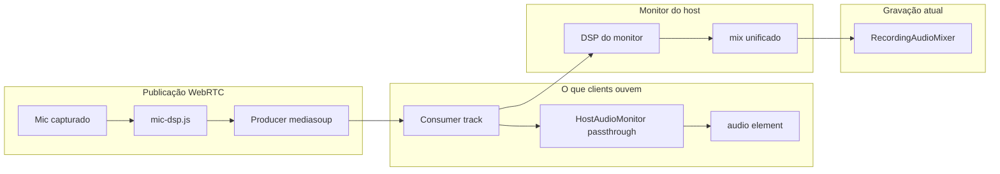
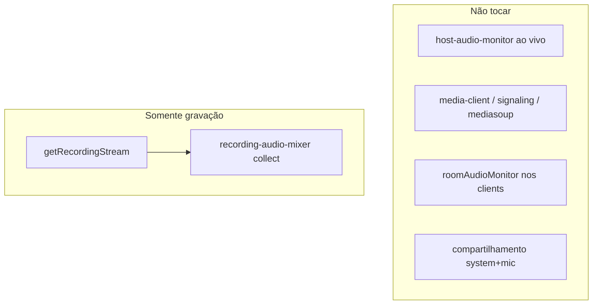

# Plano: persistência de filtros de áudio + paridade gravação/clients

## Resposta: a gravação usa filtros hoje?

**Sim, mas de forma inconsistente — e não igual ao que os clients ouvem.**

| Fonte na gravação | Filtros aplicados? | Igual ao que clients ouvem? |
|-------------------|-------------------|----------------------------|
| **Microfone do host** (`collectOwnAudioTracks`) | Sim — trilha publicada já passou por `mic-dsp.js` na captura | Sim |
| **Áudio de system do host** | Não (trilha bruta do `getDisplayMedia`) | Sim |
| **Microfones de outros clients** (cenário normal, com canais ativos) | **Sim, com dupla filtragem** — `collectMonitorAudioTracks` usa `getMixedOutputTrack()` quando `allChannelsRoutedToDest === true` (linhas 36–39 de `recording-audio-mixer.js`), que é o mix do monitor do host com DSP reaplicado sobre trilhas **já filtradas na publicação WebRTC** | **Não** — clients ouvem só a filtragem da publicação; a gravação soma a do monitor do host |
| **Fallback** (sem mix unificado) | Parcial — canais **com** filtro ativo são **ignorados** (linha 50: `continue`); só entram trilhas sem filtro ou fallback genérico | Também diverge |

**Resumo**: com participantes e filtros ativos, a gravação **não replica** fielmente o áudio dos clients. A correção prevista na seção 5 resolve isso usando as `consumer.track` WebRTC diretamente (uma única passagem de DSP, a da publicação).

---

## Diagnóstico do estado atual

### Persistência (parcial, só no navegador do host)
- Presets de **clients** já existem em [`src/shared/host-audio-monitor.js`](e:/Projetos/Trabalho/Screen%20Share/src/shared/host-audio-monitor.js) via `localStorage` (`sharescreen_audio_presets`), chave = `displayName`.
- Salvamento em [`src/host/app.js`](e:/Projetos/Trabalho/Screen%20Share/src/host/app.js) (`saveAudioFiltersPresetDebounced` → `savePresetToLocalStorage`).
- **Host**: só o ganho do microfone é persistido (`sharescreen_host_mic_gain`); compressor/peaking/EQ ficam hardcoded em `applyHostMicPublishGain`.
- **Problema de renomear**: ao mudar nome (`atualizarNome` + `POST /api/registro-cliente`), [`registerClientByName`](e:/Projetos/Trabalho/Screen%20Share/server/client-db.js) atualiza a tabela `clients`, mas o preset permanece na chave antiga do `localStorage` — configuração “some” até reconfigurar.

### Onde os filtros são aplicados (3 camadas distintas)



- **Clients ouvem**: trilha já filtrada na **publicação** (`media-client.js` → `createMicrophoneFilterGraph`), enviada pelo host via `definirFiltroAudioClient` em [`server/signaling.js`](e:/Projetos/Trabalho/Screen%20Share/server/signaling.js).
- **Monitor do client** (`roomAudioMonitor` em [`src/client/app.js`](e:/Projetos/Trabalho/Screen%20Share/src/client/app.js)): **passthrough** (sem `setFilterPrefs`) — correto.
- **Monitor do host**: reaplica DSP sobre a mesma trilha já filtrada → host ouve **dupla filtragem** (não afeta clients).
- **Gravação** ([`recording-audio-mixer.js`](e:/Projetos/Trabalho/Screen%20Share/src/shared/recording-audio-mixer.js)): quando `allChannelsRoutedToDest === true`, usa `getMixedOutputTrack()` do monitor do host → **herda o DSP do monitor**, não a trilha pura que os clients consomem.

**Conclusão**: a gravação hoje tende a divergir do que os clients ouvem sempre que há filtros ativos em microfones de participantes.

### Eliminador de eco — fora do escopo
Não será implementado neste trabalho. O AEC nativo do navegador já está ativo na captura de microfone (`echoCancellation: true` em `audio-manager.js`); nenhuma alteração relacionada a eco entra no plano.

---

## Escopo da implementação (mínimo e isolado)

### 1. Banco de dados — nova tabela

**Arquivo**: [`server/client-db.js`](e:/Projetos/Trabalho/Screen%20Share/server/client-db.js)

Criar tabela `audio_filter_presets`:

| Campo | Tipo | Descrição |
|-------|------|-----------|
| `subject_kind` | `TEXT` | `'client'` ou `'host'` |
| `subject_name` | `TEXT` | Nome de exibição (COLLATE NOCASE) |
| `prefs_json` | `TEXT` | JSON normalizado (mesmos campos de `MIC_FILTER_DEFAULTS`) |
| `updated_at` | `INTEGER` | timestamp |

- PK composta: `(subject_kind, subject_name)`.
- Funções novas (espelhando padrão de `lower_thirds`):
  - `getAudioFilterPreset(kind, name)`
  - `saveAudioFilterPreset(kind, name, prefs)` — upsert; **sobrescreve** se já existir
  - `renameAudioFilterPreset(kind, oldName, newName)` — ao renomear client:
    1. Lê `prefs` do registro com `oldName`
    2. Grava em `newName` via `saveAudioFilterPreset` (**sobrescreve** o destino se já houver preset)
    3. **Remove** o registro de `oldName` (não cria linha duplicada; não preserva histórico)

**Renomeação de nome** (em `registerClientByName`, ramo `update-by-ip`):
- Antes do `UPDATE clients SET name = ?`, chamar `renameAudioFilterPreset('client', byIp.name, trimmed)`.

No frontend (`localStorage`): ao detectar renomeação, mover a chave do preset (`delete` antiga, `set` nova) em vez de manter duas entradas.

**Atualizar**: [`docs/DATABASE_MAP.md`](e:/Projetos/Trabalho/Screen%20Share/docs/DATABASE_MAP.md) (nova tabela).

---

### 2. API REST

**Arquivo**: [`server/index.js`](e:/Projetos/Trabalho/Screen%20Share/server/index.js)

| Método | Rota | Função |
|--------|------|--------|
| `GET` | `/api/audio-filter/:kind/:name` | Retorna preset ou defaults |
| `POST` | `/api/audio-filter` | Salva `{ kind, name, prefs }` — exige token de host (mesmo padrão de `POST /api/lower-third`) |

**Atualizar**: [`docs/BACKEND_MAP.md`](e:/Projetos/Trabalho/Screen%20Share/docs/BACKEND_MAP.md).

---

### 3. Persistência no fluxo de filtros (sem tocar WebRTC)

**Arquivo**: [`server/signaling.js`](e:/Projetos/Trabalho/Screen%20Share/server/signaling.js)

No handler `definirFiltroAudioClient` (após validar target):
- Persistir com `saveAudioFilterPreset('client', target.displayName, prefs)` — side-effect leve, não altera producers/ICE/gravação.
- Em `atualizarNome`: capturar `oldName = peer.displayName` antes de `updatePeerName`, depois `renameAudioFilterPreset('client', oldName, nome)` (sobrescreve destino, remove origem).

**Não alterar**: `criarTransporte`, `produzir`, `consumir`, `splitRecvTransports`, `room-manager` audio broadcast.

---

### 4. Frontend host — carregar/salvar via API

**Arquivos**:
- [`src/host/app.js`](e:/Projetos/Trabalho/Screen%20Share/src/host/app.js) (principal)
- [`src/shared/host-audio-monitor.js`](e:/Projetos/Trabalho/Screen%20Share/src/shared/host-audio-monitor.js) (ajuste mínimo de lookup)

Mudanças em `host/app.js`:
- `fetchAudioFilterPreset(kind, name)` / `saveAudioFilterPresetApi(kind, name, prefs)` — chamadas à nova API.
- **Ao abrir modal** (`openAudioFiltersModal`) e em `syncPublishedAudioFiltersToClients`: buscar preset do servidor por `displayName`; se API falhar, fallback para `localStorage` existente.
- **Ao salvar** (`applyAudioFiltersFromUi`): POST na API + manter `localStorage` como cache offline (não remover — resiliência se SQLite readonly).
- **Migração one-shot**: na primeira carga, se API vazia mas `localStorage` tem preset para o nome, fazer upload automático.
- **Host mic**: ao alterar ganho/filtros de publicação do host, salvar preset completo com `kind: 'host'` e `name: hostDisplayName` (substitui só persistir gain isolado; manter leitura do gain antigo como fallback na primeira execução).

Mudança mínima em `host-audio-monitor.js`:
- `getFilterPrefs`: aceitar preset pré-carregado via `setFilterPrefs` (já existe) — host app passa preset da API antes de abrir modal/sync; **não mudar** `_rebuildAudioRoutes`, `_setupChannelDsp`, `syncFromSources` (área sensível do áudio ao vivo).

---

### 5. Correção da gravação (paridade com clients)

**Arquivo**: [`src/shared/recording-audio-mixer.js`](e:/Projetos/Trabalho/Screen%20Share/src/shared/recording-audio-mixer.js) **somente**

Reescrever `collectMonitorAudioTracks` para:
- **Sempre** coletar `ch.consumer.track` (trilha WebRTC = o que clients ouvem), respeitando `mutedClients` e `restrictToPeerId`.
- **Não usar** `getMixedOutputTrack()` / `allChannelsRoutedToDest` para a gravação.
- Manter `collectOwnAudioTracks` para áudio próprio do host (já usa trilha publicada com DSP de `mic-dsp.js`).
- Mix final continua sendo gain 1:1 no `AudioContext` (sem DSP adicional) — evita duplicação e dupla filtragem.

**Não alterar**: [`host-audio-monitor.js`](e:/Projetos/Trabalho/Screen%20Share/src/shared/host-audio-monitor.js) monitor ao vivo (Parte A2 permanece intacta).

**Atualizar** nota em [`docs/FRONTEND_MAP.md`](e:/Projetos/Trabalho/Screen%20Share/docs/FRONTEND_MAP.md) na linha de gravação.

---

### 6. Client padrão de áudio para gravação (opcional, anti-eco)

**Objetivo**: permitir designar um client como **única fonte de áudio** na gravação (ex.: ponte Meet), evitando mix de várias faixas que gera eco/duplicação. **Sem client padrão definido → gravação segue o fluxo normal** (após a correção da seção 5).

#### Infraestrutura já existente (reutilizar, não reinventar)

O sistema **já possui** mecanismo parcial em [`src/host/app.js`](e:/Projetos/Trabalho/Screen%20Share/src/host/app.js):

- `getRecordingAudioPrefs()` → `selectedPeerOnly`, `excludeOwnSystem` (localStorage).
- `RecordingAudioMixer.build({ restrictToPeerId })` em [`recording-audio-mixer.js`](e:/Projetos/Trabalho/Screen%20Share/src/shared/recording-audio-mixer.js) já filtra canais por `peerId`.
- Checkbox **"Gravar apenas áudio da fonte selecionada"** restringe ao peer do **vídeo em gravação** (dinâmico, por sessão).
- Preset **"Ponte externa (Meet)"** liga os dois toggles acima.

A novidade é um **client padrão persistente por nome**, independente da fonte de vídeo selecionada no momento.

#### Comportamento definido

| Situação | Áudio gravado | Vídeo gravado |
|----------|---------------|---------------|
| **Sem client padrão** | Mix normal (seção 5) — igual hoje, corrigido | Fonte selecionada (inalterado) |
| **Com client padrão** e peer **online com áudio** | **Somente** trilhas WebRTC desse peer (`restrictToPeerId`); `own: false` (sem áudio do host) | Fonte selecionada (inalterado) |
| **Com client padrão** mas peer **offline/sem áudio** | **Fallback seguro**: comportamento normal (mix completo); toast opcional `"Client padrão de gravação indisponível"` | Inalterado |

**Precedência** (apenas em `getRecordingStream`, sem afetar mais nada):

1. Client padrão resolvido e disponível → usa só esse peer.
2. Senão, se `selectedPeerOnly` ligado → usa `selectedPeerId` (comportamento Meet atual).
3. Senão → mix completo.

Checkboxes manuais (`excludeOwnSystem`, `selectedPeerOnly`) continuam funcionando quando **não** há client padrão ativo. Com client padrão ativo, `excludeOwnSystem`/`own` ficam implícitos (só o peer designado); toggles manuais **não são alterados** na UI — apenas ignorados naquele take de gravação.

#### Persistência

- **localStorage** no host: `sharescreen_rec_default_audio_client` = `displayName` ou string vazia (mesmo padrão dos outros prefs de gravação em `STORAGE_REC_*`).
- **Renomear client**: mover valor no localStorage (nome antigo → novo), alinhado à seção 1.
- **Sem SQLite** para este pref (escopo mínimo; pref operacional do painel host, não cadastro corporativo).

#### UI mínima (sem redesign)

**Arquivos**: [`public/host/index.html`](e:/Projetos/Trabalho/Screen%20Share/public/host/index.html), [`src/host/app.js`](e:/Projetos/Trabalho/Screen%20Share/src/host/app.js)

- Item no menu de contexto do client: **"Definir como áudio padrão da gravação"** (toggle; se já for o padrão, **"Remover áudio padrão da gravação"**).
- Indicador discreto no card do client (ex.: badge/ícone) quando for o padrão.
- Na seção de gravação (settings): linha de hint `"Áudio padrão: {nome}"` ou `"Nenhum"` + botão limpar.

**Não alterar**: cards de fonte, seleção de vídeo, mute, filtros de áudio, monitor ao vivo.

#### Código — único ponto de ramificação

Somente em `getRecordingStream()` (~linha 1413), **antes** de `RecordingAudioMixer.build`:

```javascript
// Pseudocódigo — ramo novo isolado
const defaultAudioName = getDefaultRecordingAudioClientName(); // localStorage ou ''
let restrictToPeerId = null;
let ownForRec = own;

if (defaultAudioName) {
  const defaultPeer = resolveRecordingAudioPeer(estado.clients, defaultAudioName);
  if (defaultPeer?.id) {
    restrictToPeerId = defaultPeer.id;
    ownForRec = false;
  }
  // se não resolver: restrictToPeerId permanece null → mix normal (fallback)
} else if (recPrefs.selectedPeerOnly) {
  restrictToPeerId = selectedPeerId;
}
```

Passar `own: ownForRec` e `restrictToPeerId` ao mixer. **Nenhuma outra função de áudio ao vivo é chamada.**

#### Garantias de integridade (obrigatórias)



| Garantia | Como |
|----------|------|
| Áudio ao vivo idêntico | Zero mudanças em `host-audio-monitor.js` rotas, `media-client.js`, `signaling.js` |
| Sem client padrão = comportamento atual | Ramo `if (defaultAudioName)` só executa com valor não vazio; else cai no fluxo existente |
| Falha não bloqueia gravação | Peer indisponível → fallback ao mix normal + vídeo grava normalmente |
| Meet bridge preservado | Preset Meet e checkboxes intactos; só usados quando não há client padrão |
| Escopo mínimo | ~40–60 linhas em `host/app.js` + hint HTML; **0** mudanças em `room-manager` |

---

## Arquivos tocados (resumo)

| Arquivo | Ação | Motivo |
|---------|------|--------|
| `server/client-db.js` | Alterar | Schema + CRUD + renomear preset in-place |
| `server/index.js` | Alterar | Endpoints GET/POST |
| `server/signaling.js` | Alterar | Persistir ao definir filtro; renomear ao mudar nome |
| `src/host/app.js` | Alterar | Load/save API filtros; preset host; client padrão gravação |
| `public/host/index.html` | Alterar mínimo | Hint de áudio padrão na seção gravação |
| `src/shared/recording-audio-mixer.js` | Alterar | Gravação = trilhas WebRTC (paridade clients) |
| `src/shared/host-audio-monitor.js` | Alterar mínimo | Opcional: export helper de cache; sem mudar rotas de áudio |
| `docs/DATABASE_MAP.md` | Alterar | Nova tabela |
| `docs/BACKEND_MAP.md` | Alterar | Novos endpoints |
| `docs/FRONTEND_MAP.md` | Alterar | Fluxo de gravação |

**Explicitamente fora do escopo** (para preservar estabilidade):
- `media-client.js`, `signaling-client.js`, `audio-manager.js`, `room-manager.js`, `mediasoup-manager.js`
- Layout/HTML/CSS, autenticação, deploy, nginx
- Eliminador de eco (qualquer implementação)

---

## Riscos e pontos de atenção

| Risco | Severidade | Mitigação |
|-------|------------|-----------|
| Gravação soa diferente após correção | Média (esperado) | Testar com filtros ativos; resultado deve **igualar** o que clients ouvem, não o que o host ouvia no monitor |
| SQLite readonly em produção | Média | Fallback para `localStorage`; log já existente em `runDbWrite` |
| Renomear com nomes que diferem só por maiúsculas | Baixa | COLLATE NOCASE na PK — comportamento consistente com `clients` |
| Dois hosts com presets diferentes para o mesmo client | Baixa | Preset é por nome, não por sessão — alinhado ao pedido |
| Host muda próprio nome | Baixa | Preset `kind=host` fica no nome antigo até reconfigurar; documentar |
| Regressão no áudio ao vivo | **Alta se mexer no monitor** | **Não alterar** `_rebuildAudioRoutes` nem transports; mudanças **somente** em `getRecordingStream` e collector da gravação |
| Client padrão offline na gravação | Baixa | Fallback automático ao mix normal; gravação de vídeo não interrompida |
| Client padrão + vídeo de outro peer | Baixa (esperado) | Vídeo da fonte selecionada + áudio só do client padrão — comportamento desejado para ponte Meet |
| Renomear para nome que já tem preset | Baixa | Comportamento definido: **sobrescreve** o preset do nome novo com o do antigo |

---

## Como testar

1. `npm run build` e reiniciar servidor.
2. **Persistência client**: configurar filtros para “João” → recarregar host → preset restaurado; verificar linha em `audio_filter_presets` no SQLite.
3. **Renomear**: client “João” → “João Silva” → preset migrado para o novo nome; registro “João” removido; se “João Silva” já existia, preset antigo de João **sobrescreve** o de João Silva.
4. **Host**: ajustar ganho/EQ do host → recarregar → preset `kind=host` restaurado.
5. **Paridade gravação**: com EQ/compressor ativo em um client, comparar áudio gravado vs áudio no client viewer — devem coincidir.
6. **Regressão áudio ao vivo**: múltiplos participantes; host e clients ouvem system+mic+remotos; reconexão; co-host — comportamento idêntico ao atual.
7. **Meet bridge presets** (`excludeOwnSystem`, `selectedPeerOnly`): gravar **sem** client padrão — sem regressão.
8. **Client padrão de gravação**:
   - Definir client A como padrão → gravar com vídeo do host → áudio **só** do client A.
   - Remover padrão → gravar com mix normal.
   - Client padrão offline → gravação continua (mix normal ou só vídeo+host conforme fallback).
   - Renomear client padrão → nome atualizado no localStorage.
