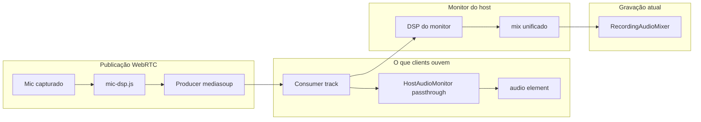

# Plano: persistência de filtros de áudio + paridade gravação/clients

## Diagnóstico do estado atual

### Persistência (parcial, só no navegador do host)
- Presets de **clients** já existem em [`src/shared/host-audio-monitor.js`](e:/Projetos/Trabalho/Screen%20Share/src/shared/host-audio-monitor.js) via `localStorage` (`sharescreen_audio_presets`), chave = `displayName`.
- Salvamento em [`src/host/app.js`](e:/Projetos/Trabalho/Screen%20Share/src/host/app.js) (`saveAudioFiltersPresetDebounced` → `savePresetToLocalStorage`).
- **Host**: só o ganho do microfone é persistido (`sharescreen_host_mic_gain`); compressor/peaking/EQ ficam hardcoded em `applyHostMicPublishGain`.
- **Problema de renomear**: ao mudar nome (`atualizarNome` + `POST /api/registro-cliente`), [`registerClientByName`](e:/Projetos/Trabalho/Screen%20Share/server/client-db.js) atualiza a tabela `clients`, mas o preset permanece na chave antiga do `localStorage` — configuração “some” até reconfigurar.

### Onde os filtros são aplicados (3 camadas distintas)

- **Clients ouvem**: trilha já filtrada na **publicação** (`media-client.js` → `createMicrophoneFilterGraph`), enviada pelo host via `definirFiltroAudioClient` em [`server/signaling.js`](e:/Projetos/Trabalho/Screen%20Share/server/signaling.js).
- **Monitor do client** (`roomAudioMonitor` em [`src/client/app.js`](e:/Projetos/Trabalho/Screen%20Share/src/client/app.js)): **passthrough** (sem `setFilterPrefs`) — correto.
- **Monitor do host**: reaplica DSP sobre a mesma trilha já filtrada → host ouve **dupla filtragem** (não afeta clients).
- **Gravação** ([`recording-audio-mixer.js`](e:/Projetos/Trabalho/Screen%20Share/src/shared/recording-audio-mixer.js)): quando `allChannelsRoutedToDest === true`, usa `getMixedOutputTrack()` do monitor do host → **herda o DSP do monitor**, não a trilha pura que os clients consomem.

**Conclusão**: a gravação hoje tende a divergir do que os clients ouvem sempre que há filtros ativos em microfones de participantes.

### Echo cancellation
- Já habilitado na captura em [`audio-manager.js`](e:/Projetos/Trabalho/Screen%20Share/src/shared/audio-manager.js) (`echoCancellation: true`).
- O eco residual vem do mix de **várias faixas** (system + mic + remotos) no playback — AEC do navegador não cancela isso de forma confiável.
- **Eliminador customizado no mix** = alto risco de degradar compartilhamento de áudio; **não implementar na v1**.

---

## Escopo da implementação (mínimo e isolado)

### 1. Banco de dados — nova tabela

**Arquivo**: [`server/client-db.js`](e:/Projetos/Trabalho/Screen%20Share/server/client-db.js)

Criar tabela `audio_filter_presets`:

| Campo | Tipo | Descrição |
|-------|------|-----------|
| `subject_kind` | `TEXT` | `'client'` ou `'host'` |
| `subject_name` | `TEXT` | Nome de exibição (COLLATE NOCASE) |
| `prefs_json` | `TEXT` | JSON normalizado (mesmos campos de `MIC_FILTER_DEFAULTS`) |
| `updated_at` | `INTEGER` | timestamp |

- PK composta: `(subject_kind, subject_name)`.
- Funções novas (espelhando padrão de `lower_thirds`):
  - `getAudioFilterPreset(kind, name)`
  - `saveAudioFilterPreset(kind, name, prefs)`
  - `migrateAudioFilterPreset(kind, oldName, newName)` — copia preset do nome antigo para o novo **somente se o novo ainda não tiver preset**; **não apaga** o antigo (preserva histórico).

**Migração de nome** (em `registerClientByName`, ramo `update-by-ip`):
- Antes do `UPDATE clients SET name = ?`, chamar `migrateAudioFilterPreset('client', byIp.name, trimmed)`.

**Atualizar**: [`docs/DATABASE_MAP.md`](e:/Projetos/Trabalho/Screen%20Share/docs/DATABASE_MAP.md) (nova tabela).

---

### 2. API REST

**Arquivo**: [`server/index.js`](e:/Projetos/Trabalho/Screen%20Share/server/index.js)

| Método | Rota | Função |
|--------|------|--------|
| `GET` | `/api/audio-filter/:kind/:name` | Retorna preset ou defaults |
| `POST` | `/api/audio-filter` | Salva `{ kind, name, prefs }` — exige token de host (mesmo padrão de `POST /api/lower-third`) |

**Atualizar**: [`docs/BACKEND_MAP.md`](e:/Projetos/Trabalho/Screen%20Share/docs/BACKEND_MAP.md).

---

### 3. Persistência no fluxo de filtros (sem tocar WebRTC)

**Arquivo**: [`server/signaling.js`](e:/Projetos/Trabalho/Screen%20Share/server/signaling.js)

No handler `definirFiltroAudioClient` (após validar target):
- Persistir com `saveAudioFilterPreset('client', target.displayName, prefs)` — side-effect leve, não altera producers/ICE/gravação.
- Em `atualizarNome`: capturar `oldName = peer.displayName` antes de `updatePeerName`, depois `migrateAudioFilterPreset('client', oldName, nome)`.

**Não alterar**: `criarTransporte`, `produzir`, `consumir`, `splitRecvTransports`, `room-manager` audio broadcast.

---

### 4. Frontend host — carregar/salvar via API

**Arquivos**:
- [`src/host/app.js`](e:/Projetos/Trabalho/Screen%20Share/src/host/app.js) (principal)
- [`src/shared/host-audio-monitor.js`](e:/Projetos/Trabalho/Screen%20Share/src/shared/host-audio-monitor.js) (ajuste mínimo de lookup)

Mudanças em `host/app.js`:
- `fetchAudioFilterPreset(kind, name)` / `saveAudioFilterPresetApi(kind, name, prefs)` — chamadas à nova API.
- **Ao abrir modal** (`openAudioFiltersModal`) e em `syncPublishedAudioFiltersToClients`: buscar preset do servidor por `displayName`; se API falhar, fallback para `localStorage` existente.
- **Ao salvar** (`applyAudioFiltersFromUi`): POST na API + manter `localStorage` como cache offline (não remover — resiliência se SQLite readonly).
- **Migração one-shot**: na primeira carga, se API vazia mas `localStorage` tem preset para o nome, fazer upload automático.
- **Host mic**: ao alterar ganho/filtros de publicação do host, salvar preset completo com `kind: 'host'` e `name: hostDisplayName` (substitui só persistir gain isolado; manter leitura do gain antigo como fallback na primeira execução).

Mudança mínima em `host-audio-monitor.js`:
- `getFilterPrefs`: aceitar preset pré-carregado via `setFilterPrefs` (já existe) — host app passa preset da API antes de abrir modal/sync; **não mudar** `_rebuildAudioRoutes`, `_setupChannelDsp`, `syncFromSources` (área sensível do áudio ao vivo).

---

### 5. Correção da gravação (paridade com clients)

**Arquivo**: [`src/shared/recording-audio-mixer.js`](e:/Projetos/Trabalho/Screen%20Share/src/shared/recording-audio-mixer.js) **somente**

Reescrever `collectMonitorAudioTracks` para:
- **Sempre** coletar `ch.consumer.track` (trilha WebRTC = o que clients ouvem), respeitando `mutedClients` e `restrictToPeerId`.
- **Não usar** `getMixedOutputTrack()` / `allChannelsRoutedToDest` para a gravação.
- Manter `collectOwnAudioTracks` para áudio próprio do host (já usa trilha publicada com DSP de `mic-dsp.js`).
- Mix final continua sendo gain 1:1 no `AudioContext` (sem DSP adicional) — evita duplicação e dupla filtragem.

**Não alterar**: [`host-audio-monitor.js`](e:/Projetos/Trabalho/Screen%20Share/src/shared/host-audio-monitor.js) monitor ao vivo (Parte A2 permanece intacta).

**Atualizar** nota em [`docs/FRONTEND_MAP.md`](e:/Projetos/Trabalho/Screen%20Share/docs/FRONTEND_MAP.md) na linha de gravação.

---

### 6. Echo eliminator — decisão

| Opção | Risco | Decisão |
|-------|-------|---------|
| AEC customizado no mix Web Audio | Alto — pode cortar fala, causar artefatos, quebrar sync de faixas | **Não implementar** |
| Reforçar AEC na captura | Baixo — já está `true` | Nenhuma mudança |
| Documentar uso de fones | Nenhum | Mencionar no resumo de testes |

Se no futuro for necessário, abordagem segura seria flag experimental **desligada por padrão**, isolada em módulo novo, sem tocar `media-client.js` nem `host-audio-monitor.js`.

---

## Arquivos tocados (resumo)

| Arquivo | Ação | Motivo |
|---------|------|--------|
| `server/client-db.js` | Alterar | Schema + CRUD + migração por nome |
| `server/index.js` | Alterar | Endpoints GET/POST |
| `server/signaling.js` | Alterar | Persistir ao definir filtro; migrar ao renomear |
| `src/host/app.js` | Alterar | Load/save API; preset host completo |
| `src/shared/recording-audio-mixer.js` | Alterar | Gravação = trilhas WebRTC (paridade clients) |
| `src/shared/host-audio-monitor.js` | Alterar mínimo | Opcional: export helper de cache; sem mudar rotas de áudio |
| `docs/DATABASE_MAP.md` | Alterar | Nova tabela |
| `docs/BACKEND_MAP.md` | Alterar | Novos endpoints |
| `docs/FRONTEND_MAP.md` | Alterar | Fluxo de gravação |

**Explicitamente fora do escopo** (para preservar estabilidade):
- `media-client.js`, `signaling-client.js`, `audio-manager.js`, `room-manager.js`, `mediasoup-manager.js`
- Layout/HTML/CSS, autenticação, deploy, nginx

---

## Riscos e pontos de atenção

| Risco | Severidade | Mitigação |
|-------|------------|-----------|
| Gravação soa diferente após correção | Média (esperado) | Testar com filtros ativos; resultado deve **igualar** o que clients ouvem, não o que o host ouvia no monitor |
| SQLite readonly em produção | Média | Fallback para `localStorage`; log já existente em `runDbWrite` |
| Renomear com nomes que diferem só por maiúsculas | Baixa | COLLATE NOCASE na PK — comportamento consistente com `clients` |
| Dois hosts com presets diferentes para o mesmo client | Baixa | Preset é por nome, não por sessão — alinhado ao pedido |
| Host muda próprio nome | Baixa | Preset `kind=host` fica no nome antigo até reconfigurar; documentar |
| Regressão no áudio ao vivo | **Alta se mexer no monitor** | **Não alterar** `_rebuildAudioRoutes` nem transports; mudança restrita ao collector da gravação |
| Echo eliminator | **Alto** | Não implementar |

---

## Como testar

1. `npm run build` e reiniciar servidor.
2. **Persistência client**: configurar filtros para “João” → recarregar host → preset restaurado; verificar linha em `audio_filter_presets` no SQLite.
3. **Renomear**: client “João” → “João Silva” → preset deve aparecer para o novo nome (API + modal).
4. **Host**: ajustar ganho/EQ do host → recarregar → preset `kind=host` restaurado.
5. **Paridade gravação**: com EQ/compressor ativo em um client, comparar áudio gravado vs áudio no client viewer — devem coincidir.
6. **Regressão áudio ao vivo**: múltiplos participantes; host e clients ouvem system+mic+remotos; reconexão; co-host — comportamento idêntico ao atual.
7. **Meet bridge presets** (`excludeOwnSystem`, `selectedPeerOnly`): gravar com toggles ligados — sem regressão.
