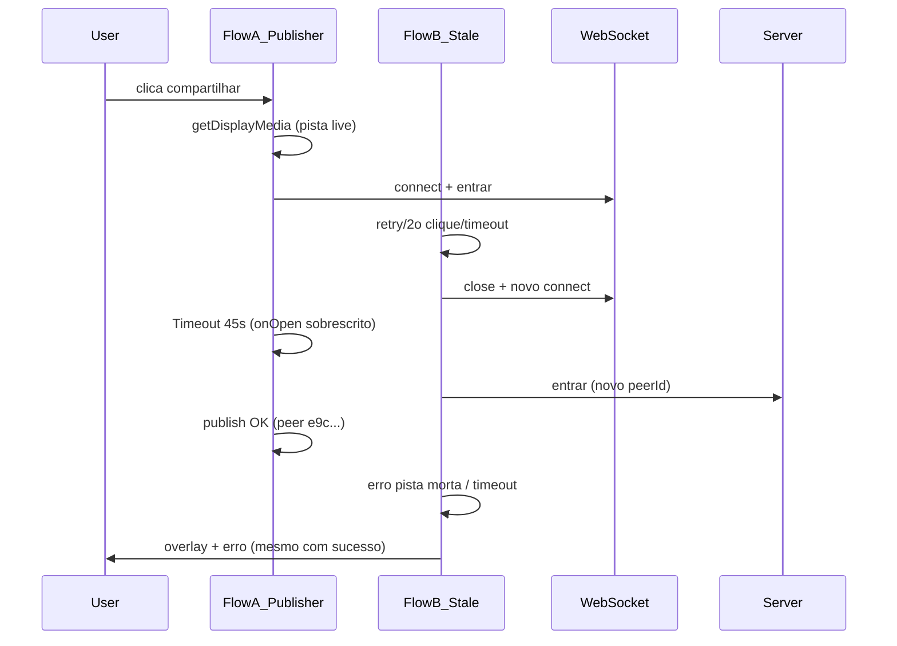
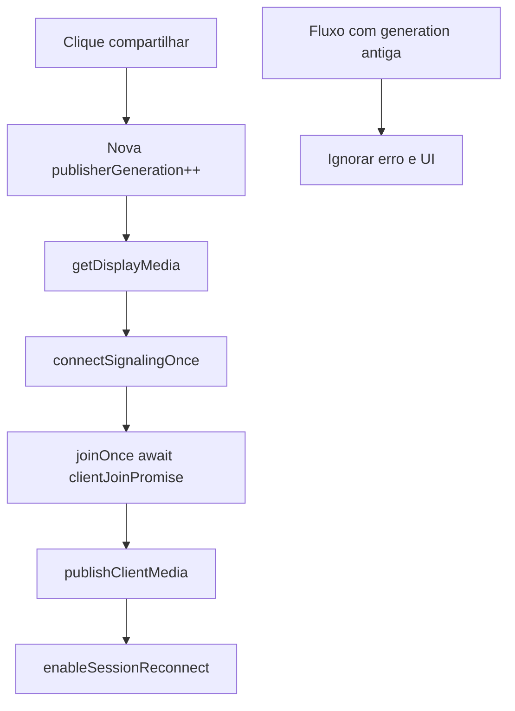

# Plano: Corrigir timeout e múltiplas conexões do client

## Causa provável (confirmada por evidência)

O problema **não é deploy/cache** como causa primária. Os logs de [`/api/debug-session`](https://10.1.1.73:3443/api/debug-session) (sessão `20cf0e`) e o histórico em [`docs/cursor_system_stability_and_issues.md`](e:/Projetos/Trabalho/Screen Share/docs/cursor_system_stability_and_issues.md) apontam para **corrida arquitetural no client**:

| Evidência | Significado |
|-----------|-------------|
| `H7 failed: Timeout ao conectar` com `wsConnected:true`, `hasMedia:true` | Timer de 45s disparou em fluxo **obsoleto** enquanto outro fluxo já conectou |
| `startPublisherFlow start` **antes** de `capture-ok` (peer Link) | Dois fluxos paralelos na mesma aba |
| Basilio `77fe4fb8` → `e9c2064a` | Cada retry cria **novo peer** no servidor |
| `produce ok` + `midiaPronta ok` **seguido** de `H7: Pista de video indisponivel` | Fluxo A publicou; fluxo B falhou e reabriu overlay |
| Client entra no servidor sem `produzir` | Join completa, publish nunca roda no fluxo vencedor ou morre no fluxo perdedor |

### Bugs específicos no código atual

1. **`connectSignalingAndJoin`** ([`src/client/app.js`](e:/Projetos/Trabalho/Screen Share/src/client/app.js) ~686-726): encadeia `priorOnOpen` + `joinWhenOpen`; múltiplas chamadas podem deixar timers de 45s órfãos disparando `"Timeout ao conectar"`.

2. **`ensurePublisherSession`** (~735-826): **fecha o WebSocket e cria outro** mesmo com captura ativa, gerando novo `entrar` e peer fantasma no host.

3. **`executeJoinAndStart`** (~1747): `if (joinInFlight) return` **sem aguardar** o join em andamento — callers assumem sucesso.

4. **`captureScreenFirst`** (~926): chama `teardownClientSession` antes da captura, invalidando sessão/WS em retries rápidos.

5. **`agentHostname` vazio** na maioria dos clients ([`app.js`](e:/Projetos/Trabalho/Screen Share/src/client/app.js) L105): servidor só deduplica peer antigo se `maquina` coincide ([`server/room-manager.js`](e:/Projetos/Trabalho/Screen Share/server/room-manager.js) ~704-731) — reconexões viram múltiplos clients no host.

6. **Handlers de erro** em `startPublisherFlow` (~1069-1091): ainda reabrem overlay após falha de fluxo obsoleto, mesmo quando `hasVideoProducer()` já é true (parcialmente mitigado por H10, mas não por geração de fluxo).

### Deploy: o que está correto e o que verificar

O pipeline **está estruturado corretamente** (`preparar-deploy.bat` → `pacote-servidor/` → `deploy-producao.bat`). Riscos reais ao testar nos **dois ambientes** (sua escolha):

| Ambiente | URL | Risco |
|----------|-----|-------|
| DEV local | `https://<IP-LAN>:3443/client` via [`start-dev.bat`](e:/Projetos/Trabalho/Screen Share/start-dev.bat) | Código atual do repo |
| Produção | `http://cgrafsysvm/meet/` ou `https://10.1.1.73:3443` | Bundle da VM — **só muda após deploy + restart** |

**Nota:** `c:\dev\sagraweb` **não faz parte** deste projeto ShareScreen. DEV = pasta do repo + `start-dev.bat`.

Checklist antes de considerar deploy em produção:
- `GET /api/info` → `buildId` recente e `roomStateProtocol: true`
- Network → `app.bundle.js?v=<mesmo buildId>`
- Reiniciar `start-producao.bat` na VM após copiar arquivos (Node mantém código antigo em memória)

---

## Estratégia de correção (mínima, sem refatorar o sistema)

**Princípio:** um único pipeline linear por aba — `captura → conectar uma vez → join uma vez → publish uma vez → habilitar reconnect`. Fluxos obsoletos são cancelados silenciosamente.

---

## Fase 1 — Single-flight com geração de fluxo (client)

**Arquivo:** [`src/client/app.js`](e:/Projetos/Trabalho/Screen Share/src/client/app.js)

- Adicionar `let publisherFlowGeneration = 0` e helper `isPublisherFlowCurrent(gen)`.
- Em `startPublisherFlow` / `captureScreenFirst`: incrementar geração no início; em **todo** `catch`, `showOverlay`, `teardown` e timeout — checar `isPublisherFlowCurrent` **e** `media?.hasVideoProducer()` antes de alterar UI.
- Unificar gates existentes (`publisherFlowPromise`, `captureScreenInFlight`, `signalingConnectPromise`, `publisherSessionPromise`) sob a mesma geração: se geração mudou, abortar sem erro visível.

---

## Fase 2 — Conexão WS atômica (client)

**Arquivos:** [`src/client/app.js`](e:/Projetos/Trabalho/Screen Share/src/client/app.js), opcionalmente [`src/shared/signaling-client.js`](e:/Projetos/Trabalho/Screen Share/src/shared/signaling-client.js)

### 2.1 Reescrever `connectSignalingAndJoin`
- **Remover** encadeamento `priorOnOpen?.()` — causa double-join com `handleSignalingReconnect`.
- Usar `connectEpoch` local: se `signaling.connect()` for chamado de novo, invalidar timer/Promise anterior.
- Garantir `clearTimeout` no `finish()` em todos os caminhos (resolve e reject).

### 2.2 Corrigir `executeJoinAndStart`
- Substituir `if (joinInFlight) return` por `if (clientJoinPromise) return clientJoinPromise` (mesmo padrão de `runClientJoin`).

### 2.3 `ensurePublisherSession` — não destruir WS desnecessariamente
- Se `signaling?.connected` e peer ainda válido (`peerId` + `media`): **reutilizar** conexão; apenas `ensureSendTransport()` + publish.
- Só `signaling.close()` + novo `SignalingClient` quando WS morto ou geração de fluxo invalidou a sessão.
- Remover chamada a `schedulePostJoinWork` no caminho que reutiliza sessão **sem** producer (L749-760) — esse caminho hoje retorna sem publicar.

---

## Fase 3 — Pipeline linear de publish (client)

**Arquivo:** [`src/client/app.js`](e:/Projetos/Trabalho/Screen Share/src/client/app.js)

- **`captureScreenFirst`:** remover `teardownClientSession` no início (L926-929); só resetar `mediaPublisher` se não há producer.
- **`confirmAudioAndTransmit` e `startPublisherFlow`:** ambos devem delegar ao mesmo `runPublisherFlowBody` (já quase assim) — garantir que `confirmAudioAndTransmit` não abre segundo WS se `publisherFlowPromise` ativo.
- **`enableSessionReconnect()`:** chamar **somente** após `publishClientMedia` + `midiaPronta` OK (já parcialmente feito; reforçar nos caminhos `ensure-reuse-session`).
- **`handleSignalingReconnect`:** se `publisherFlowPromise` ou `signalingConnectPromise` ativos, **não** chamar `rejoinSession`.

---

## Fase 4 — Identidade estável de máquina (client + server mínimo)

### Client ([`src/client/app.js`](e:/Projetos/Trabalho/Screen Share/src/client/app.js))
- Se `agentHostname` vazio, gerar e persistir em `localStorage` (`sharescreen_machine_id`, UUID) na inicialização.
- Enviar sempre em `entrar` como `maquina`.
- Incluir `computerName` no POST `/api/registro-cliente` (já parcialmente feito em `resolveClientNameFromServer`).

### Server ([`server/room-manager.js`](e:/Projetos/Trabalho/Screen Share/server/room-manager.js)) — alteração mínima
- Na deduplicação de client (L709-714), adicionar fallback: **mesmo `displayName` + mesmo IP** (via `getClientIpFromWs`) quando `agentHostname` vazio — suficiente para LAN sem quebrar convidados externos (`isExternal`).

**Contrato público:** sem mudança de protocolo WS; apenas melhor dedup server-side.

---

## Fase 5 — Hardening de publish (client)

**Arquivo:** [`src/client/app.js`](e:/Projetos/Trabalho/Screen Share/src/client/app.js) + [`src/shared/media-client.js`](e:/Projetos/Trabalho/Screen Share/src/shared/media-client.js) (se necessário)

- Centralizar `getLiveDisplayVideoTrack()` (já existe) — usar em **todos** os pontos antes de publish.
- Em `publishClientMedia`: se `hasVideoProducer()` após publish de fluxo paralelo, retornar sem erro (já existe H10).
- No `catch` de `startPublisherFlow`: **nunca** zerar `clientDisplayStream` se `hasVideoProducer()` ou geração obsoleta.

---

## Fase 6 — Validação (DEV local + checklist produção)

### Testes obrigatórios em DEV (`start-dev.bat`)

| # | Cenário | Critério |
|---|---------|----------|
| 1 | 1 clique → captura → publish | Host vê fonte em &lt;5s; **sem** overlay repetido |
| 2 | Clique duplo rápido no botão | Log `H10 dedupe`; **1** peer no host |
| 3 | Reload da página + repetir | Comportamento idêntico |
| 4 | 2 clients LAN simultâneos | Sem timeout; cada um publicável |
| 5 | `/api/debug-session` | `produce ok` + `midiaPronta ok` **sem** `H7 failed` posterior |

### Ao testar produção (após sua aprovação explícita)

1. `npm run build:prod` via `preparar-deploy.bat`
2. `deploy-producao.bat` (somente você executa)
3. Reiniciar `start-producao.bat` na VM
4. Confirmar `buildId` em `/api/info` = bundle no Network
5. Repetir matriz acima em `http://cgrafsysvm/meet/`

### O que NÃO alterar

- Layout, co-host, gravação MP4, nginx, TURN, autenticação PIN
- Arquivos em `\\cgrafsysvm\Sistemas CGraf\Screen Share` durante implementação
- Contratos WS existentes (`entrar`, `produzir`, `roomState`, `midiaPronta`)

---

## Arquivos a modificar (escopo controlado)

| Arquivo | Mudança |
|---------|---------|
| [`src/client/app.js`](e:/Projetos/Trabalho/Screen Share/src/client/app.js) | Geração de fluxo, connect/join atômico, pipeline linear, machine ID |
| [`server/room-manager.js`](e:/Projetos/Trabalho/Screen Share/server/room-manager.js) | Dedup client por nome+IP (fallback) |
| [`src/shared/signaling-client.js`](e:/Projetos/Trabalho/Screen Share/src/shared/signaling-client.js) | Somente se necessário: cancelar handlers órfãos no `connect()` |

**Build:** `npm run build` via `start-dev.bat` (gera novo `buildId` em [`public/shared/build-id.json`](e:/Projetos/Trabalho/Screen Share/public/shared/build-id.json)).

---

## Riscos e mitigação

| Risco | Mitigação |
|-------|-----------|
| Dedup nome+IP afeta dois users com mesmo nome na mesma NAT | Raro em LAN corporativa; machine UUID no client é a dedup primária |
| Regressão em viewer (`?espectador=1`) | `publisherFlowGeneration` só no fluxo publisher; viewer usa `bootstrap` inalterado |
| Instrumentação debug (H1-H10) poluir logs | Manter durante validação; remover em commit separado após confirmação |
