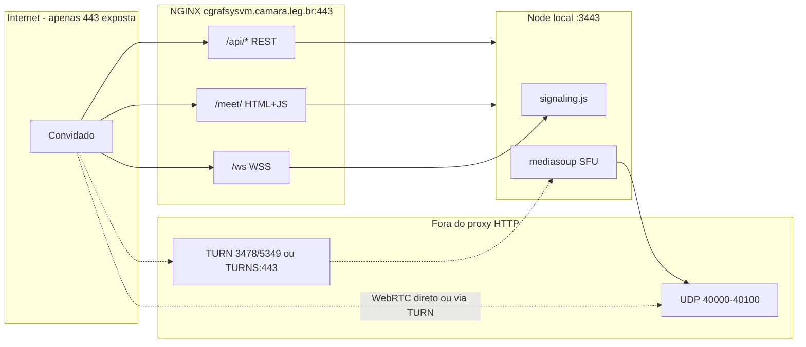

# Plano: link externo funcionando com perímetro 80/443

## Resposta direta: é possível?

| Camada | Só 80/443 no perímetro? | Situação atual |
|--------|-------------------------|----------------|
| URL do convite (`https://cgrafsysvm.camara.leg.br/meet/?token=...`) | **Sim** | [`start-producao.bat`](e:/Projetos/Trabalho/Screen%20Share/start-producao.bat) define `PUBLIC_URL=https://cgrafsysvm.camara.leg.br` (sem `:3443`) |
| Página HTML, CSS, JS, APIs REST | **Sim** | NGINX em [`nginx.conf`](//cgrafsysvm/nginx/conf/nginx.conf) escuta 80→301 e 443 com certificado `cgrafsysvm-leg` |
| WebSocket de sinalização (`wss://.../ws`) | **Sim** | Já proxied em [`cgrafsysvm-sharescreen-internet-locations.conf`](//cgrafsysvm/nginx/conf/cgrafsysvm-sharescreen-internet-locations.conf) |
| Mídia WebRTC (vídeo/áudio em tempo real) | **Não via 80/443 HTTP** | Mediasoup usa UDP **40000–40100** ([`config/default.js`](e:/Projetos/Trabalho/Screen%20Share/config/default.js)); isso **não passa** por reverse proxy |
| Mídia em redes com NAT restrito (4G, Wi‑Fi corporativo) | **Exige TURN** | Coturn em [`turn/turnserver.conf`](e:/Projetos/Trabalho/Screen%20Share/turn/turnserver.conf) usa **3478** e **5349**, relay **49160–49252** |

**Conclusão:** É possível fazer o link externo **abrir, autenticar e sinalizar** usando apenas 80/443 no perímetro. Para **vídeo e áudio funcionarem de forma confiável** com perímetro estritamente 80/443, é necessária uma solução de **TURNS na porta 443** (demux TLS com o NGINX que já ocupa 443) **ou** abertura controlada de portas adicionais no NAT corporativo. Sem uma dessas opções, o sistema LAN **não é prejudicado**, mas o convidado externo verá a interface sem mídia.



---

## O que já está correto (não alterar)

1. **Separação LAN vs Internet no NGINX**
   - Interno: `cgrafsysvm.redecamara.camara.gov.br` → [`cgrafsysvm-apps-locations.conf`](//cgrafsysvm/nginx/conf/cgrafsysvm-apps-locations.conf) (`/host`, `/client`, `/meet` completos)
   - Internet: `cgrafsysvm.camara.leg.br` → [`cgrafsysvm-sharescreen-internet-locations.conf`](//cgrafsysvm/nginx/conf/cgrafsysvm-sharescreen-internet-locations.conf) bloqueia `/host` e `/client` (404), `/meet` só com `?token=`

2. **Geração do link** — [`server/index.js`](e:/Projetos/Trabalho/Screen%20Share/server/index.js) `POST /api/link-externo` produz `https://cgrafsysvm.camara.leg.br/meet/?token=...&nome=...` quando `PUBLIC_URL` está definido.

3. **WebSocket relativo** — [`src/shared/signaling-client.js`](e:/Projetos/Trabalho/Screen%20Share/src/shared/signaling-client.js) usa `wss://${location.host}/ws`, compatível com proxy 443.

4. **ICE público** — `PUBLIC_ANNOUNCED_IP=200.219.133.192` + `TRUST_PROXY=1` em produção; [`server/network.js`](e:/Projetos/Trabalho/Screen%20Share/server/network.js) anuncia IP público nos candidatos ICE.

5. **Segurança do convite** — token em memória 24h ([`server/auth-dev.js`](e:/Projetos/Trabalho/Screen%20Share/server/auth-dev.js)); NGINX exige `?token=` em `/meet` na internet.

**Impacto na LAN:** Nenhuma das fases abaixo altera o bloco `server_name cgrafsysvm.redecamara.camara.gov.br` nem a porta interna `3443` do Node.

---

## Lacunas identificadas (causam falha parcial hoje)

### 1. APIs ausentes no bloco internet

[`cgrafsysvm-sharescreen-internet-locations.conf`](//cgrafsysvm/nginx/conf/cgrafsysvm-sharescreen-internet-locations.conf) **não** inclui:

- `GET/POST /api/registro-cliente` — usado em [`src/client/app.js`](e:/Projetos/Trabalho/Screen%20Share/src/client/app.js) no fluxo com token externo (`salvarEIniciar`)
- `GET /api/lower-third/*` — usado por lower thirds (menor prioridade para convidado; mídia principal vem do SFU)

O bloco interno em [`cgrafsysvm-apps-locations.conf`](//cgrafsysvm/nginx/conf/cgrafsysvm-apps-locations.conf) já tem essas rotas. A internet precisa espelhar **apenas** o necessário para o client externo.

### 2. TURN não está garantido em produção

[`start-producao.bat`](e:/Projetos/Trabalho/Screen%20Share/start-producao.bat) define credenciais TURN, mas **não inicia** o coturn (isso é [`scripts/start-turn.bat`](e:/Projetos/Trabalho/Screen%20Share/scripts/start-turn.bat)). Sem TURN ativo + portas no perímetro, convidados em 4G falham mesmo com sinalização OK.

### 3. Perímetro só 80/443 vs portas TURN padrão

[`config/default.js`](e:/Projetos/Trabalho/Screen%20Share/config/default.js) gera URLs TURN padrão:

- `turn:host:3478` (UDP/TCP)
- `turns:host:5349` (TCP)

Nenhuma usa **443**. Com perímetro estrito, essas portas **não alcançam** o convidado.

---

## Plano de implementação (fases)

### Fase 1 — Completar proxy NGINX na 443 (baixo risco, sem mudança de código Node)

**Arquivos a abrir:**
- [`cgrafsysvm-sharescreen-internet-locations.conf`](//cgrafsysvm/nginx/conf/cgrafsysvm-sharescreen-internet-locations.conf)
- Referência: [`nginx/sharescreen-static-locations.conf`](e:/Projetos/Trabalho/Screen%20Share/nginx/sharescreen-static-locations.conf)

**Alteração:** Adicionar blocos `location` para:
- `/api/registro-cliente` (GET e POST)
- Opcional: `^~ /api/lower-third` (se convidados precisarem de LT própria)

Copiar headers já usados nos blocos existentes (`Host`, `X-Forwarded-*`, `proxy_ssl_verify off`).

**Motivo:** Convidado com token consegue registrar nome e completar onboarding sem 502/404 na API.

**Validação:** `nginx -t && nginx -s reload` no servidor. Testar `GET https://cgrafsysvm.camara.leg.br/api/info` e `GET .../api/registro-cliente` de rede externa.

**Mapas:** Atualizar [`DEPLOY_MAP.md`](e:/Projetos/Trabalho/Screen%20Share/docs/DEPLOY_MAP.md) seção NGINX internet (rotas adicionais).

---

### Fase 2 — Garantir TURN em produção (infra, sem alterar lógica WebRTC)

**Arquivos a abrir:**
- [`turn/turnserver.conf`](e:/Projetos/Trabalho/Screen%20Share/turn/turnserver.conf)
- [`start-producao.bat`](e:/Projetos/Trabalho/Screen%20Share/start-producao.bat) ou script de serviço Windows

**Alteração:**
1. Garantir coturn rodando como serviço (paralelo ao Node).
2. Confirmar `external-ip=200.219.133.192/10.1.1.73` correto.
3. Documentar dependência de portas no [`DEPLOY_MAP.md`](e:/Projetos/Trabalho/Screen%20Share/docs/DEPLOY_MAP.md).

**Para perímetro só 80/443 — decisão de infra obrigatória (escolher uma):**

| Opção | Portas no perímetro | Complexidade | Impacto LAN |
|-------|---------------------|--------------|-------------|
| **A — TURNS na 443 com demux TLS** | Só 80/443 | Alta (stream/ssl_preread ou haproxy na frente do NGINX) | Médio — exige coordenação com apps SAGRA no mesmo `:443` |
| **B — IP público dedicado para TURN:443** | 443 em IP secundário | Média | Baixo — NGINX atual intacto |
| **C — Abertura mínima adicional** | 443 + UDP 40000–40100 + TCP/UDP 3478 | Baixa | **Nenhum** na LAN; mais comum em WebRTC |
| **D — TURN gerenciado (SaaS) na 443** | Só 443 outbound do cliente | Média (custo + config) | Baixo no código; ajustar `TURN_SERVERS` em env |

**Recomendação para seu cenário (perímetro estrito):** negociar com infra a **Opção B ou D**. A Opção C é a mais simples tecnicamente, mas viola o requisito de perímetro. A Opção A é viável, porém arriscada porque o mesmo `nginx.conf` já serve SAGRA Web e e-mail na 443.

Se a infra aceitar TURNS na 443 do mesmo hostname:
- Ajustar [`turn/turnserver.conf`](e:/Projetos/Trabalho/Screen%20Share/turn/turnserver.conf) para certificado válido (`cgrafsysvm-leg-chain.crt`)
- Definir em [`start-producao.bat`](e:/Projetos/Trabalho/Screen%20Share/start-producao.bat):
  ```
  set TURN_URLS=turns:cgrafsysvm.camara.leg.br:443?transport=tcp
  ```
- Configurar demux na borda (fora do escopo do código Node)

**Alteração mínima no código (somente se Opção B/D/C aprovada):** variáveis de ambiente `TURN_URLS` / `TURN_SERVERS` — [`config/default.js`](e:/Projetos/Trabalho/Screen%20Share/config/default.js) já suporta.

---

### Fase 3 — Validar variáveis Node (sem refatorar)

**Arquivo:** [`start-producao.bat`](e:/Projetos/Trabalho/Screen%20Share/start-producao.bat)

Confirmar antes de cada deploy:

| Variável | Valor esperado | Função |
|----------|----------------|--------|
| `PUBLIC_URL` | `https://cgrafsysvm.camara.leg.br` | URL do link (sem porta) |
| `PUBLIC_ANNOUNCED_IP` | IP público alcançável | Candidatos ICE |
| `TRUST_PROXY` | `1` | IP real via `X-Forwarded-For` |
| `TURN_USERNAME` / `TURN_PASSWORD` | iguais ao coturn | Relay para NAT simétrico |
| `TURN_URLS` | conforme opção da Fase 2 | Portas compatíveis com perímetro |

Verificar em `GET /api/info` (interno ou externo): `turnEnabled: true`, `publicAnnouncedIp` preenchido.

---

### Fase 4 — Testes de regressão (obrigatórios antes de considerar concluído)

**LAN (não pode quebrar):**
1. `https://cgrafsysvm.redecamara.camara.gov.br/host/` — host transmite
2. `https://cgrafsysvm.redecamara.camara.gov.br/client/` — client local recebe vídeo/áudio
3. Gerar link externo no host (botão em [`public/host/index.html`](e:/Projetos/Trabalho/Screen%20Share/public/host/index.html))

**Internet (4G ou rede fora da Câmara):**
4. Abrir link `https://cgrafsysvm.camara.leg.br/meet/?token=...&nome=...` → HTTP 200, sem pedir `:3443`
5. Sem token → 403 (NGINX)
6. `/host` e `/client` na internet → 404
7. WebSocket conecta (`wss://.../ws`)
8. Vídeo/áudio do host aparece no convidado (depende da Fase 2)
9. Convidado com token pode compartilhar tela (exige HTTPS 443 — já atendido)

---

## Segurança: é possível sem prejudicar o sistema?

**Sim**, desde que se mantenha a separação atual:

- **Host bloqueado na internet** (`return 404` em `/host`) — painel de transmissão só na rede interna.
- **Client local bloqueado na internet** (`return 404` em `/client`) — força uso de `/meet` com token.
- **Token obrigatório** no NGINX + validação no WebSocket ([`server/auth-dev.js`](e:/Projetos/Trabalho/Screen%20Share/server/auth-dev.js)).
- **Node continua em `127.0.0.1:3443`** — não exposto diretamente no perímetro.
- **Sem alteração** em autenticação host, PIN, banco SQLite ou rotas LAN.

**Riscos a monitorar (não corrigir automaticamente fora do escopo):**
- Token de link em memória — perdido ao reiniciar Node (convites antigos invalidam).
- Credenciais TURN visíveis no bundle via `videoQuality` (padrão WebRTC; mitigar com credenciais temporárias no futuro).
- `POST /api/link-externo` só acessível na LAN (correto); não adicionar esse endpoint no bloco internet.

---

## Limitações finais (perímetro só 80/443)

1. **WebRTC nunca passará pelo proxy HTTP 443** — é protocolo UDP/DTLS/SRTP, não HTTP.
2. **Sem TURNS:443 ou portas UDP adicionais**, convidado verá UI e status "Conectando..." indefinidamente.
3. **Host na LAN** sempre precisará de UDP **40000–40100** no firewall **interno** do servidor (já documentado em [`SYSTEM_MAP.md`](e:/Projetos/Trabalho/Screen%20Share/docs/SYSTEM_MAP.md)).
4. **Demux TLS na 443** com múltiplos apps (SAGRA, e-mail, ShareScreen) exige envolvimento da equipe de infra — não é alteração isolada no repositório.
5. **Latência e banda** via TURN são maiores que conexão UDP direta.
6. **Certificado** na internet já é CA corporativa (`cgrafsysvm-leg`) — adequado para `getDisplayMedia` externo.

---

## Arquivos previstos (resumo)

| Ação | Arquivo | Motivo |
|------|---------|--------|
| Abrir + alterar | [`cgrafsysvm-sharescreen-internet-locations.conf`](//cgrafsysvm/nginx/conf/cgrafsysvm-sharescreen-internet-locations.conf) | Completar APIs do client externo na 443 |
| Abrir (validar) | [`nginx.conf`](//cgrafsysvm/nginx/conf/nginx.conf) | Confirmar upstream `127.0.0.1:3443` e server_name internet |
| Abrir (validar) | [`start-producao.bat`](e:/Projetos/Trabalho/Screen%20Share/start-producao.bat) | `PUBLIC_URL`, ICE, TURN_URLS |
| Abrir (infra) | [`turn/turnserver.conf`](e:/Projetos/Trabalho/Screen%20Share/turn/turnserver.conf) | TURN alinhado ao perímetro |
| Espelhar no repo | [`nginx/sharescreen-static-locations.conf`](e:/Projetos/Trabalho/Screen%20Share/nginx/sharescreen-static-locations.conf) | Manter referência versionada |
| Atualizar mapa | [`DEPLOY_MAP.md`](e:/Projetos/Trabalho/Screen%20Share/docs/DEPLOY_MAP.md) | Rotas internet + nota sobre perímetro 80/443 |
| **Não alterar** | `src/`, `server/signaling.js`, `mediasoup-manager.js` | Fluxo já correto; problema é infra/proxy |

**Nenhum arquivo fora dos mapas será necessário**, exceto o `nginx.conf` de produção em `\\cgrafsysvm\nginx\conf\` (já referenciado em DEPLOY_MAP).

---

## Próximo passo após sua confirmação

1. Aprovar com a infra qual opção da Fase 2 (A/B/C/D) para mídia com perímetro 80/443.
2. Aplicar Fase 1 (NGINX) — mudança isolada, reversível com `nginx -s reload`.
3. Validar checklist da Fase 4 antes de considerar o link "funcionando perfeitamente".
