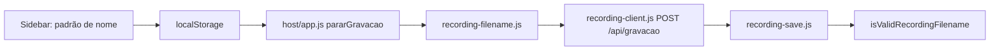

# Padrão de nome para gravações

## Contexto atual

O nome do arquivo é gerado em [`src/shared/recording-filename.js`](e:/Projetos/Trabalho/Screen%20Share/src/shared/recording-filename.js) pela função `formatRecordingFilename()`, com formato fixo:

```17:25:src/shared/recording-filename.js
export function formatRecordingFilename(endDate = new Date()) {
  const y = endDate.getFullYear();
  const m = endDate.getMonth();
  const mes = MESES[m] || 'Mes';
  const mm = String(m + 1).padStart(2, '0');
  const dd = String(endDate.getDate()).padStart(2, '0');
  const hh = String(endDate.getHours()).padStart(2, '0');
  const nn = String(endDate.getMinutes()).padStart(2, '0');
  return `${y} ${mes}${mm} ${dd} ${hh}h${nn}.webm`;
}
```

Chamada em [`src/host/app.js`](e:/Projetos/Trabalho/Screen%20Share/src/host/app.js) ao parar a gravação (`pararGravacao`, linha ~1307).

O servidor valida o nome em [`server/recording-save.js`](e:/Projetos/Trabalho/Screen%20Share/server/recording-save.js) via `isValidRecordingFilename()`, com regex **rígida** que só aceita o formato legado — **precisa ser relaxada** para nomes customizados, senão o upload falhará.



---

## Arquivos a abrir (somente leitura prévia já feita)

| Arquivo | Motivo |
|---|---|
| [`src/shared/recording-filename.js`](e:/Projetos/Trabalho/Screen%20Share/src/shared/recording-filename.js) | Lógica de formatação e validação |
| [`src/host/app.js`](e:/Projetos/Trabalho/Screen%20Share/src/host/app.js) | Persistência e uso do padrão |
| [`public/host/index.html`](e:/Projetos/Trabalho/Screen%20Share/public/host/index.html) | Campo no sidebar de gravação |
| [`server/recording-save.js`](e:/Projetos/Trabalho/Screen%20Share/server/recording-save.js) | Confirmar impacto da validação (sem alteração direta) |

## Arquivos a alterar

### 1. [`src/shared/recording-filename.js`](e:/Projetos/Trabalho/Screen%20Share/src/shared/recording-filename.js)

**Motivo:** Suportar padrão customizado sem quebrar o default.

- Alterar assinatura: `formatRecordingFilename(endDate, pattern?)`.
- Se `pattern` estiver vazio/ausente → **manter bloco atual intacto** (mesmo output de hoje).
- Se `pattern` preenchido → substituir variáveis:
  - `{YYYY}` → ano 4 dígitos
  - `{MM}` → mês 2 dígitos (`01`–`12`)
  - `{DD}` → dia 2 dígitos
  - `{HH}` → hora 2 dígitos
  - `{NN}` → minuto 2 dígitos
  - `{MES}` → nome do mês em português (Janeiro, Fevereiro, …)
- Anexar `.webm` automaticamente se o padrão não terminar com `.webm`.
- Relaxar `isValidRecordingFilename()` para aceitar qualquer basename seguro terminando em `.webm` (sem `/`, `\`, `..`, caracteres proibidos no Windows, tamanho máximo ~200). O formato legado continua válido.

Exemplo com padrão `{YYYY} Mes{MM} {DD} {HH}h{NN} - Apogee - Aula Sem6 1Dia M1` → `2026 Mes06 30 09h45 - Apogee - Aula Sem6 1Dia M1.webm`.

### 2. [`public/host/index.html`](e:/Projetos/Trabalho/Screen%20Share/public/host/index.html)

**Motivo:** UI no sidebar, seção Gravação (antes de "Destino da gravação").

- Campo de texto `id="recording-filename-pattern-input"`.
- Label: **Padrão de nome do arquivo**.
- Placeholder com exemplo e variáveis disponíveis (`{DD} {MM} {YYYY} {HH} {NN} {MES}`).
- Hint curto: campo vazio = padrão atual do sistema.

Estilo reutiliza o mesmo padrão visual do campo `recordings-dir-input` (sem CSS novo).

### 3. [`src/host/app.js`](e:/Projetos/Trabalho/Screen%20Share/src/host/app.js)

**Motivo:** Persistir preferência e aplicar na gravação.

- Constante `STORAGE_RECORDING_FILENAME_PATTERN = 'sharescreen_recording_filename_pattern'`.
- Referência em `els`: `recordingFilenamePatternInput`.
- Função `setupRecordingFilenamePattern()` (espelhando `setupRecordingsDirInput()`):
  - Carregar valor do `localStorage` no input.
  - Salvar em `input` event.
- Em `pararGravacao()`:
  ```js
  const pattern = localStorage.getItem(STORAGE_RECORDING_FILENAME_PATTERN) || '';
  const filename = formatRecordingFilename(new Date(), pattern);
  ```
- Chamar `setupRecordingFilenamePattern()` nos dois blocos de init do host (linhas ~2214 e ~2595, onde já existe `setupRecordingsDirInput()`).

**Não alterar:** `recording-client.js`, backend, banco, deploy, autenticação.

---

## Compatibilidade garantida

| Cenário | Comportamento |
|---|---|
| Campo vazio (default) | `formatRecordingFilename(date)` sem pattern → nome idêntico ao atual |
| Padrão customizado | Substituição de variáveis + `.webm` |
| Upload existente | Fluxo `POST /api/gravacao` inalterado; só muda o header `X-Recording-Filename` |
| `stopAndUpload()` | Não usado no host; permanece com default legado (sem impacto) |

---

## Build e testes

Após as alterações em `/src`, executar `npm run build` para regenerar [`public/host/app.bundle.js`](e:/Projetos/Trabalho/Screen%20Share/public/host/app.bundle.js).

**Como testar:**
1. Abrir `/host/`, sidebar → Configurações → Gravação.
2. **Sem padrão:** gravar e parar → nome deve ser `YYYY MêsMM DD HHhNN.webm` (ex.: `2026 Julho01 30 09h45.webm`).
3. **Com padrão:** `{YYYY} Mes{MM} {DD} {HH}h{NN} - Apogee - Aula Sem6 1Dia M1` → verificar nome salvo e toast de sucesso.
4. Recarregar página → padrão deve persistir no input.
5. Testar padrão com `{MES}` (ex.: `{YYYY} {MES}{MM} {DD}`).

**Riscos / atenção:**
- A validação mais permissiva em `isValidRecordingFilename` é necessária; continua bloqueando path traversal e caracteres inválidos.
- Caracteres proibidos no Windows (`<>:"|?*`) no texto fixo do padrão farão o upload falhar — comportamento esperado; não sanitizar silenciosamente para não surpreender o usuário.
- Mapas `.md` **não serão atualizados** (ajuste pontual de UI + extensão de módulo existente, sem mudança estrutural).
