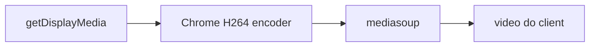

# Qualidade nativa (mais próxima da tela de origem)

## Por que ficou terrível

A alteração anterior fez [`pickScreenCodec`](src/shared/quality-manager.js) escolher **High `64002a`**. O encoder de tela do Chrome é quase sempre **Constrained Baseline em hardware**. High cai no OpenH264 por software: CPU não acompanha 1080p/4K, a imagem fica ruim o tempo todo e **não “melhora com o tempo”** (isso era o ramp do encoder de hardware no Baseline).

Level 3.1 (`42e01f`, primeiro codec do router) também é insuficiente para 1080p/4K. O alvo robusto é **Constrained Baseline no maior level** (`42e02a` = 4.2; incluir 5.1 para 4K).

Há um segundo cap: [`buildDisplayMediaConstraints`](src/shared/quality-manager.js) pede `width/height: screen.width/height` (pixels CSS). Em Windows com DPI 125–200% isso **reduz** a captura abaixo da tela física.

O caminho do viewer (`consume` + `object-fit: contain`) não é o problema. Studio compositor (cap 1080) fica fora deste plano: não é o feed padrão da sala.

Codec só muda no próximo `produce`. Depois do deploy é preciso **parar e compartilhar de novo**. Bitrate ao vivo (`applyLiveVideoQuality`) permanece.

## Alterações

### 1. Escolher codec de hardware — [`src/shared/quality-manager.js`](src/shared/quality-manager.js)

- `pickScreenCodec`: com `preferH264`, entre os `video/h264` preferir profile **`42` (Constrained Baseline)** com **maior level**; só então Main/High. VP8 só se não houver H.264.
- `buildDisplayMediaConstraints`: **não** definir `width`/`height`. Manter `frameRate`, `resizeMode: 'none'`.
- `buildVideoProduceOptions` encodings: `scaleResolutionDownBy: 1`, `priority`/`networkPriority: 'high'`, `maxBitrate`/`maxFramerate` como hoje.
- Helper `applySenderResolutionPreference(producer)`: `rtpSender.getParameters()`, `degradationPreference = 'maintain-resolution'`, `setParameters` em try/catch (não fecha producer).

### 2. Router — [`server/mediasoup-manager.js`](server/mediasoup-manager.js)

Reordenar `mediaCodecs` de vídeo:

1. H.264 CBP **5.1** `42e033` (novo, 4K)
2. H.264 CBP **4.2** `42e02a`
3. H.264 CBP **3.1** `42e01f` (fallback)
4. Main / High / VP8 como hoje

Não mexer em `maxVideoBitrate` / `maxIncomingBitrate` (já 32/40 Mbps).

### 3. Producer ao vivo — [`src/shared/media-client.js`](src/shared/media-client.js)

Após cada `produce` de vídeo e em `applyLiveVideoQuality`:

- chamar `applySenderResolutionPreference`
- `setRtpEncodingParameters` incluir `scaleResolutionDownBy: 1` além de bitrate/fps
- logar `profile-level-id` escolhido + `getSettings()` width/height (o log de captura já existe)

Não recriar producer/consumer.

### 4. Testes e build

Atualizar [`scripts/quality-manager-smoke.js`](scripts/quality-manager-smoke.js): o mock deve escolher **`42e02a`**, não `64002a`; constraints de display **sem** width/height. `npm run test:quality`, `npm run check`, `npm run build`.

## O que não fazer

- Não forçar High/Main para “qualidade”.
- Não recriar a sessão para mudar bitrate.
- Não alterar áudio, ICE, studio compositor, CSS do player.

## Verificação

- Parar e **recompartilhar** a tela após o build (codec novo).
- Viewer: texto de UI e 1080p/4K nítidos; host muda Máxima/Alta sem cortar a sala.
- Log do host deve mostrar H.264 `42e02a` ou `42e033` e resolução da captura próxima da tela física, não 1280×720.

Incerteza: se a LAN tiver perda, o GCC ainda baixa bitrate (teto alto, resolução mantida). Encoder de hardware depende do GPU do transmissor.
