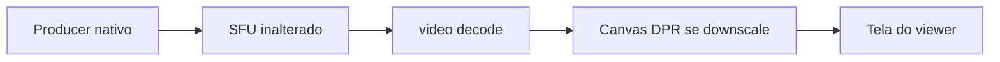

# Adaptação visual no viewer (sem mexer na transmissão)

## O que está acontecendo

A captura continua nativa (ex. 1920×1080 ou 4K). O viewer coloca o `<video>` em 100% com `object-fit: contain` ([`public/client/style.css`](public/client/style.css)). O Chrome reduz esse bitmap para o retângulo CSS e, em DPI 125–200%, o compositor escala de novo para pixels físicos.

Dois reamostramentos em conteúdo de tela (texto/ícones) geram o aspecto **mole**, sem a transmissão estar ruim.

Não usar simulcast, `scaleResolutionDownBy` no producer, nem baixar o bitrate: isso pioraria quem assiste em tela grande e o encode.

## Estratégia

Módulo de **apresentação** compartilhado. Só desenha uma cópia já ajustada ao tamanho **físico** do monitor do espectador. O WebRTC segue full-res.

Ativar o canvas somente se a escala for menor que ~0,98 (está encolhendo) **ou** `devicePixelRatio !== 1` com downscale. Se o vídeo já cabe 1:1 (tela cheia igual à origem), o `<video>` nativo permanece visível — zero custo extra.

O `<video>` continua no DOM (`object-fit: contain`, `opacity: 0` quando o canvas está ativo) para:

- `srcObject` / consume / preview local iguais
- [`getVideoContentRect`](src/shared/drawing-primitives.js) inalterado (anotações, LT, quadro)
- gravação e studio continuam lendo o elemento/stream nativo, não o canvas

## Alterações

### 1. [`src/shared/playback-scaler.js`](src/shared/playback-scaler.js) (novo)

- `shouldPresentScaled(videoW, videoH, cssW, cssH, dpr)` — true se `min(cssW/videoW, cssH/videoH) * dpr < 0.98`.
- `attachPlaybackScaler({ video, container })`:
  - cria canvas `playback-scale-canvas` (position absolute, inset 0, `pointer-events: none`, z-index abaixo de overlays/anotações)
  - `ResizeObserver` no container + `resize` do vídeo + `visibilitychange`
  - loop `requestVideoFrameCallback` (fallback `rAF`)
  - backing store = `cssW * dpr` × `cssH * dpr`; `drawImage` no retângulo contain (mesma conta de `getVideoContentRect`); `imageSmoothingEnabled = true`, `imageSmoothingQuality = 'high'`
  - canvas on: vídeo `opacity: 0`; canvas off: vídeo `opacity: 1`, parar o loop
  - `detach()` no teardown da sessão
- Não tocar em track, producer, consumer.

### 2. Ligar no client e no host (mesmo sintoma no preview)

- [`src/client/app.js`](src/client/app.js): attach em `#video-remoto` / `#preview-area` após o vídeo existir; detach em teardown.
- [`src/host/app.js`](src/host/app.js): attach em `#preview-video` / `.preview-area` principal (não nos canvas do studio).

CSS mínimo em [`public/client/style.css`](public/client/style.css) e [`public/host/style.css`](public/host/style.css): `.playback-scale-canvas { position:absolute; inset:0; pointer-events:none; }`. Build já copia host → `public/shared/host-style.css`.

### 3. Testes

Em [`scripts/quality-manager-smoke.js`](scripts/quality-manager-smoke.js) (ou smoke curto no mesmo estilo): `shouldPresentScaled(1920,1080,900,500,1) === true`, `shouldPresentScaled(1920,1080,1920,1080,1) === false`. `npm run test:quality`, `check`, `build`.

## O que não fazer

- Não alterar [`quality-manager.js`](src/shared/quality-manager.js) encode, router, `applyLiveVideoQuality`.
- Não reamostrar no compositor do studio / gravação.
- Não mudar z-index das anotações acima do canvas de apresentação.

## Verificação

- Viewer em janela pequena: texto/ícones mais nítidos; letterbox contain igual.
- Mesmo viewer em tela cheia ~igual à origem: canvas desliga, imagem continua nativa.
- Anotar / LT / fullscreen / trocar fonte: overlay alinhado; outros viewers em monitor grande inalterados.
- Transmitir: bitrate/resolução do producer iguais (só o desenho local muda).
