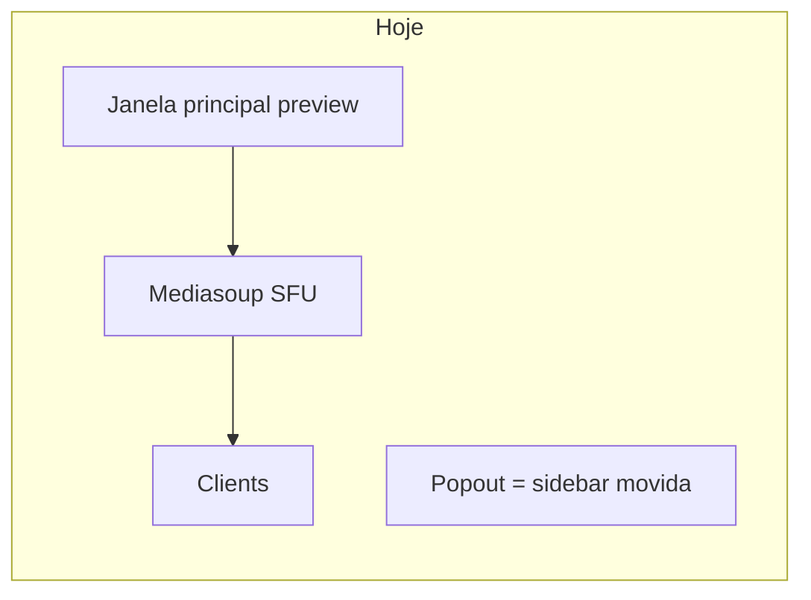
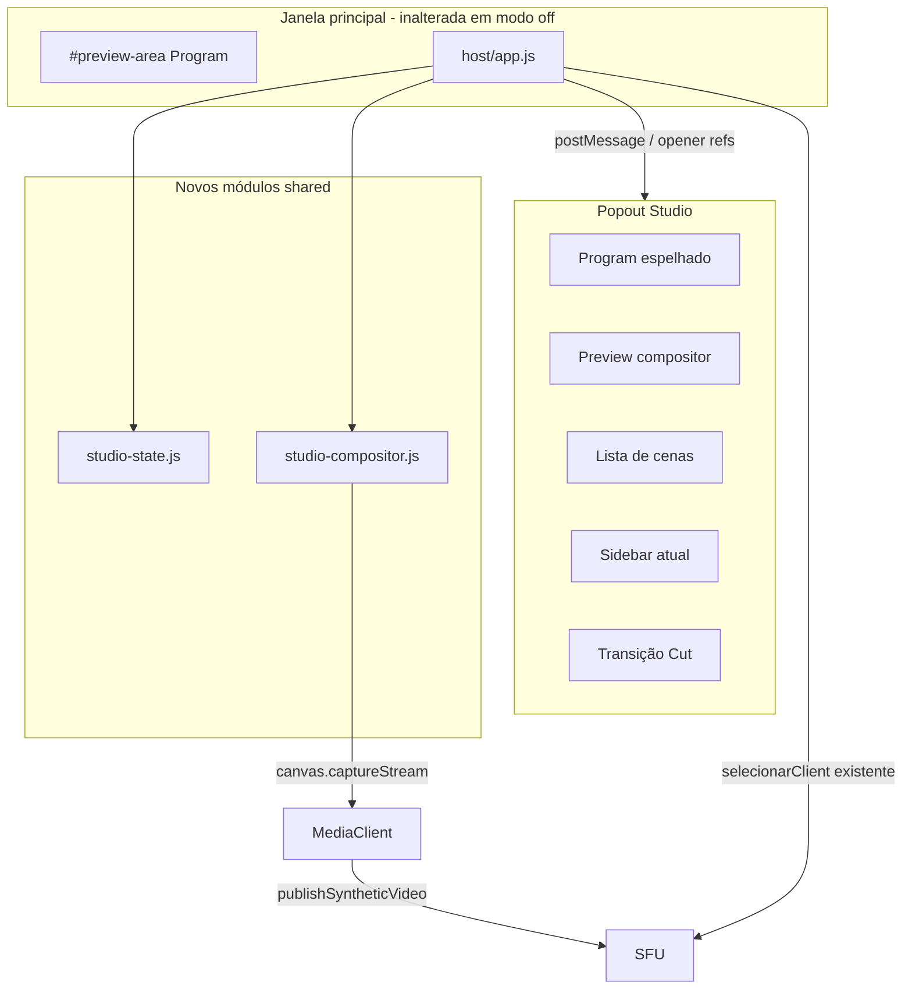
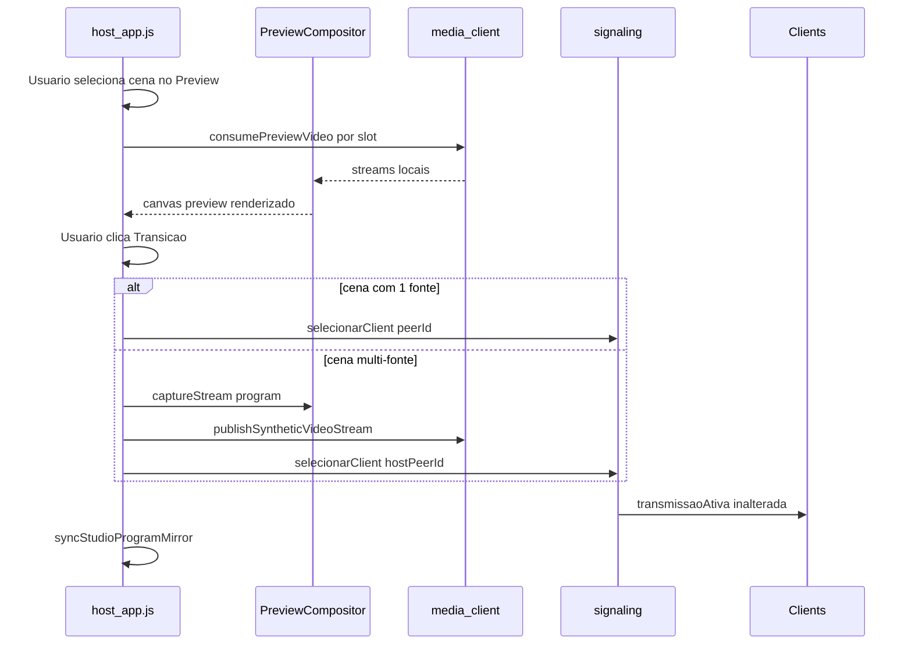

# Plano: Painel Studio OBS na aba popout do Host

## Estado atual (baseline a preservar)

A funcionalidade existe em [`src/host/app.js`](e:/Projetos/Trabalho/Screen Share/src/host/app.js) (~L2280–2432):

- Botão `#btn-popout-controls` abre `window.open('about:blank', 'sharescreen-controls')`.
- A **sidebar inteira** (`#sidebar`) é movida para o popout via DOM reparenting.
- CSS em [`public/host/style.css`](e:/Projetos/Trabalho/Screen Share/public/host/style.css) (`.controls-popout-body`).
- A janela principal fica só com `#preview-area` (Program implícito).
- **Uma fonte ao vivo** por vez: `room-manager.selectedPeerId` + `selecionarClient` via WebSocket — sem mudança necessária no backend.



## Conceitos OBS aplicáveis a este sistema

| OBS Studio | ShareScreen LAN (proposta) | Viável sem quebrar o sistema |
|---|---|---|
| Scenes | Cenas nomeadas com 1–4 slots de fonte + layout (full / split / PiP) | Sim — estado só no host |
| Sources | Participantes com `hasVideoProducer()` + tela do próprio host | Sim — lista já existe em `estado.clients` |
| Program | O que está no ar (`estado.selecionado` / `#preview-video` na janela principal) | Sim — sem alterar SFU |
| Preview | Cena preparada antes do "Go Live" | Sim — consumidores auxiliares locais |
| Studio Mode | Toggle: clique em fonte **prepara** preview; botão **Transição** chama `selecionar()` | Sim — interceptação condicional |
| Transitions | v1: **Cut** (instantâneo); v2 opcional: fade CSS | Sim — Cut usa API existente |
| Multi-source layout | Compositor canvas no host → novo producer sintético | Sim — padrão já usado em gravação |

**Fora de escopo (não aplicável ou alto risco):** filtros OBS, transições complexas (stinger), gravação por cena, virtual cam do SO, áudio mixado multi-fonte em tempo real (v1 mantém áudio da fonte primária da cena).

## Arquitetura proposta



### Regra de ouro de compatibilidade

- **`studioModeEnabled === false`**: popout funciona **exatamente como hoje** (só sidebar movida, clique em participante chama `selecionar()` imediatamente).
- **`studioModeEnabled === true`**: popout ganha região Studio acima da sidebar; cliques preparam preview; só **Transição** altera o que está no ar.

Nenhuma alteração em [`server/room-manager.js`](e:/Projetos/Trabalho/Screen Share/server/room-manager.js), [`server/signaling.js`](e:/Projetos/Trabalho/Screen Share/server/signaling.js), banco, deploy ou [`src/client/app.js`](e:/Projetos/Trabalho/Screen Share/src/client/app.js).

---

## Fase 1 — Infraestrutura segura (sem mudar o que vai ao ar)

### Arquivos a **abrir** (somente leitura inicial + edição pontual)

| Arquivo | Motivo |
|---|---|
| [`docs/SYSTEM_MAP.md`](e:/Projetos/Trabalho/Screen Share/docs/SYSTEM_MAP.md) | Já consultado — referência |
| [`docs/FRONTEND_MAP.md`](e:/Projetos/Trabalho/Screen Share/docs/FRONTEND_MAP.md) | Já consultado — referência |
| [`src/host/app.js`](e:/Projetos/Trabalho/Screen Share/src/host/app.js) | Popout, seleção, preview |
| [`src/shared/media-client.js`](e:/Projetos/Trabalho/Screen Share/src/shared/media-client.js) | Consumidores auxiliares + producer sintético |
| [`src/shared/recording-compositor.js`](e:/Projetos/Trabalho/Screen Share/src/shared/recording-compositor.js) | Padrão canvas `captureStream` a reutilizar |
| [`public/host/index.html`](e:/Projetos/Trabalho/Screen Share/public/host/index.html) | Template `<template id="studio-popout-shell">` |
| [`public/host/style.css`](e:/Projetos/Trabalho/Screen Share/public/host/style.css) | Layout Studio no popout |

### Arquivos a **criar**

**1. [`src/shared/studio-state.js`](e:/Projetos/Trabalho/Screen Share/src/shared/studio-state.js)** (novo, isolado)

- Modelo de cena:

```js
{
  id: 'scene-uuid',
  name: 'Entrevista',
  layout: 'pip-br', // 'full' | 'split-h' | 'split-v' | 'pip-br' | 'pip-bl'
  slots: [
    { peerId: 'abc', producerId: '...', label: 'Notebook João' },
    { peerId: 'def', producerId: '...', label: 'Mesa B' }
  ],
  primaryAudioPeerId: 'abc' // áudio da transição
}
```

- Persistência em `sessionStorage` (`sharescreen_studio_scenes_v1`) — sem DB.
- API: `createScene`, `updateScene`, `deleteScene`, `setPreviewScene`, `getProgramScene`, `studioModeEnabled`.
- Limite v1: **máx. 4 slots** por cena.

**2. [`src/shared/studio-compositor.js`](e:/Projetos/Trabalho/Screen Share/src/shared/studio-compositor.js)** (novo)

- Baseado no loop `requestAnimationFrame` de [`recording-compositor.js`](e:/Projetos/Trabalho/Screen Share/src/shared/recording-compositor.js).
- Entrada: array de `{ videoEl | MediaStream, rect: {x,y,w,h} normalizado 0–1 }`.
- Saída: `{ stream, stop, canvas }` via `canvas.captureStream(30)`.
- Layouts fixos pré-calculados (sem editor drag livre na v1 — reduz risco e escopo).

### Arquivos a **alterar** (mínimo)

**3. [`src/shared/media-client.js`](e:/Projetos/Trabalho/Screen Share/src/shared/media-client.js)** — extensão cirúrgica

| Adição | Impacto | Mitigação |
|---|---|---|
| `previewVideoConsumers: Map<producerId, consumer>` | Permite N previews sem fechar Program | Não toca `remoteConsumers.video` usado hoje |
| `consumePreviewVideo(producerId, videoEl)` | Novo método paralelo a `consumeRemoteMedia` | Reutiliza `_consumeOne` + cache por producerId |
| `closePreviewConsumers()` | Cleanup ao fechar popout / desligar studio | Chamado em `finalizePopoutDock` |
| `publishSyntheticVideoStream(stream)` | Publica track de canvas sem `getDisplayMedia` | Só chamado em transição de cena composta |
| `stopSyntheticVideo()` | Para compositor e fecha producer sintético | Restaura estado anterior |

**Não alterar** a lógica existente de `consumeRemoteMedia` / `closeActiveVideoConsumer` — Program continua pelo caminho atual.

**4. [`src/host/app.js`](e:/Projetos/Trabalho/Screen Share/src/host/app.js)**

- Refatorar `setupPopoutDocument` / `openControlsPopout`:
  - Inserir shell Studio (`#studio-popout-root`) **acima** da sidebar movida.
  - Aumentar janela para ~`width=960,height=880` (só quando studio ON; OFF mantém 320×800).
- Novas funções locais (ou import de módulo leve):
  - `initStudioPopout(win)` — monta UI, listeners.
  - `syncStudioProgramMirror()` — espelha `els.preview.srcObject` no `<video id="studio-program">` do popout (MediaStream compartilhável entre janelas no mesmo browser).
  - `renderStudioScenes()` — lista de cenas + editor simples (nome, layout, adicionar fonte da lista de participantes).
  - `applyStudioPreview(scene)` — consome previews + roda compositor no painel Preview.
  - `executeStudioTransition()` — **único ponto** que muda o ar:
    - **Cena 1 fonte**: `selecionar(peerId)` (fluxo atual, zero compositor).
    - **Cena multi-fonte**: `publishSyntheticVideoStream` + `selecionar(hostPeerId)`.
  - Interceptar callback de `buildSourceCard` em studio mode: adiciona slot à cena em edição em vez de `selecionar()`.

**5. [`public/host/index.html`](e:/Projetos/Trabalho/Screen Share/public/host/index.html)**

- Adicionar `<template id="studio-popout-shell">` com:
  - Toggle "Modo Estúdio"
  - Painéis Program / Preview + labels
  - Botão "Transição" (Cut)
  - Lista de cenas + botões Nova / Duplicar / Remover
  - Seletor de layout (dropdown)
  - Área de slots da cena ativa

**6. [`public/host/style.css`](e:/Projetos/Trabalho/Screen Share/public/host/style.css)**

- Grid OBS-like no popout: Program | Preview lado a lado; cenas abaixo; sidebar existente na base.
- Estados visuais: cena ativa no Program (borda verde), cena no Preview (borda amarela).
- `.studio-mode-off` oculta região studio — sidebar ocupa 100% como hoje.

**7. Build:** `npm run build` (sem mudança em [`scripts/build-client.js`](e:/Projetos/Trabalho/Screen Share/scripts/build-client.js)).

---

## Fase 2 — Comportamento Studio Mode (lógica de transição)

### Fluxo Program / Preview



### Áudio na transição (v1 conservador)

- **Cena 1 fonte:** comportamento atual (áudio da fonte selecionada via SFU).
- **Cena composta:** áudio do slot `primaryAudioPeerId` (dropdown na cena); **não** mixar múltiplos áudios na v1 (evita eco e regressão no `audio-manager`).

### Gravação

- Se Program = host sintético composto, gravação segue o vídeo/áudio já ouvidos no host (mesmo caminho de [`recording-compositor.js`](e:/Projetos/Trabalho/Screen Share/src/shared/recording-compositor.js)).
- **Risco:** badge/gravação pode precisar de teste manual com cena composta — sem alterar código de gravação na v1.

---

## Matriz de impacto por alteração

| Alteração | Áreas afetadas | Risco | Rollback |
|---|---|---|---|
| Template + CSS studio no popout | Só UI popout | Baixo | Toggle OFF = UI oculta |
| `studio-state.js` | Só host | Nenhum | Módulo independente |
| `consumePreviewVideo` | Host consumo extra | Médio | Fechar previews no dock; não afeta Program |
| `publishSyntheticVideoStream` | Host producer + seleção | **Alto** | Só em transição multi-fonte; fallback para seleção direta |
| Interceptar clique em participante | Só com studio ON | Médio | Flag `studioModeEnabled` |
| Mover sidebar (existente) | Popout | Baixo | Já testado em produção |

### O que **não** será alterado

- Backend WebSocket / `selecionarClient` / `transmissaoAtiva`
- Mediasoup router/codecs/portas
- Client viewer, lower-thirds, anotações live
- Autenticação, deploy, nginx, SQLite
- Layout da janela principal (exceto espelhamento passivo do stream no popout)

---

## Ordem de implementação (segura)

1. **CSS + template** do shell Studio (studio OFF — zero mudança funcional).
2. **`studio-state.js`** + persistência sessionStorage.
3. **`consumePreviewVideo`** em media-client + testes isolados (preview de 1 client sem mudar Program).
4. **`studio-compositor.js`** com layout `split-h` e `pip-br`.
5. **Preview pane** no popout (studio ON, transição ainda desabilitada).
6. **`publishSyntheticVideoStream`** + transição multi-fonte.
7. **Interceptação de cliques** + botão Transição + espelho Program.
8. **`closePreviewConsumers` / cleanup** em `finalizePopoutDock` e `pagehide`.
9. `npm run build` + testes manuais abaixo.

---

## Como testar (checklist de regressão)

**Regressão obrigatória (studio OFF):**
1. Abrir popout → sidebar idêntica; selecionar fonte → vai ao ar imediatamente.
2. Fechar popout / janela → sidebar volta; preview principal intacto.
3. Áudio, mute, pausa, gravação, lower-thirds, anotações live — tudo com studio OFF.

**Studio ON — cena 1 fonte:**
4. Preparar cena com 1 participante → Preview mostra stream correto.
5. Transição → mesmo resultado que clicar no participante hoje.
6. Trocar preview para outra cena → Program não muda até Transição.

**Studio ON — cena multi-fonte:**
7. 2 clients transmitindo → layout split → Preview mostra ambos.
8. Transição → viewers veem layout composto; host aparece como fonte selecionada.
9. Transição para cena 1 fonte → volta ao consumer direto do client; compositor parado.

**Edge cases:**
10. Fonte desconecta durante preview → slot mostra placeholder preto; transição bloqueada com toast.
11. Popout fechado com studio ativo → cleanup de consumers preview e compositor.
12. Co-host / `controleExibicao` — confirmar que não interfere (co-host não usa popout studio na v1).

---

## Atualização de mapas

Atualizar **somente** [`docs/FRONTEND_MAP.md`](e:/Projetos/Trabalho/Screen Share/docs/FRONTEND_MAP.md) — nova seção:

- Módulos `studio-state.js`, `studio-compositor.js`
- Fluxo "Popout Studio Mode" em `src/host/app.js`
- Extensões pontuais em `media-client.js` (preview consumers + synthetic producer)

**Não** atualizar BACKEND_MAP, DATABASE_MAP ou DEPLOY_MAP.

---

## Riscos e pontos de atenção

1. **CPU/GPU no host** — compositor 2–4 streams @ 30fps; limitar a 4 slots e 1080p output.
2. **Latência** — +1 frame de canvas; aceitável em LAN, monitorar em máquinas fracas.
3. **Producer sintético** — se `publishSyntheticVideoStream` falhar, toast + manter Program anterior (não chamar `selecionar`).
4. **Conflito com host compartilhando tela** — cena composta usa producer sintético; slot do host usa `localScreenStream` se ativo, senão placeholder.
5. **Janela popout pequena** — studio ON exige resolução mínima recomendada 960×700.

## Fora de escopo desta entrega (informar se encontrado)

- Transições fade/dissolve animadas
- Editor drag-and-drop livre de layout
- Mixagem de áudio multi-fonte
- Persistência de cenas no SQLite
- Studio mode no client ou co-host
