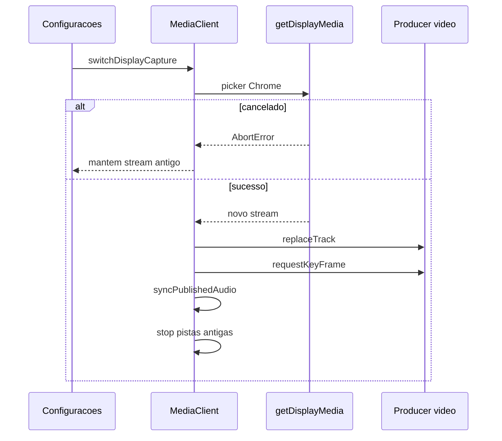

# Trocar tela compartilhada sem recarregar

## O que muda (e o que não muda)

Hoje a captura é única: host chama [`startScreenShare`](src/shared/media-client.js) e client usa [`promptDisplayCapture`](src/client/app.js) no onboarding. [`startScreenShare`](src/shared/media-client.js) **para o producer e as pistas antes** de abrir o diálogo. Se o usuário cancelar, a transmissão some. Parar pelo Chrome dispara `sharescreen-ended` e, no client, volta ao onboarding.

O botão novo **não** troca o participante no ar (isso já existe nos cards do host e em “Trocar fonte”). Ele só troca **a superfície capturada nesta máquina**.

**Não alterar:** sinalização (`produzir` / `selecionarFonte`), seleção de programa da sala, microfone/DSP, monitor de áudio, reconnect WS, gravação (o compositor continua no mesmo `producerId`), quadro branco/studio (producer sintético permanece).

## Núcleo: `MediaClient.switchDisplayCapture`

Arquivo: [`src/shared/media-client.js`](src/shared/media-client.js)

Novo método (não reutilizar `startScreenShare`):

1. Guard contra reentrada (`_switchDisplayInFlight`).
2. `getDisplayMedia` **primeiro** (`requestDisplayCapture`), com prefs atuais de áudio da aba.
3. Cancelamento (`NotAllowedError` / `AbortError`): return `{ ok: false, cancelled: true }` **sem** tocar no stream atual.
4. `stripMonitorSystemAudio` + hints de áudio da aba (mesmo pipeline de `publishDisplayStream`).
5. Com producer de vídeo aberto e **sem** vídeo sintético: `producers.video.replaceTrack({ track })` + `requestKeyFrame`.
6. Sem producer (raro, captura viva mas producer morto): `publishDisplayStream` no stream novo (já existe close-then-produce no slot; a sala reemite estado).
7. Só depois do sucesso: parar pistas do stream antigo; apontar `localScreenStream`; ligar `ended` no track novo; `syncPublishedAudio` para republicar **system** se a prefs pedir. Microfone **não** entra nesse fluxo.
8. Durante a troca, um flag tipo `suppressShareEndedHandler` (já existe no client; o host precisa do equivalente) para o `ended` do track antigo **não** ser tratado como “usuário parou de compartilhar”.

Vídeo sintético (quadro branco / studio): **não** chamar `replaceTrack` no producer (ele está no canvas). Atualizar só `localScreenStream` para o restore posterior, ou recusar com toast “encerre o quadro/studio para trocar a tela”. Preferência: recapturar em background e deixar o sintético no ar — assim `restoreScreenVideoProducer` já usa a tela nova.

## UI

**Host** — seção Imagem em [`public/host/index.html`](public/host/index.html) (`#details-imagem`), abaixo do bitrate:

- Botão `Trocar tela` (`#btn-host-switch-screen`).
- Hint curto: abre o diálogo do navegador; cancelar mantém a captura atual.

Handler em [`src/host/app.js`](src/host/app.js): clique → `media.switchDisplayCapture(getHostCapturePrefs())` → se ok, `bindHostSelfPreview` quando o programa for o próprio host; `setStatus` / toast. Estilo em [`public/host/style.css`](public/host/style.css) (o build copia para `public/shared/host-style.css`).

**Client** — modal em [`public/client/index.html`](public/client/index.html):

- Botão `Trocar tela` visível só se houver captura/producer ao vivo e **não** for espectador.
- Mesmo fluxo: `switchDisplayCapture` + atualizar `clientDisplayStream` para o stream retornado.
- Preview local (`#video-remoto` quando o próprio client está selecionado) deve apontar para o stream novo (mesmo critério de [`getLocalPreviewStream`](src/client/app.js)).
- Espectador: botão oculto; persistir no onboarding sem sessão publicada.

`getDisplayMedia` exige gesto do usuário: o clique no botão é o gesto; não disparar o picker em `Salvar`.

## O que precisa permanecer intacto

| Área | Como preservar |
|------|----------------|
| Microfone / filtros | Não chamar `stopVideoShare` / `dispose`; `syncPublishedAudio` só no canal system |
| Consumers remotos | `replaceTrack` mantém `producerId`; não precisam `consumir` de novo |
| Reconnect | Stream novo vira `localScreenStream` / `clientDisplayStream`, o mesmo que `rejoinSession` já preserva |
| Áudio de aba | Full-screen continua sem system audio (`stripMonitorSystemAudio`); janela/aba republica se o checkbox estiver ligado |
| `sharescreen-ended` | Só o stop real do Chrome (barra “Parar”) deve encerrar; troca in-app suprime o ended antigo |
| Qualidade | Encodings do producer atual; não recapturar só por mudar bitrate |
| Controle de exibição | Continua listando peers; não misturar com este botão |

## Testes e verificação

- `npm run check` e `npm run test:smoke` (regressão).
- `npm run build` para bundles (não editar `public/*/app.bundle.js` à mão).
- Manual (obrigatório, WebRTC):
  1. Host compartilhando monitor A → Configurações → Trocar tela → monitor B; clients veem B sem reload; mic continua.
  2. Cancelar o diálogo: captura A permanece.
  3. Client publisher: mesmo fluxo; se ele for o programa da sala, host e outros clients atualizam.
  4. Trocar para aba com áudio da aba ligado; full-screen sem áudio de sistema.
  5. Host com quadro branco: programa continua no quadro; ao sair, restore usa a tela nova (ou o toast de recusa, se essa variante for a implementada).
  6. Gravação em andamento no host: não cortar ao trocar tela do peer selecionado.

Não há teste automatizado de `getDisplayMedia`; não inventar mock pesado só para isto.
