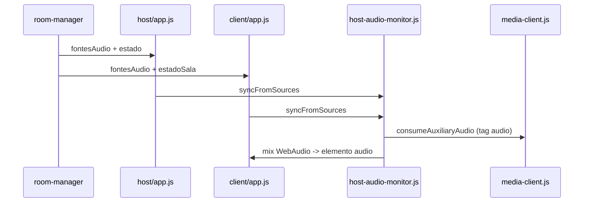
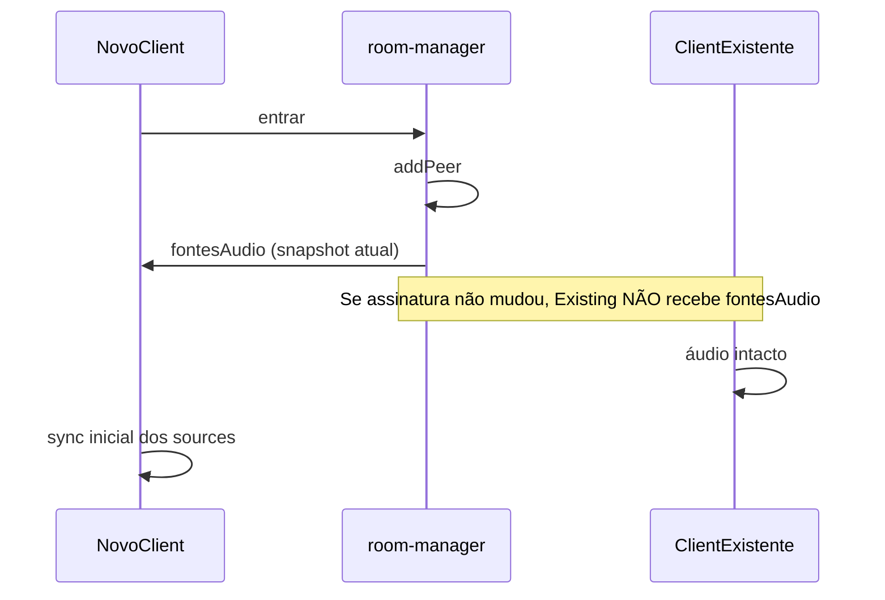

# Plano: áudio compartilhado robusto (entrada tardia de participantes)

## Diagnóstico

### Sobre `?_sv=2026-07-01T14-39-14-u6dzqh`
**Não é autenticação.** É o `BUILD_ID` gerado em cada build, injetado por [`scripts/cache-guard-snippet.js`](e:/Projetos/Trabalho/Screen%20Share/scripts/cache-guard-snippet.js) em [`public/client/index.html`](e:/Projetos/Trabalho/Screen%20Share/public/client/index.html) e [`public/host/index.html`](e:/Projetos/Trabalho/Screen%20Share/public/host/index.html). Serve para forçar reload quando o bundle muda. **Não alterar nem remover** nesta tarefa.

### Arquitetura atual (relevante)


- Clients **não** ouvem áudio pelo consumer de vídeo (`audioEl: null` em [`transmission.js`](e:/Projetos/Trabalho/Screen%20Share/src/shared/transmission.js) linha 356). **Todo** o áudio da reunião passa por `HostAudioMonitor` + `fontesAudio`.
- A gravação no host usa as mesmas `consumer.track` do monitor ([`recording-audio-mixer.js`](e:/Projetos/Trabalho/Screen%20Share/src/shared/recording-audio-mixer.js)) — por isso gravação pode funcionar enquanto clients ficam mudos.

### Causa raiz (por que quebra ao entrar participante)

A **Parte A** (sync incremental, filas separadas, mix WebAudio, `broadcastAudioSources` no `addPeer`) já está no código, mas o problema persiste por três lacunas:

| # | Problema | Evidência no código | Sintoma |
|---|----------|---------------------|---------|
| **R1** | **Ressync global desnecessário** a cada `addPeer()` | [`room-manager.js:546`](e:/Projetos/Trabalho/Screen%20Share/server/room-manager.js) chama `broadcastAudioSources()` para **todos** mesmo quando a lista de producers não mudou | Entrada de espectador/client sem áudio derruba e recria todos os consumers de áudio em host + clients já conectados |
| **R2** | **Reparo incompleto** quando consumer de áudio fecha | Client: [`consumerFechado`](e:/Projetos/Trabalho/Screen%20Share/src/client/app.js) só chama `repairHostAudioIfNeeded()` (host). Host: só ressincroniza se foi consumer de **vídeo** | Após falha parcial no rebuild, canais de outros clients ou do host ficam mortos até reload ou `syncPublishedAudio` (salvar config) |
| **R3** | **Fonte de verdade duplicada no host** | `syncHostAudioMonitor` usa `buildHostAudioSources()` que mescla `lastAudioSources` + `estado.clients.producerIds` ([`host/app.js:996-1045`](e:/Projetos/Trabalho/Screen%20Share/src/host/app.js)) | Pode tentar consumir `producerId` obsoleto do estado UI, falhar consume e bloquear a fila `_runAudioMediaOp` |
| **R4** | **Gatilhos duplicados de sync** | Host recebe `estado` + `fontesAudio` quase juntos; client recebe `estadoSala` + `fontesAudio` + `transmissaoAtiva` | Tempestade de sync serializado, mas com janelas de estado inconsistente entre mensagens |

**Por que salvar configurações “conserta” às vezes:** [`saveSettingsModal`](e:/Projetos/Trabalho/Screen%20Share/src/client/app.js) chama `media.syncPublishedAudio()` → fecha/reabre producer → `broadcastAudioSources()` → ressincronização forçada que mascara o estado corrompido.

**Por que reiniciar o servidor conserta:** limpa peers/transports/consumers órfãos acumulados no mediasoup.

---

## Escopo da solução (mínimo impacto)

**Alterar:**
- [`server/room-manager.js`](e:/Projetos/Trabalho/Screen%20Share/server/room-manager.js)
- [`src/client/app.js`](e:/Projetos/Trabalho/Screen%20Share/src/client/app.js)
- [`src/host/app.js`](e:/Projetos/Trabalho/Screen%20Share/src/host/app.js)
- [`src/shared/host-audio-monitor.js`](e:/Projetos/Trabalho/Screen%20Share/src/shared/host-audio-monitor.js)
- [`src/shared/audio-sources.js`](e:/Projetos/Trabalho/Screen%20Share/src/shared/audio-sources.js) — helper de comparação (1 função)

**Não alterar:**
- Gravação ([`recording-audio-mixer.js`](e:/Projetos/Trabalho/Screen%20Share/src/shared/recording-audio-mixer.js), [`recording-client.js`](e:/Projetos/Trabalho/Screen%20Share/src/shared/recording-client.js))
- Autenticação, banco, deploy, nginx
- Layout/UI

---

## Implementação

### 1. Broadcast inteligente no servidor (R1)

Em [`room-manager.js`](e:/Projetos/Trabalho/Screen%20Share/server/room-manager.js):

- Guardar `_lastAudioSourcesSig` na sala.
- `broadcastAudioSources({ targets = 'all', force = false })`:
  - Calcular assinatura com mesma lógica de `audioSourcesSignature` (importar ou duplicar mínima no server).
  - Se `!force` e assinatura igual à anterior: **não enviar** para peers já conectados.
  - Em `addPeer()`: após adicionar peer, **sempre** enviar `fontesAudio` só para o **novo peer**; broadcast global apenas se assinatura mudou.
- Manter `broadcastAudioSources({ force: true })` nos pontos onde producer realmente abre/fecha (`produce`, `closeProducer`, `removePeer`, etc.).

### 2. Skip de sync redundante no frontend (R4)

Em [`client/app.js`](e:/Projetos/Trabalho/Screen%20Share/src/client/app.js) e [`host/app.js`](e:/Projetos/Trabalho/Screen%20Share/src/host/app.js):

- Variável `lastAppliedAudioSig`.
- Antes de `syncClientAudioMonitor` / `syncHostAudioMonitor`: comparar `audioSourcesSignature(sources)` com `lastAppliedAudioSig`; se igual e `monitor.channelCount >= expectedCount`, **retornar sem rebuild**.
- Debounce leve (≈80ms) no handler de `fontesAudio` para coalescer rajadas.
- Atualizar `lastAppliedAudioSig` só após sync bem-sucedido com canais ≥ esperado.

### 3. Fonte de verdade única no host (R3)

Em [`host/app.js`](e:/Projetos/Trabalho/Screen%20Share/src/host/app.js):

- Em `syncHostAudioMonitor`, usar **`normalizeRemoteAudioSources(lastAudioSources)`** como lista principal.
- `buildHostAudioSources()` só como fallback quando `lastAudioSources` estiver vazio (bootstrap).
- Remover merge de `estado.clients.producerIds` para áudio remoto (estado continua servindo só UI/VU).

### 4. Reparo universal de áudio (R2)

Substituir `repairHostAudioIfNeeded` por `repairAllAudioIfNeeded` em [`client/app.js`](e:/Projetos/Trabalho/Screen%20Share/src/client/app.js):

```javascript
// expected = normalizeRemoteAudioSources(lastAudioSources, { excludePeerId: peerId })
// active = canais live no monitor (por producerId)
// se active < expected → syncPeerSources ou syncFromSources com backoff
```

- Watchdog 5s: comparar **todos** os sources esperados, não só host.
- Em `consumerFechado` (áudio): chamar `repairAllAudioIfNeeded`, não só repair do host.
- No host ([`host/app.js`](e:/Projetos/Trabalho/Screen%20Share/src/host/app.js)): em `consumerFechado` de áudio auxiliar, chamar `syncHostAudioMonitor()` (mesmo padrão do vídeo).

### 5. Hardening do monitor (R2 complementar)

Em [`host-audio-monitor.js`](e:/Projetos/Trabalho/Screen%20Share/src/shared/host-audio-monitor.js):

- `recoverOutputIfSilent()`: se `channels.size > 0` mas `dest` sem track live → `_rebuildAudioRoutes()` + `ctx.resume()` + `_tryPlayOutput()`.
- Chamar ao final de cada `syncFromSources` / `syncPeerSources` e no watchdog.
- Em `syncFromSources`: **adicionar/atualizar canais antes de remover** (já é a ordem atual — manter e documentar).
- Preservar canais live cujo `producerId` ainda existe na nova lista (evitar remove+add desnecessário quando só entrou peer sem áudio).

### 6. Build e deploy

```bash
npm run build
```

Reiniciar Node no servidor. Hard refresh nos navegadores (o `_sv` na URL confirma bundle novo).

---

## Fluxo corrigido (entrada tardia)



---

## Testes obrigatórios

1. **Baseline:** Host transmite (system + mic) + Client A ouve host.
2. **Entrada tardia (crítico):** Com transmissão ativa, Client B entra (espectador) → **Client A e Host continuam ouvindo tudo**.
3. **Entrada com mic:** Client B entra e publica microfone → Host ouve B; Client A ouve host + B; B não ouve a si mesmo.
4. **N participantes:** 3+ clients com mic; validar mix estável após cada entrada.
5. **Regressão gravação:** Gravar 30s com 3 participantes; áudio na gravação igual ao esperado (sem mudanças no mixer).
6. **Console:** Verificar logs `[audio] sync-ok` e ausência de `sync-falhou` após entradas; `repair-all` só em falha real.

---

## Riscos e atenção

- **Não** remover `broadcastAudioSources` dos eventos de producer — só suprimir quando assinatura idêntica.
- **Autoplay:** manter fluxo existente de `onRemoteAudioAutoplayBlocked` / botão de ativar áudio.
- **Co-host:** validar que host/co-host continuam ouvindo clients após entrada tardia.
- Se após deploy ainda falhar: coletar no client (F12) logs `[audio]` com `signature`, `sync-falhou`, `repair-all` — indica consume/ICE, não sync.

## Atualização de mapas

Atualizar apenas seção de áudio em [`docs/BACKEND_MAP.md`](e:/Projetos/Trabalho/Screen%20Share/docs/BACKEND_MAP.md) (broadcast condicional) e [`docs/FRONTEND_MAP.md`](e:/Projetos/Trabalho/Screen%20Share/docs/FRONTEND_MAP.md) (repair universal + dedup de sync).
