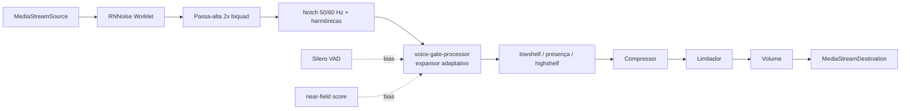

# Filtros de áudio: DSP eficiente + painel profissional unificado

## 1. Diagnóstico (por que ainda passa ruído)

Confirmado lendo [src/shared/mic-dsp.js](src/shared/mic-dsp.js), [public/shared/rnnoise/RnnoiseProcessor.js](public/shared/rnnoise/RnnoiseProcessor.js) e [src/shared/audio-manager.js](src/shared/audio-manager.js):

- **RNNoise roda na taxa errada.** O contexto é criado sem taxa fixa (`new AudioContextCtor({ latencyHint: 'interactive' })`, linhas 385 e 487). RNNoise é treinado em 48 kHz e consome quadros fixos de 480 amostras; no Windows o contexto costuma abrir em 44,1 kHz, deslocando as bandas ~9% — supressão fraca e warble na voz.
- **RNNoise vem desligado por padrão.** `noiseSuppressionMl: false` em `HOST_MIC_PUBLISH_DEFAULTS` (L52) e `CLIENT_MIC_PUBLISH_DEFAULTS` (L72). Só o preset "Sala compartilhada" liga. Na prática o padrão é EQ + compressor, sem nenhuma redução de ruído.
- **O compressor padrão amplifica o ruído de fundo.** Ligado por padrão com `threshold -26 / knee 24 / ratio 5` (L413-417) e sem gate — isso levanta o piso de ruído entre as frases, que é exatamente o chiado percebido.
- **Passa-alta desligado por padrão** (`highpass: false`, e quando off a frequência vai para 20 Hz, L402) — zumbido de rede em 50/60 Hz passa direto. Mesmo ligado é um único biquad de 12 dB/oitava, fraco para hum.
- **Gate depois do compressor.** A ordem é EQ → compressor → gate (L431-440). O compressor já levantou o ruído acima do limiar, então o gate quase não fecha. Ordem correta: passa-alta → expansor → EQ → compressor → limitador.
- **Os laços de gate usam `requestAnimationFrame`** (`startLegacyRmsGateLoop` L287, `createNearFieldGateLoop` L189). O Chrome congela rAF em aba oculta/minimizada — situação normal para quem apresenta —, deixando o gate travado no último estado.
- **Dupla supressão.** `noiseSuppression: true` sempre no `getUserMedia` ([audio-manager.js L43-49](src/shared/audio-manager.js)) empilhado com RNNoise gera artefato metálico/musical na voz.
- **Sem limitador.** `gain` chega a 3x sem teto, e o AGC do navegador é desligado quando há filtro ativo ([media-client.js L829](src/shared/media-client.js)) — sobra clipping.
- **Gates que se anulam em silêncio.** Em `wirePublishGates` (L310-311), `legacyGateActive` só vale se near-field **e** VAD estiverem off: ligar near-field faz "Noise gate" e "Sensibilidade" virarem controles mortos, sem aviso na UI.

## 2. Nova cadeia DSP

Reescrever a construção do grafo em [src/shared/mic-dsp.js](src/shared/mic-dsp.js) como uma única função (elimina a divisão legacy/advanced duplicada, L381-593):

Mudanças concretas:

- `new AudioContextCtor({ sampleRate: 48000, latencyHint: 'interactive' })`, com `try/catch` caindo para a taxa padrão e, nesse caso, desativando o RNNoise (evita processar fora da taxa treinada).
- Em [audio-manager.js](src/shared/audio-manager.js), `buildMicrophoneConstraints` ganha `disableNoiseSuppression`; [media-client.js L829](src/shared/media-client.js) passa a pedir `noiseSuppression: false` quando a redução ML está ativa. `echoCancellation` continua ligado.
- **Novo worklet** `src/shared/worklets/voice-gate-processor.js` (saída em `public/shared/worklets/`): expansor descendente adaptativo — segue o piso de ruído por mínimo lento, abre com margem sobre o piso, joelho suave, `attack/hold/release` e profundidade máxima de atenuação (duck em vez de corte seco, preserva finais de palavra). Roda na thread de áudio, imune ao throttling de aba. Publica por `port.postMessage` a cada ~10 ms: RMS de entrada, pico, redução de ganho aplicada e estado do portão — usado pelos medidores da UI.
- VAD (Silero) e near-field deixam de ter nós de ganho próprios e passam a enviar **bias** para o worklet (um único ponto de decisão, acaba o conflito entre portões). O near-field continua com `AnalyserNode`, mas a leitura passa a ser disparada pelo tick do worklet em vez de `requestAnimationFrame`.
- Passa-alta em cascata de 2 biquads (24 dB/oitava), ligado por padrão em 85 Hz.
- Notch opcional de zumbido: biquads `notch` Q alto em 50 ou 60 Hz + 2ª e 3ª harmônicas.
- Compressor mais suave (`light/medium/strong` em vez do fixo -26/5) e **limitador** final (`DynamicsCompressor` threshold -1.5 dB, ratio 20, knee 0, attack rápido).
- Novos defaults de publicação: redução de ruído em `medium` (RNNoise ligado), passa-alta ligado, portão em `auto`, compressor `light`, limitador ligado.

## 3. Consolidar prefs (fim das duplicidades)

Modelo canônico único em `normalizeMicrophoneFilterPrefs`, com migração das chaves antigas (presets já gravados no SQLite `audio_filter_presets` e nos caches de `localStorage` continuam válidos):

- `gain` → `volume` (global, aplicado na origem; escala em dB de -40 a +9,5 dB, permitindo **abaixar** e não só aumentar)
- `noiseSuppressionMl` + `speechGate` + `noiseGate`/`noiseGateThreshold` + `micSensitivity`/`micCaptureDistance` → **`noiseReduction`** (`off|low|medium|high`, controla RNNoise + profundidade do expansor + assist do VAD) e **`gateMode`** (`auto|manual|off`) + `gateThreshold` (só no modo manual, no Avançado)
- `nearFieldGate` + `nearFieldThreshold` + `micCaptureDistance` → **`roomIsolation`** (`off|soft|strict`) + `roomIsolationStrength`
- `peaking`/`peakingFreq`/`peakingGain` → `presence*` (mantidos, só renomeados junto do EQ)
- novos: `humFilter` (`off|50|60`), `limiter`, `compressor` como enum

Sai de 4 mecanismos de portão sobrepostos (RMS legado, sensibilidade por proximidade, VAD, near-field) para 2 conceitos distintos e não conflitantes: redução de ruído e isolamento de sala. Também atualizar o mapeamento de `hostMicPublishGain`/`hostMicCompressor`/`hostMicPeaking` em [media-client.js `_resolvePublishMicFilterPrefs`](src/shared/media-client.js) (L350-363) e em [config/default.js](config/default.js) (L69-74).

## 4. Painel compartilhado host + co-host

Hoje o modal existe em quatro lugares: HTML duplicado em [public/host/index.html](public/host/index.html) (L899-1086) e [public/client/index.html](public/client/index.html) (L796-955), e a lógica de popular/ler duplicada em [src/host/app.js](src/host/app.js) (L5057-5172) e [src/shared/room-controls.js](src/shared/room-controls.js) (L481-560). Qualquer ajuste precisa ser feito duas vezes — é a causa raiz da divergência host/co-host.

- **Novo módulo** `src/shared/audio-filters-panel.js`: renderiza todo o conteúdo do modal e expõe `open(client, ctx)`, `readPrefs()`, `populate(prefs)`, `attachMeters(source)`, `destroy()`.
- Os dois HTML ficam apenas com a casca vazia `

`.
- `src/host/app.js` e `src/shared/room-controls.js` passam a delegar ao painel; a seção "Monitorar meu microfone" continua como capability só do host.
- **Novo CSS** `public/shared/audio-filters.css`, referenciado nas duas páginas.

## 5. Interface (Simples / Avançado)

**Simples** (visão inicial): nome do participante, medidor de entrada e saída com escala em dB e LED de clip, seletor de preset (Voz limpa / Sala compartilhada / Ambiente ruidoso / Sem processamento / Personalizado), **Redução de ruído** em 4 posições com LED de atividade do portão, **Volume** (fader em dB com marca de 0 dB, global) e botão Bypass A/B para comparar com o sinal cru.

**Avançado** (revela os módulos estilo channel strip, cada um com header, LED de ativo e medidor próprio):
- FILTROS — passa-alta (frequência) e notch de zumbido 50/60 Hz
- ISOLAMENTO DE SALA — off/suave/estrito + força
- PORTÃO — auto/manual, limiar em dB, medidor de redução de ganho
- EQ — 3 bandas (graves, presença com frequência e ganho, agudos) com curva desenhada em `<canvas>`
- DINÂMICA — compressor (off/leve/médio/forte) + limitador, com medidor de GR

Os medidores vêm do worklet quando o alvo é o próprio microfone. Quando o host configura um **client remoto**, ele não tem o sinal pré-filtro: nesse caso o painel mostra o medidor da saída recebida (analisador por canal que já existe em `_startChannelMeter` de [host-audio-monitor.js](src/shared/host-audio-monitor.js)) e oculta os indicadores de GR/portão, com legenda explicando.

## 6. Build e verificação

- Adicionar entrada esbuild do worklet em [scripts/build-client.js](scripts/build-client.js) (após o bundle de `audio-ml-entry.js`, L97-107) gerando `public/shared/worklets/voice-gate-processor.js`.
- Novo smoke `scripts/mic-dsp-prefs-smoke.js` cobrindo normalização e migração das chaves legadas; estender `scripts/audio-filter-presets-smoke.js`.
- Rodar `npm run check`, `npm run test:smoke` e `npm run build`.
- Teste manual: host e co-host abrindo o painel do mesmo participante devem ver controles idênticos; validar em aba minimizada que o portão continua atuando.