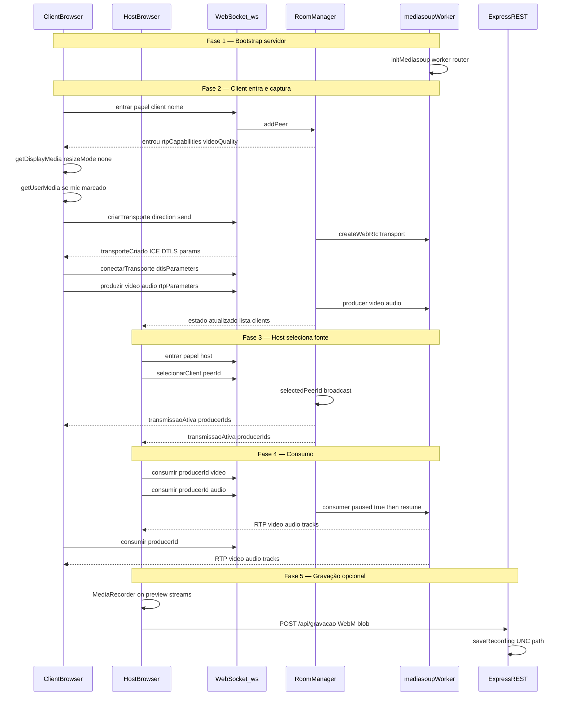
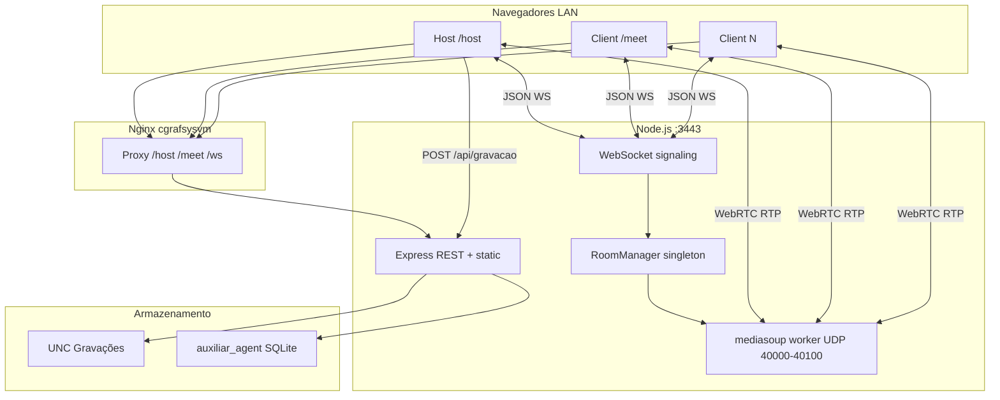

# Relatório Técnico — Sistema de Transmissão Local (ShareScreen LAN)

**Projeto:** `sharescreen-lan` v1.0.0  
**Data da análise:** 16 de junho de 2026  
**Escopo:** Análise read-only do código e artefatos de deploy. Nenhuma alteração foi feita no sistema.  
**Workspace analisado:** `E:\Projetos\Trabalho\Screen Share` (cópia idêntica em `\\cgrafsysvm\Sistemas CGraf\Screen Share`)

---

## Sumário executivo

O **ShareScreen LAN** é uma aplicação web para compartilhamento de tela e áudio em rede local, voltada a treinamentos e reuniões internas (ambiente CGraf / Câmara dos Deputados). Utiliza **mediasoup** como **SFU (Selective Forwarding Unit)** — tráfego de mídia passa pelo servidor Node.js via WebRTC/RTP, não por mesh P2P direto entre navegadores.

A sinalização é feita por **WebSocket JSON** em `/ws`. A captura usa APIs nativas do navegador (`getDisplayMedia`, `getUserMedia`). A gravação é feita no **painel host** via `MediaRecorder` e enviada ao servidor por `POST /api/gravacao`, salvando em compartilhamento UNC de rede.

**Achado crítico:** o código-fonte frontend editável (`src/host/app.js`, `src/client/app.js`) **não está presente** neste workspace — apenas bundles minificados em `public/`. O build (`npm run build`) falharia sem restaurar essas fontes (referência em `DEPLOY-PRODUCAO.md`: `d:\Antigravity\Backup\ControleOBSNDI\ShareScreen`).

---

# 1. Visão geral do sistema atual

## 1.1 Finalidade

O sistema permite que um ou mais computadores na rede local **capturem a tela** (e opcionalmente áudio do sistema e microfone) e que um **operador host** selecione qual fonte será **retransmitida para todos os participantes** conectados. É pensado para uso interno em LAN, com deploy centralizado no servidor `cgrafsysvm` (IP de produção `10.1.1.73`).

Casos de uso implícitos no código e documentação:

- Treinamentos com gravação automática em pasta de rede
- Reuniões onde vários PCs podem compartilhar tela, mas apenas um transmite por vez
- Abertura remota de clientes Chrome via integração `auxiliar_agent`

## 1.2 Compartilhamento de tela

1. Um **client** (ou o próprio host) abre a URL do client (`/client` ou `/meet/` via Nginx).
2. Após identificação, o navegador solicita permissão de captura via **`navigator.mediaDevices.getDisplayMedia()`**.
3. O usuário escolhe monitor/janela no seletor nativo do Chrome.
4. A captura usa **`resizeMode: 'none'`** (confirmado no bundle) para manter a resolução nativa do monitor, sem downscale pelo Chrome.
5. Tracks de vídeo (e áudio, se habilitado) são publicadas no SFU mediasoup via `sendTransport.produce()`.
6. O **host** seleciona qual peer está transmitindo; todos os demais peers **consomem** esse producer.

O host também pode compartilhar sua própria tela (checkboxes de áudio em `public/host/index.html` e producer permitido para `role === 'host'` em `server/signaling.js`).

## 1.3 Captura e transmissão de microfone

- Microfone é **opcional**, controlado por checkbox (`#chk-microphone` no client, `#host-chk-microphone` no host).
- Quando marcado, o bundle chama **`getUserMedia()`** para obter track de áudio do dispositivo selecionado (`#mic-select` / `#host-mic-select`).
- Áudio do sistema vem junto com `getDisplayMedia` quando o usuário marca a opção e também seleciona "Compartilhar áudio da aba" no diálogo do Chrome.
- Vídeo e áudio são **producers separados** no mediasoup (`peer.producers.video` e `peer.producers.audio` em `server/room-manager.js`).
- Codecs: **Opus** para áudio, **H.264 Baseline** (preferido) ou **VP8** (fallback) para vídeo.

## 1.4 Conexão entre computadores na rede local

| Caminho | Protocolo | Função |
|---------|-----------|--------|
| Navegador → Node `:3443` | HTTPS + WSS | Páginas estáticas, REST API, sinalização WebSocket |
| Navegador → mediasoup worker | WebRTC (UDP preferencial) | RTP de vídeo/áudio — portas **40000–40100** |
| Nginx `:80` / `:443` | HTTP(S) proxy | `/host/` → host, `/meet/` → client, `/ws` → WebSocket |
| Host → UNC | SMB | Gravações salvas em `\\cgrafsysvm\ApogeeFiles\Gravaçoes Treinamento` |

O IP WebRTC (ICE) é anunciado via `ANNOUNCED_IP` / `config.announcedIp` / detecção automática (`server/network.js`). Em produção, `start-producao.bat` define `ANNOUNCED_IP=10.1.1.73`.

**Importante:** o tráfego de mídia **não** passa pelo Nginx — apenas TCP/HTTPS. UDP 40000–40100 deve estar liberado no firewall do servidor.

## 1.5 Fluxo do usuário: iniciar, assistir e encerrar

### Client (transmissor)

1. Abre URL (`https://10.1.1.73:3443/client` ou `http://cgrafsysvm/meet/`).
2. Modal de identificação: informa nome, opções de áudio, clica "Salvar e continuar".
3. WebSocket conecta em `/ws`, envia `entrar` com `papel: 'client'`.
4. Navegador pede captura de tela (e microfone, se marcado).
5. Client produz vídeo/áudio no SFU; status muda para `transmitindo`.
6. Aguarda seleção do host (`#aguardando`: "Aguardando seleção do host...").
7. Se selecionado, banner `#banner-selecionado` indica transmissão ativa.
8. Se captura encerrar (usuário para no Chrome), botão `#btn-recompartilhar` permite reiniciar.
9. Encerramento: fechar aba/navegador → WebSocket fecha → `room.removePeer()` limpa recursos.

### Host (controlador / espectador principal)

1. Abre URL (`https://10.1.1.73:3443/host` ou `http://cgrafsysvm/host/`).
2. WebSocket conecta com `papel: 'host'`.
3. Recebe `estado` com lista de clients conectados (`#lista-clients`).
4. Seleciona uma fonte na lista → envia `selecionarClient`.
5. Preview aparece em `#preview-video`; áudio em `#preview-audio`.
6. Pode pausar, retomar, limpar transmissão, ajustar volume, gravar.
7. Opcionalmente abre clients remotos via agent (`abrirClientRemoto`, `abrirTodosRemotos`).

### Espectadores (outros clients conectados)

Clients que não estão transmitindo consomem o producer selecionado e exibem em `#video-remoto` / `#audio-remoto`. **NÃO IDENTIFICADO** se há UI distinta "somente espectador" — todos usam a mesma página client, mas a lógica de captura vs. consumo depende do bundle (fonte ausente).

## 1.6 Gravação da transmissão

Existe e funciona assim (host only):

1. Host clica **Gravar** (`#btn-gravar`).
2. Bundle host usa **`MediaRecorder`** sobre streams do preview (vídeo + áudio).
3. Ao parar (`#btn-parar-gravar`), gera arquivo **WebM**.
4. Upload via **`POST /api/gravacao`** com header `X-Recording-Filename`.
5. Servidor valida nome e grava em UNC configurada.

Clients **não** gravam (`MediaRecorder` ausente no bundle client).

## 1.7 Limitações visíveis no estado atual

| Limitação | Impacto |
|-----------|---------|
| Sem autenticação | Qualquer pessoa na LAN pode ser host ou client |
| Sala única global | Não há múltiplas salas ou códigos de acesso |
| Uma fonte ativa por vez | Host seleciona apenas 1 peer para broadcast |
| Frontend source ausente | Manutenção depende de bundles minificados |
| HTTPS inconsistente via Nginx | Proxy HTTP `:80` ativo; captura pode falhar sem HTTPS |
| Máximo 10 clients | `config.maxClients` |
| Sem reconexão automática documentada | **NÃO IDENTIFICADO** no bundle (sem source) |
| UI funcional, não profissional | Sidebar básica, emoji como ícones, CSS duplicado |
| Gravação consome RAM no host | Upload de blob inteiro (até 4 GB) |
| Dependência de Chrome | System audio via getDisplayMedia é específico Chromium |
| Scripts batch ausentes | `preparar-deploy.bat`, `instalar-producao.bat`, `abrir-firewall-producao.bat` referenciados mas não presentes |

---

# 2. Stack e tecnologias utilizadas

## 2.1 Resumo da stack

| Camada | Tecnologia | Versão |
|--------|------------|--------|
| Runtime | Node.js (ES Modules) | ≥ 18.0.0 |
| Backend HTTP | Express | ^4.21.2 |
| SFU / WebRTC server | mediasoup | ^3.14.11 |
| WebRTC client | mediasoup-client | ^3.7.17 (bundled) |
| WebSocket | ws | ^8.18.0 |
| Bundler | esbuild | ^0.24.2 |
| Certificados TLS | selfsigned / OpenSSL | ^2.4.1 |
| Frontend | HTML5 + CSS3 + vanilla JS | — |
| Proxy reverso | Nginx | (externo ao Node) |
| Agente remoto | Python 3 + SQLite | scripts agent |

## 2.2 Linguagem principal

**JavaScript (ESM)** em backend e frontend. Scripts auxiliares em **Python** (`agent_list.py`, `agent_enqueue.py`) e **PowerShell/Batch** para deploy Windows.

## 2.3 Bibliotecas relacionadas a vídeo, áudio, WebRTC e streaming

| Biblioteca/API | Uso |
|----------------|-----|
| mediasoup | Worker SFU, router, WebRTC transports, producers/consumers |
| mediasoup-client | Device, Transport, Producer, Consumer no browser |
| getDisplayMedia | Captura de tela + system audio (Chrome) |
| getUserMedia | Captura de microfone |
| MediaRecorder | Gravação WebM no host |
| WebSocket (ws + nativo) | Sinalização JSON |
| RTCPeerConnection | Usado **indiretamente** dentro do mediasoup-client (SDP/ICE internos) |

**Não utilizado:** canvas capture, MJPEG, HLS, WebSocket video chunks, ffmpeg no servidor, OBS integration.

## 2.4 Ferramentas de build

| Comando | Script | Resultado |
|---------|--------|-----------|
| `npm run build` | `scripts/build-client.js` | Bundles dev com sourcemap |
| `npm run build:prod` | idem + `--prod` | Bundles minificados, sem sourcemap |
| `npm run cert` | `scripts/generate-cert.js` | `certs/server.key` + `server.crt` |
| `npm run postinstall` | `scripts/copy-mediasoup-client.js` | Stub (cria `public/vendor/` vazio) |
| Deploy | `scripts/preparar-pacote-deploy.ps1` | Pasta `pacote-servidor/` completa |

Target de browsers no build: `chrome90`, `edge90`, `firefox90`.

## 2.5 Como iniciar em ambiente local

### Produção (servidor cgrafsysvm)

```cmd
verificar-producao.bat
start-producao.bat
```

Define `SHARESCREEN_SERVER_HOST=10.1.1.73` e `ANNOUNCED_IP=10.1.1.73`.

### Desenvolvimento

```cmd
npm install
npm run cert
npm run build        # REQUER src/host/app.js e src/client/app.js (AUSENTES)
npm start            # ou npm run dev (--dev flag, sem efeito adicional visível)
```

### URLs

| Acesso | URL |
|--------|-----|
| Host direto HTTPS | `https://10.1.1.73:3443/host` |
| Client direto HTTPS | `https://10.1.1.73:3443/client` |
| Host via Nginx | `http://cgrafsysvm/host/` |
| Client via Nginx | `http://cgrafsysvm/meet/` |
| WebSocket | `wss://.../ws` ou `ws://.../ws` |

## 2.6 Portas utilizadas

| Porta | Protocolo | Serviço |
|-------|-----------|---------|
| 3443 | TCP HTTPS | Node.js (Express + WSS) |
| 3080 | TCP HTTP | Redirect → HTTPS 3443 |
| 40000–40100 | UDP | mediasoup WebRTC (ICE/RTP) |
| 80 | TCP HTTP | Nginx (proxy ShareScreen + outros apps) |
| 443 | TCP HTTPS | Nginx (config opcional em `nginx/https-sharescreen.conf`) |

## 2.7 Dependências importantes

```json
"dependencies": {
  "express": "^4.21.2",
  "mediasoup": "^3.14.11",
  "mediasoup-client": "^3.7.17",
  "ws": "^8.18.0"
}
```

O pacote `mediasoup` inclui binário nativo `mediasoup-worker.exe` (Windows), essencial para o SFU.

## 2.8 Arquivos principais do sistema

| Arquivo | Responsabilidade |
|---------|------------------|
| `server/index.js` | Entry point: TLS, Express, REST, static, attach WS |
| `server/signaling.js` | Protocolo WebSocket completo |
| `server/room-manager.js` | Estado da sala, peers, produce/consume, seleção host |
| `server/mediasoup-manager.js` | Worker, router, codecs, transports WebRTC |
| `server/recording-save.js` | Persistência de gravações |
| `server/agent-bridge.js` | Integração auxiliar_agent |
| `server/network.js` | Resolução IP LAN / ICE |
| `config/default.js` | Toda configuração tunável |
| `public/host/index.html` + `app.bundle.js` | UI e lógica host |
| `public/client/index.html` + `app.bundle.js` | UI e lógica client |
| `src/shared/recording-filename.js` | Formato de nome de gravação |

---

# 3. Estrutura de pastas e responsabilidades

```
Screen Share/
├── certs/                    # TLS self-signed (server.key, server.crt)
├── config/
│   └── default.js            # Configuração central (portas, bitrates, paths)
├── nginx/
│   ├── nginx.conf.cgrafsysvm-completo.conf  # Config Nginx produção (HTTP proxy)
│   ├── https-sharescreen.conf               # Snippet HTTPS ShareScreen
│   └── HTTPS-NGINX.md                       # Guia HTTPS/mkcert
├── public/
│   ├── host/
│   │   ├── index.html        # Shell HTML host
│   │   ├── style.css         # Estilos host
│   │   └── app.bundle.js     # Frontend host (minificado, ~259 KB)
│   └── client/
│       ├── index.html        # Shell HTML client
│       ├── style.css         # Estilos client
│       └── app.bundle.js     # Frontend client (minificado, ~252 KB)
├── scripts/
│   ├── build-client.js       # esbuild: src → public bundles
│   ├── generate-cert.js      # Geração certificados TLS
│   ├── copy-mediasoup-client.js  # Stub postinstall
│   ├── preparar-pacote-deploy.ps1  # Empacotamento produção
│   ├── agent_list.py         # Lista PCs do auxiliar_agent
│   └── agent_enqueue.py      # Enfileira comando Chrome remoto
├── server/
│   ├── index.js              # Servidor principal
│   ├── signaling.js          # WebSocket signaling
│   ├── room-manager.js       # Gerenciamento de sala/peers
│   ├── mediasoup-manager.js  # SFU mediasoup
│   ├── recording-save.js     # API gravação
│   ├── agent-bridge.js       # Bridge Python/SQLite
│   ├── network.js            # IP LAN
│   └── logger.js             # Logging estruturado
├── src/
│   └── shared/
│       └── recording-filename.js  # ÚNICO source frontend presente
├── package.json
├── start-producao.bat
├── verificar-producao.bat
├── DEPLOY-PRODUCAO.md
├── DEPLOY-COPIAR.txt
└── LEIA-ME-SERVIDOR.txt
```

## 3.1 Onde está cada responsabilidade

| Responsabilidade | Localização |
|------------------|-------------|
| Captura de tela | Bundle `public/client/app.bundle.js` e `public/host/app.bundle.js` (`getDisplayMedia`) — **source ausente** |
| Captura de microfone | Idem (`getUserMedia`) + HTML checkboxes |
| Transmissão WebRTC | Bundles (mediasoup-client produce) + `server/room-manager.js` + `server/mediasoup-manager.js` |
| Gravação | Bundle host (`MediaRecorder`) + `server/recording-save.js` + `src/shared/recording-filename.js` |
| Interface visual | `public/host/*`, `public/client/*` (HTML/CSS) + bundles |
| Servidor / sinalização | `server/index.js`, `server/signaling.js` |
| Configuração | `config/default.js` |
| Deploy / infra | `scripts/`, `nginx/`, `*.bat`, `DEPLOY-*.md` |

## 3.2 Arquivos ausentes ou referenciados

| Referência | Status |
|-----------|--------|
| `src/host/app.js` | **AUSENTE** |
| `src/client/app.js` | **AUSENTE** |
| `preparar-deploy.bat` | **AUSENTE** (existe `.ps1`) |
| `instalar-producao.bat` | **AUSENTE** |
| `abrir-firewall-producao.bat` | **AUSENTE** |
| `public/vendor/` | Rota Express existe; diretório **AUSENTE** |
| `public/shared/` | Rota Express existe; diretório **AUSENTE** |
| `README.md` | **AUSENTE** (docs em DEPLOY/LEIA-ME) |

---

# 4. Fluxo técnico da transmissão

## 4.1 Diagrama de sequência completo



## 4.2 Passo a passo detalhado

### 4.2.1 Transmissor inicia captura

1. Client carrega `app.bundle.js`, constrói URL WebSocket a partir de `location` + `/ws`.
2. Envia `{ type: 'entrar', payload: { papel: 'client', nome, maquina } }`.
3. Servidor responde `entrou` com `peerId`, `rtpCapabilities`, `videoQuality`.
4. Client instancia `mediasoupClient.Device`, chama `device.load({ routerRtpCapabilities })`.
5. Solicita `criarTransporte` com `direction: 'send'`.
6. mediasoup-client cria offer/answer internamente; app envia `conectarTransporte` com `dtlsParameters`.
7. Chama `getDisplayMedia` com constraints incluindo `resizeMode: 'none'`.
8. Se microfone: `getUserMedia({ audio: { deviceId } })`.
9. Para cada track: `sendTransport.produce({ kind, rtpParameters, appData })` via WS `produzir`.
10. Servidor cria producer no SFU; notifica host via `estado`.

### 4.2.2 Como a tela é capturada

- API: **`navigator.mediaDevices.getDisplayMedia()`**
- Resolução: nativa do monitor (`resizeMode: 'none'`)
- Frame rate: limitado client-side por `videoQuality.maxFrameRate` (30 fps do servidor)
- Codec de saída: negociado via mediasoup — H.264 Baseline preferido
- **Não** usa canvas, html2canvas, ou screenshot sequencial

### 4.2.3 Como o microfone é capturado

- API: **`navigator.mediaDevices.getUserMedia()`** (somente se checkbox marcado)
- Device picker popula `<select>` via `enumerateDevices()` — **NÃO IDENTIFICADO** nome exato da função (bundle minificado)
- Track de áudio é producer separado (`kind: 'audio'`)
- System audio vem do track de áudio do `getDisplayMedia` (Chrome)

### 4.2.4 Combinação áudio e vídeo

- **Producers separados** no SFU (slots `video` e `audio` em `room-manager.js`)
- No consumer/receptor: tracks attachados separadamente a `<video>` e `<audio>`
- Na gravação host: **NÃO IDENTIFICADO** se MediaRecorder usa `canvas.captureStream()`, `MediaStream` combinado ou apenas vídeo — provável composição de streams do preview (vídeo + áudio elements)

### 4.2.5 Envio para outro computador

1. Client → SFU: RTP/UDP (portas 40000–40100)
2. SFU → Consumers (host + outros clients): RTP/UDP
3. Sinalização nunca carrega mídia — apenas metadados ICE/DTLS/RTP

### 4.2.6 Receptor recebe e exibe

1. Recebe evento `transmissaoAtiva` com `producerIds.video` e `producerIds.audio`.
2. Envia `consumir` para cada producerId.
3. Servidor cria consumer (`paused: true`, depois `resume()`).
4. Client chama `recvTransport.consume()`, obtém `track`.
5. Track attachado a `#preview-video` / `#video-remoto` e `#preview-audio` / `#audio-remoto`.
6. **`playoutDelayHint`** aplicado no bundle para reduzir buffer do decoder.

### 4.2.7 Negociação cliente-servidor

| Etapa | Mecanismo |
|-------|-----------|
| Descoberta de capacidades | `rtpCapabilities` do router via WS |
| Transport creation | WS `criarTransporte` → ICE candidates + DTLS params |
| DTLS handshake | WS `conectarTransporte` |
| Codec negotiation | mediasoup-client + router codecs |
| Media flow | WebRTC (UDP preferencial) |

SDP offer/answer ocorre **dentro** do mediasoup-client, não exposto ao código da aplicação.

## 4.3 Protocolo WebSocket completo

### Client → Server

| type | Quem | Função |
|------|------|--------|
| `entrar` | todos | Join com `papel`, `nome`, `maquina` |
| `atualizarNome` | client | Atualiza display name |
| `criarTransporte` | todos | Cria send/recv transport |
| `conectarTransporte` | todos | Completa handshake DTLS |
| `produzir` | host/client | Publica track no SFU |
| `pararProducao` | todos | Para producers locais |
| `consumir` | todos | Subscribe a producer |
| `retomarConsumer` | todos | Resume consumer pausado |
| `fecharConsumer` | todos | Fecha consumer |
| `status` | todos | Reporta status/erro |
| `selecionarClient` | host | Escolhe fonte de broadcast |
| `pausarTransmissao` | host | Pausa producers da fonte |
| `retomarTransmissao` | host | Retoma producers |
| `limparTransmissao` | host | Limpa seleção |
| `abrirClientRemoto` | host | Abre Chrome remoto via agent |
| `abrirTodosRemotos` | host | Abre Chrome em todos agentes online |
| `listarAgentes` | host | Lista PCs do agent |

### Server → Client

| type | Função |
|------|--------|
| `entrou` | Confirma join + capabilities |
| `estado` | Snapshot completo para host |
| `transmissaoAtiva` | Producer selecionado mudou |
| `transporteCriado` | Params ICE/DTLS |
| `transporteConectado` | ACK conexão |
| `produzido` | Producer criado |
| `consumido` | Consumer criado |
| `consumerFechado` | Producer remoto fechou |
| `nomeAtualizado` | ACK rename |
| `selecaoResultado` | Resultado seleção |
| `pausaResultado` / `retomadaResultado` / `limpezaResultado` | ACK controles |
| `abrirClientResultado` / `abrirTodosResultado` | Resultado agent |
| `agentesLista` | Lista agentes |
| `erro` | Erro com `mensagem` |

### Keepalive

Ping/pong a cada `config.wsPingInterval` (25 s). Conexão morta é terminada com `ws.terminate()`.

## 4.4 APIs e abordagens utilizadas

| Tecnologia | Usado? | Onde |
|------------|--------|------|
| WebRTC (via mediasoup) | Sim | SFU + client bundles |
| WebSocket | Sim | Sinalização `/ws` |
| getDisplayMedia | Sim | Bundles host + client |
| getUserMedia | Sim | Bundles host + client |
| MediaRecorder | Sim | Apenas bundle host |
| Canvas | Não confirmado | — |
| Stream direto (RTP) | Sim | mediasoup SFU |
| WebSocket chunks vídeo | Não | — |

## 4.5 Fallback e tratamento de erro

| Cenário | Tratamento |
|---------|------------|
| Mensagem WS inválida | Ignorada (`parseMessage` retorna null) |
| Erro em handler WS | `{ type: 'erro', payload: { mensagem } }` |
| Permissão negada captura | `NotAllowedError` tratado no bundle |
| ICE failed/disconnected | Log warning + dica firewall UDP |
| Worker mediasoup morre | `process.exit(1)` — **sem recovery** |
| Sem certificados TLS | HTTP-only + warning; captura falha em LAN |
| VP8 fallback | Codec registrado no router se H.264 falhar |
| Producer fecha | `consumerFechado` push + rebroadcast `transmissaoAtiva` |
| Re-share após stop | Botão `#btn-recompartilhar` |
| Limite clients | Erro ao `addPeer` se ≥ 10 clients |

**Não há** fallback para streaming alternativo (MJPEG, WebSocket binary, etc.).

---

# 5. Análise de latência e desempenho

## 5.1 WebRTC SFU vs outros métodos

O sistema usa **WebRTC via mediasoup SFU** — abordagem de **baixa latência** adequada para LAN. **Não** usa:

- Canvas + JPEG sequencial (latência alta, 100–500 ms+)
- WebSocket com chunks de vídeo (buffering significativo)
- HLS/DASH (latência de segmentos, 2–10 s+)
- Server-side transcoding ffmpeg em tempo real (adiciona delay)

## 5.2 Configurações favoráveis à baixa latência

Extraídas de `config/default.js` e `server/mediasoup-manager.js`:

| Configuração | Valor | Efeito |
|--------------|-------|--------|
| `lowLatency` | `true` | Flag enviada aos clients |
| `preferUdp` | `true` | UDP preferido sobre TCP |
| H.264 profile | Baseline `42e01f` | Sem B-frames → menor delay de decode |
| Opus `usedtx` | `0` | Desativa DTX → menos buffer de áudio |
| Opus `useinbandfec` | `1` | FEC para perda de pacotes |
| `initialVideoBitrate` | 4 Mbps | Bitrate inicial moderado |
| `maxVideoBitrate` | 8 Mbps | Teto de bitrate |
| `targetFrameRate` | 30 fps | Trade-off latência vs fluidez |
| `resizeMode: 'none'` | captura nativa | Evita resize no Chrome |
| `playoutDelayHint` | no bundle | Reduz jitter buffer do receptor |
| Comentário config | "Bitrates moderados = menos buffer no decoder" | Intenção explícita de baixo delay |

## 5.3 Possíveis fontes de delay

| Fator | Estimativa impacto | Detalhe |
|-------|-------------------|---------|
| Encode browser (H.264) | 30–100 ms | Depende de CPU/GPU |
| SFU hop (1 relay) | 5–20 ms | LAN, UDP direto |
| Network LAN | 1–5 ms | Gigabit típico |
| Decode browser | 20–50 ms | Depende de hardware |
| Jitter buffer | 0–200 ms | Mitigado por playoutDelayHint |
| Frame rate 30 vs 60 | +16 ms/frame | Escolha consciente por latência |
| Gravação MediaRecorder | CPU overhead | Pode afetar encode indiretamente |

**Estimativa total end-to-end em LAN bem configurada:** ~100–300 ms (típico para WebRTC screen share).

## 5.4 Buffering excessivo?

- **Não** há buffering intencional de chunks no servidor.
- mediasoup faz forward RTP sem re-encode (SFU puro) — mínimo processing delay.
- Consumer criado com `paused: true` e imediatamente `resume()` — pequeno overhead de setup, não de playback buffer.
- **Risco:** bitrates altos demais aumentam buffer do decoder; config atual é moderada.

## 5.5 Canvas, blobs, imagens sequenciais?

**Não** para transmissão live. Apenas WebRTC RTP.

MediaRecorder gera **blob WebM** apenas na gravação (offline do pipeline live).

## 5.6 Compressão/transcodificação

- **Encode:** no browser do transmissor (hardware/software H.264 ou VP8).
- **SFU:** forward sem transcode.
- **Decode:** no browser de cada receptor.
- **Sem** ffmpeg/transcode no servidor para live.

## 5.7 Áudio e vídeo juntos ou separados?

**Separados** como producers/consumers distintos. Sincronização via timestamps RTP/WebRTC — **NÃO IDENTIFICADO** se há lógica explícita de lip-sync no frontend.

## 5.8 Gargalos por camada

| Camada | Gargalo potencial | Severidade |
|--------|-------------------|------------|
| Backend SFU | CPU do worker em muitos consumers | Baixa (≤10 clients) |
| Backend | Single worker, single router | Média para escala |
| Frontend encode | CPU do PC transmissor | Média-alta em telas 4K |
| Frontend decode | CPU de múltiplos viewers | Média |
| Gravação | MediaRecorder + blob RAM | Alta em gravações longas |
| Rede | Firewall UDP bloqueado | Alta (impede conexão) |
| Layout | `object-fit: contain` fullscreen | Negligível |

## 5.9 Avaliação arquitetural para delay mínimo

| Abordagem | Adequação LAN | Veredicto |
|-----------|---------------|-----------|
| WebRTC SFU (atual) | Excelente para multi-viewer | **Manter** |
| WebRTC P2P mesh | Menor hop, mas N×N complexo | Pior para >2 peers |
| WebSocket chunks | Simples, alta latência | Substituir |
| Server transcode | Flexível, +100–500 ms | Evitar para live |

**Conclusão:** A arquitetura atual é **adequada para delay mínimo** em LAN com múltiplos espectadores. Melhorias devem focar em tuning fino (bitrate, FPS, playoutDelayHint, simulcast) e infra (HTTPS, firewall UDP), não em substituir o SFU.

---

# 6. Gravação da transmissão

## 6.1 O sistema grava?

**Sim**, exclusivamente no **painel host**.

## 6.2 Onde a gravação é iniciada

- UI: botões `#btn-gravar` e `#btn-parar-gravar` em `public/host/index.html`
- Lógica: bundle `public/host/app.bundle.js` (presença confirmada de `MediaRecorder`, `webm`, `/api/gravacao`, `X-Recording-Filename`)

## 6.3 Como os dados são capturados

1. Host está consumindo preview da transmissão selecionada (`#preview-video`, `#preview-audio`).
2. **MediaRecorder** inicia gravação sobre stream(s) derivados do preview.
3. Chunks acumulados em memória (**NÃO IDENTIFICADO** valor de `timeslice` — não encontrado no bundle).
4. Ao parar, blob WebM montado e enviado ao servidor.

## 6.4 API / biblioteca

- **`MediaRecorder`** (API nativa do navegador)
- Formato: **WebM** (confirmado string `webm` no bundle)
- **NÃO IDENTIFICADO** mimeType exato (`video/webm;codecs=vp9,opus` ou similar)

## 6.5 Formato de saída

- Container: **`.webm`**
- Nome: `YYYY MesMM DD HHhNN.webm` (ex.: `2026 Junho06 16 14h30.webm`)
- Gerado por `formatRecordingFilename()` em `src/shared/recording-filename.js`
- Horário: **fim** da gravação (`endDate` default `new Date()`)

## 6.6 Áudio e vídeo juntos?

**Provável sim** — gravação do preview que inclui vídeo e áudio. **NÃO IDENTIFICADO** com certeza absoluta (source frontend ausente).

## 6.7 Local vs servidor

| Etapa | Onde |
|-------|------|
| Captura/gravação | Browser do host (client-side) |
| Upload | `POST /api/gravacao` → Node.js |
| Persistência | Servidor escreve em disco UNC |

## 6.8 Onde o arquivo final fica

```
\\cgrafsysvm\ApogeeFiles\Gravaçoes Treinamento\
```

Configurável via `SHARESCREEN_RECORDINGS_DIR` ou `config.recordingsDir`.

Resposta JSON do servidor inclui `{ ok: true, path, filename }`.

## 6.9 Limitações atuais

| Limitação | Detalhe |
|-----------|---------|
| Sem auth no upload | Qualquer client na LAN pode POST |
| Blob inteiro em RAM | Até 4 GB (`express.raw` limit) |
| Sem upload chunked | Falha ou OOM em gravações muito longas |
| Sem progress UI | **NÃO IDENTIFICADO** feedback de upload |
| Sem histórico/listagem | Apenas save silencioso em UNC |
| Sem download pelo browser | Arquivo fica na rede, não link direto |
| Gravação para se transmissão parar | **NÃO IDENTIFICADO** comportamento |
| Filename só validado por regex | Sem deduplicação se mesmo minuto |

## 6.10 Riscos

| Risco | Probabilidade | Impacto |
|-------|---------------|---------|
| OOM no host (blob grande) | Média em gravações >1h | Browser crash, perda gravação |
| UNC inacessível | Média | Erro 500, gravação perdida |
| CPU alta durante gravação + transmissão | Média | Frame drops, delay aumenta |
| Disco cheio na UNC | Baixa | Falha write |
| POST malicioso preenchendo disco | Baixa (LAN trust) | DoS storage |

---

# 7. Interface atual e problemas de UX/UI

## 7.1 Estrutura visual atual

### Host (`/host`)

- **Viewport fullscreen:** vídeo `#preview-video` com `object-fit: contain`, fundo preto.
- **Sidebar colapsável** (320px, hamburger ☰): lista de fontes, controles, logs.
- **Overlays:** aguardando, banner transmissão própria, info transmissão, botão recompartilhar.
- **Footer fixo:** `#status-bar` com texto de status.
- **Tema:** dark (`#0a0a0a`), accent `#3d5afe`, fonte Segoe UI.

### Client (`/client` ou `/meet/`)

- **Modal bloqueante inicial:** identificação + opções áudio.
- **Viewport fullscreen:** `#video-remoto` para consumir transmissão.
- **Overlays:** aguardando, banner selecionado, caixa erro, recompartilhar.
- **Botão flutuante:** "Editar nome" (`#btn-editar-nome`).
- **Footer fixo:** status bar.

## 7.2 Telas existentes

| Tela | Rota | Descrição |
|------|------|-----------|
| Host / Controle | `/host` | Operador seleciona fonte, grava, pausa |
| Client / Meet | `/client`, `/meet/` | Captura tela ou consome transmissão |
| Redirect root | `/` | Redireciona para `/host` |

**Não existe:** landing page, tela de sala, login, histórico gravações, settings page.

## 7.3 Componentes existentes (HTML)

| Componente | Host | Client |
|------------|------|--------|
| Video player | `#preview-video` | `#video-remoto` |
| Audio player | `#preview-audio` | `#audio-remoto` |
| Modal identificação | — | `#overlay` |
| Sidebar | `#sidebar` | — |
| Lista fontes | `#lista-clients` | — |
| Volume/mute | `#volume-slider`, `#btn-mute-audio` | — |
| Gravação | `#btn-gravar`, `#btn-parar-gravar` | — |
| Pausar/Retomar/Limpar | `#btn-pausar`, `#btn-retomar`, `#btn-limpar` | — |
| Prefs áudio | `<details>` host | Modal + checkboxes |
| Log eventos | `#logs` | — |
| Status bar | `#status-bar` | `#status-bar` |

## 7.4 Problemas identificados

### Organização e hierarquia

- Sidebar host concentra muitas funções (lista, gravação, pausa, áudio, logs) sem separação visual clara.
- Botões Pausar e Retomar **sempre visíveis** — deveriam ser mutuamente exclusivos ou contextuais.
- Client modal bloqueia tudo — sem opção "entrar como espectador sem captura" (**NÃO IDENTIFICADO** se bundle suporta).

### Espaçamento e visual

- CSS funcional mas **duplicado** entre host e client (~70% similar).
- Inconsistência: client `#btn-recompartilhar` sem classe `.btn-recompartilhar` que host possui.
- Emoji (☰, 🔊, ✕) como UI controls — aparência amadora.
- Paleta limitada a dark + azul — sem design system.

### Responsividade

- Sidebar usa `min(320px, 85vw)` — parcialmente responsiva.
- Vídeo fullscreen funciona em desktop; **mobile não projetado** (`overflow: hidden`, modal 420px).
- Sem breakpoints dedicados.

### Acessibilidade

- Sidebar tem `aria-label="Painel de controle"` e toggle `aria-expanded` — pontos positivos.
- Botão mute sem `aria-label` (só emoji 🔊).
- Modal sem focus trap documentado.
- Contraste geralmente OK (texto claro em fundo escuro).
- Sem suporte a navegação por teclado documentada.

### Feedback visual

- Status bar textual — funcional mas discreto.
- Sem indicador de qualidade de conexão (ICE state, bitrate, packet loss).
- Sem indicador visual de áudio (VU meter).
- Gravação: classe `.btn-gravando` existe no CSS (vermelho) — provável feedback ao gravar.
- Erros client em `#erro-box` — adequado mas básico.

### Usabilidade operacional

| Ação | Problema |
|------|----------|
| Iniciar transmissão | Client precisa passar por modal; host precisa saber selecionar fonte |
| Assistir | Funciona, mas "aguardando" genérico |
| Gravar | Botão existe; sem confirmação de sucesso visível (**NÃO IDENTIFICADO**) |
| Parar | Fechar aba; sem "encerrar sessão" explícita |
| Copiar link | **Não existe** botão |
| Conectar dispositivos | Agent remoto existe mas requer infra externa |

### Aparência amadora / desestruturada

- Visual de "MVP funcional" — não produto comercial.
- Falta identidade visual, onboarding, estados vazios elaborados.
- Logs em `<details>` com fonte monospace — útil para dev, não para operador.

---

# 8. Funcionalidades atuais

## 8.1 Funcionalidades confirmadas

Evidência direta em código servidor, HTML ou bundles:

| # | Funcionalidade | Evidência |
|---|----------------|-----------|
| 1 | Compartilhamento de tela via SFU | mediasoup + getDisplayMedia nos bundles |
| 2 | Compartilhamento de microfone | getUserMedia + checkboxes HTML |
| 3 | Áudio do sistema (Chrome) | Checkbox + getDisplayMedia |
| 4 | Host seleciona fonte de broadcast | `selectClient()` + UI lista |
| 5 | Múltiplos clients conectados (até 10) | `config.maxClients` |
| 6 | Pausar transmissão | `pauseTransmission()` |
| 7 | Retomar transmissão | `resumeTransmission()` |
| 8 | Limpar seleção | `clearTransmission()` |
| 9 | Host também pode transmitir | `produce` permitido para host |
| 10 | Visualização remota (consume) | `consume()` + video elements |
| 11 | Gravação WebM → UNC | MediaRecorder + POST /api/gravacao |
| 12 | Volume e mute no host | HTML controls |
| 13 | Re-compartilhar tela | `#btn-recompartilhar` ambos lados |
| 14 | Identificação client por nome | Modal + `atualizarNome` |
| 15 | Editar nome posteriormente | `#btn-editar-nome` |
| 16 | Log de eventos no host | `#logs` panel |
| 17 | Status bar | `#status-bar` |
| 18 | Abrir Chrome remoto via agent | `agent-bridge.js` + WS commands |
| 19 | Listar agentes online | GET /api/agentes |
| 20 | HTTPS Node com redirect HTTP | server/index.js |
| 21 | Diagnóstico servidor | GET /api/diagnostico |
| 22 | Info LAN | GET /api/info |
| 23 | WebSocket keepalive | ping/pong 25s |
| 24 | Seletor de microfone | mic-select elements |
| 25 | Low-latency tuning | config + codecs + playoutDelayHint |

## 8.2 Funcionalidades parciais

| Funcionalidade | Estado | Gap |
|----------------|--------|-----|
| HTTPS via Nginx | Config existe | Produção usa HTTP :80 no nginx.conf completo |
| Build pipeline | Scripts existem | Source frontend ausente → build quebrado |
| Integração agent | Código completo | Depende DB SQLite externo + agente em cada PC |
| Frontend maintainability | Bundles OK | Sem source para editar |
| Deploy automatizado | PS1 existe | Batch wrappers ausentes |
| Vendor static assets | Rota Express | Diretório vazio/ausente |
| Pausar/Retomar UX | Backend OK | UI não reflete estado (ambos botões visíveis) |
| Feedback gravação | CSS btn-gravando | Confirmação save **NÃO IDENTIFICADO** |

## 8.3 Funcionalidades ausentes

Recursos esperados em sistema profissional de transmissão local:

| Funcionalidade | Status |
|----------------|--------|
| Autenticação / login | Ausente |
| Proteção por PIN/senha de sala | Ausente |
| Múltiplas salas / room codes | Ausente (sala única) |
| Botão copiar link | Ausente |
| Tela cheia (fullscreen API) | Ausente |
| Seleção de qualidade (720p/1080p/bitrate) | Ausente (fixo via config) |
| Reconexão automática | Ausente confirmado |
| Tratamento visual de queda | Parcial (erro-box) |
| Histórico de gravações | Ausente |
| Download da gravação pelo browser | Ausente |
| Lista de espectadores | Ausente |
| Logs técnicos visíveis (ICE, bitrate) | Ausente (só server logs) |
| Diagnóstico de rede no UI | Ausente |
| Indicador de áudio (VU meter) | Ausente |
| Indicador robusto status conexão | Parcial (status bar) |
| Chat / Q&A | Ausente |
| Notificações desktop | Ausente |
| Testes automatizados | Ausente |
| CI/CD | Ausente |
| Documentação README | Ausente |
| Suporte mobile/tablet | Ausente |
| Tela de entrada/sala profissional | Ausente |
| Controle de permissões granular | Ausente |

---

# 9. Arquitetura atual

## 9.1 Modelo arquitetural

**Híbrida cliente-servidor com SFU:**

- **Sinalização:** centralizada no Node.js (WebSocket)
- **Mídia:** passa pelo mediasoup worker (SFU), **não** P2P direto
- **Estático:** Express serve HTML/CSS/JS
- **Gravação:** híbrida (capture browser → upload server → UNC)



## 9.2 Papel do servidor

| Função | Servidor participa? |
|--------|---------------------|
| Sinalização WS | Sim |
| Forward RTP (SFU) | Sim |
| Transcode | Não |
| Armazenar gravação | Sim (recebe upload) |
| Autenticação | Não |
| Descoberta de peers | Sim (room state) |

## 9.3 Tráfego de mídia

**Passa pelo servidor** (mediasoup worker), **não** diretamente entre navegadores.

Fluxo: `Transmissor → SFU → [Host, Client2, Client3, ...]`

## 9.4 Mecanismo de sinalização

WebSocket JSON customizado em `/ws` — **não** usa Socket.io, **não** usa protocolo standard (colyseus, etc.).

## 9.5 Descoberta da transmissão

- **Sem** mecanismo de descoberta automática (mDNS, broadcast).
- Usuários acessam **URL fixa** conhecida (`cgrafsysvm/host`, IP:3443).
- Agent pode abrir Chrome automaticamente em PCs remotos.

## 9.6 Conceitos de sala, sessão, host, viewer

| Conceito | Implementação |
|----------|---------------|
| Sala | **Uma única** — `RoomManager` singleton exportado como `room` |
| Sessão | Implícita — dura enquanto servidor roda |
| Host | `papel: 'host'` no WS — self-declared |
| Client/Transmissor | `papel: 'client'` — captura e produz |
| Viewer | Mesmo client page consumindo — **não** role separado |
| Broadcaster ativo | Um `selectedPeerId` por vez |

## 9.7 Múltiplos espectadores

**Sim.** Todos os peers recebem `transmissaoAtiva` e podem `consumir` o mesmo producer. SFU faz fan-out eficiente.

## 9.8 Expansão futura

| Aspecto | Viabilidade |
|---------|-------------|
| Multi-room | Requer refactor RoomManager → Map de rooms |
| Horizontal scale | Difícil — single worker, state in-memory |
| Multi-host | Não — um host controlador |
| Cloud deploy | Possível mas ICE/NAT complexo |
| Recording server-side | mediasoup PlainTransport + recorder |

## 9.9 Pontos frágeis

1. **Role self-declared** — qualquer um pode ser host
2. **Singleton in-memory** — restart perde todos os peers
3. **Worker death = exit** — sem supervisor/restart
4. **Single point of failure** — um Node process
5. **Sem persistência de estado** — gravações ok, sessão não
6. **Frontend opaco** — bundles sem source
7. **Hardcoded IPs/paths** — 10.1.1.73, UNC paths

---

# 10. Segurança e rede local

## 10.1 Escopo de rede

Projetado para **rede local confiável** (LAN parlamentar). Servidor bind `0.0.0.0` — acessível a toda rede que alcança o IP.

## 10.2 Autenticação e controle de acesso

| Mecanismo | Presente? |
|-----------|-----------|
| Login usuário/senha | Não |
| Token JWT/session | Não |
| PIN de sala | Não |
| Validação role host | Apenas `peer.role === 'host'` self-declared |
| Rate limiting | Não |
| CORS restritivo | Não |
| CSRF protection | Não |

**Qualquer pessoa na LAN** pode:
- Conectar como host ou client
- Selecionar fontes (se host)
- Enviar gravação falsa para `/api/gravacao`

## 10.3 Exposição de dados sensíveis

| Item | Risco |
|------|-------|
| `certs/server.key` no deploy | Chave privada TLS exposta |
| IPs hardcoded | 10.1.1.73 em config/batch |
| UNC paths | Caminhos internos visíveis |
| Agent DB path | Caminho DFS interno em config |
| GET /api/diagnostico | Info técnica sem auth |
| GET /api/info | IP, portas, max clients |

## 10.4 HTTPS vs HTTP

| Caminho | TLS? |
|---------|------|
| Node direto :3443 | Sim (self-signed) |
| Node redirect :3080 | Redirect para HTTPS |
| Nginx :80 (produção ativa) | **Não** — proxy HTTP |
| Nginx :443 (opcional) | Config em https-sharescreen.conf |

**Risco crítico:** `getDisplayMedia` exige [secure context](https://developer.mozilla.org/en-US/docs/Web/API/MediaDevices/getDisplayMedia). Em HTTP na LAN (exceto localhost), **captura falha**. Documentação (`HTTPS-NGINX.md`) reconhece o problema; nginx.conf completo ainda serve ShareScreen via HTTP.

## 10.5 Bloqueio de microfone/tela

- **Microfone/tela em HTTP:** bloqueado pelo Chrome em IPs não-localhost.
- **Self-signed cert:** usuário deve aceitar aviso ou importar certificado.
- **mkcert** documentado como solução em `HTTPS-NGINX.md`.

## 10.6 Riscos de gravação/download

- Upload 4 GB sem auth — potencial enchimento de disco
- Filename validation impede path traversal — **positivo**
- Arquivos gravados em share acessível na rede — controle depende de permissões SMB

## 10.7 Acesso indevido à transmissão

Qualquer dispositivo na LAN com a URL pode ver a transmissão ativa (conectando como client e consumindo). **Sem** criptografia end-to-end além de DTLS/SRTP WebRTC padrão.

## 10.8 Recomendações futuras (sem implementar)

1. PIN ou token por sessão validado no WS `entrar`
2. HTTPS obrigatório via Nginx + mkcert corporativo
3. Auth no POST /api/gravacao (token host)
4. Rate limit no upload
5. Remover chave privada do pacote deploy; gerar no servidor
6. Role host atribuído server-side (primeiro conectado ou config)
7. Segmentação VLAN para serviço
8. Audit log de conexões
9. Rotacionar certificados
10. Validar `X-Forwarded-Proto` e forçar WSS

---

# 11. Compatibilidade com navegadores

## 11.1 Targets de build

```javascript
target: ['chrome90', 'edge90', 'firefox90']
```

## 11.2 Compatibilidade provável

| Browser | Compatibilidade | Notas |
|---------|-----------------|-------|
| Chrome ≥90 | **Excelente** | Recomendado. System audio nativo. |
| Edge ≥90 | **Excelente** | Chromium-based, igual Chrome |
| Firefox ≥90 | **Boa** | mediasoup ok; system audio limitado |
| Safari | **Fraca/Não testada** | H.264 ok; VP8 variável; system audio getDisplayMedia limitado |
| Mobile Chrome | **Fraca** | getDisplayMedia mobile limitado; UI não adaptada |
| Mobile Safari | **Muito fraca** | Múltiplas limitações WebRTC |

## 11.3 APIs com limitações conhecidas

| API | Chrome/Edge | Firefox | Safari |
|-----|-------------|---------|--------|
| getDisplayMedia | Sim + system audio | Sim, system audio parcial | Limitado |
| getUserMedia | Sim | Sim | Sim com HTTPS |
| mediasoup-client | Sim | Sim | Problemático |
| MediaRecorder WebM | Sim | Sim | Formato limitado |
| playoutDelayHint | Chromium | **NÃO IDENTIFICADO** | Provável não |

## 11.4 Problemas específicos

### getDisplayMedia
- Requer secure context (HTTPS ou localhost)
- Chrome pede seleção de tela **e** checkbox de áudio separadamente
- `resizeMode: 'none'` — extensão Chrome; outros browsers podem ignorar

### Microfone
- Permissão persistente requer HTTPS
- enumerateDevices pode ocultar labels sem permissão

### Autoplay
- `<video muted autoplay>` — workaround para autoplay policy
- Áudio em elemento separado `<audio autoplay>` — pode ser bloqueado; usuário interação necessária (**NÃO IDENTIFICADO** handling completo)

### HTTP vs HTTPS
- HTTP LAN: **captura bloqueada**
- Self-signed: warning interstitial

### Mobile
- UI desktop-first
- Screen capture mobile muito limitado
- **Não recomendado** para uso mobile

---

# 12. Estado dos testes e qualidade do código

## 12.1 Testes

| Tipo | Status |
|------|--------|
| Unit tests | **Nenhum** |
| Integration tests | **Nenhum** |
| E2E tests | **Nenhum** |
| Arquivos `*.test.js` / `*.spec.js` | **0 encontrados** |
| Script test em package.json | **Ausente** |

**Como executar testes:** N/A — não existem.

## 12.2 Lint e build

| Verificação | Resultado |
|-------------|-----------|
| ESLint | Não configurado |
| Prettier | Não configurado |
| TypeScript | Não utilizado |
| `node --check server/*.js` | **OK** (sintaxe válida) |
| `npm run build` | **Falharia** — `src/host/app.js` e `src/client/app.js` ausentes |
| Bundles pré-compilados | Presentes, deploy funcional |

## 12.3 Arquivos mortos ou duplicados

| Item | Tipo |
|------|------|
| Rotas `/vendor`, `/shared` | Dead routes (dirs ausentes) |
| `copy-mediasoup-client.js` | Stub sem função real |
| `nginx/sharescreen-cgrafsysvm.conf` | Stub 5 linhas |
| CSS host vs client | Duplicação ~70% |
| Batch files referenciados | Ausentes |
| Dois workspace paths | Mesma cópia, não duplicação de código |

## 12.4 Acoplamento e organização

| Aspecto | Avaliação |
|---------|-----------|
| Room singleton global | Acoplamento alto |
| signaling.js monolítico | Switch 240 linhas, todos handlers juntos |
| Config centralizada | Bom (`config/default.js`) |
| Separação server modules | Razoável (manager, signaling, recording) |
| Frontend | Monolito em bundle IIFE — acoplamento total |
| Shared code | Apenas `recording-filename.js` |

## 12.5 Código repetido

- CSS duplicado entre host/client
- Lógica host/client provavelmente duplicada no source original (**NÃO IDENTIFICADO** — source ausente)
- Config nginx duplicada entre `nginx.conf.cgrafsysvm-completo.conf` e `https-sharescreen.conf`

## 12.6 Estados globais frágeis

- `export const room = new RoomManager()` — estado global único
- Variáveis module-level em mediasoup-manager (`worker`, `router`, `announcedIp`)
- Peer state em Map in-memory — perdido em restart

## 12.7 Tratamento de erros

| Camada | Qualidade |
|--------|-----------|
| WS handlers | try/catch → erro JSON — **Bom** |
| mediasoup ICE | Log + dica firewall — **Bom** |
| Recording save | Validação filename + try/catch — **Bom** |
| Agent bridge | Graceful `{ ok: false }` — **Bom** |
| Frontend | **NÃO IDENTIFICADO** detalhes (bundle) |
| Process-level | Worker death → exit — **Frágil** |

## 12.8 Logs para depuração

- `server/logger.js`: níveis debug/info/warn/error via `LOG_LEVEL` env
- Logs de ICE state, producer/consumer lifecycle, gravações
- Panel `#logs` no host para eventos client-side
- GET `/api/diagnostico` para snapshot config

---

# 13. Pontos críticos para melhoria futura

## 13.1 Redução máxima de delay

| Aspecto | Detalhe |
|---------|---------|
| **Problema atual** | Arquitetura já boa; tuning e infra podem melhorar |
| **Arquivos** | `config/default.js`, `server/mediasoup-manager.js`, bundles frontend |
| **Risco alterar** | Médio — bitrates muito baixos degradam qualidade |
| **Direção recomendada** | Manter SFU; testar 60fps opcional; simulcast; manter playoutDelayHint; evitar MediaRecorder durante live crítico; garantir UDP firewall; medir RTT real |

## 13.2 Reestruturação profissional da interface

| Aspecto | Detalhe |
|---------|---------|
| **Problema atual** | UI MVP dark, emoji, CSS duplicado, sem design system |
| **Arquivos** | `public/host/*`, `public/client/*`, criar `src/host/`, `src/client/` |
| **Risco alterar** | Baixo visual / Alto funcional se bundle reescrito |
| **Direção recomendada** | Recriar frontend modular (componentes); design system; estados claros; remover emoji; fullscreen nativo; indicadores conexão/áudio |

## 13.3 Organização da arquitetura

| Aspecto | Detalhe |
|---------|---------|
| **Problema atual** | Singleton room, signaling monolítico, frontend monolito |
| **Arquivos** | `server/signaling.js`, `server/room-manager.js`, novo `src/shared/signaling-client.js` |
| **Risco alterar** | Alto — protocolo WS é contrato com bundles atuais |
| **Direção recomendada** | Extrair módulos WS; shared lib frontend; preparar multi-room sem breaking change imediato |

## 13.4 Estabilidade da conexão

| Aspecto | Detalhe |
|---------|---------|
| **Problema atual** | Sem auto-reconnect; worker death mata processo; ICE failure só log |
| **Arquivos** | Bundles, `server/mediasoup-manager.js`, `server/signaling.js` |
| **Risco alterar** | Médio |
| **Direção recomendada** | Auto-reconnect WS + re-produce; ICE restart; UI diagnóstico; PM2/supervisor para Node |

## 13.5 Gravação confiável

| Aspecto | Detalhe |
|---------|---------|
| **Problema atual** | Blob RAM; upload monolítico; sem auth |
| **Arquivos** | Bundle host, `server/recording-save.js` |
| **Risco alterar** | Médio |
| **Direção recomendada** | Server-side recording via mediasoup PlainTransport **ou** chunked upload; confirmação UI; auth token |

## 13.6 Experiência do usuário

| Aspecto | Detalhe |
|---------|---------|
| **Problema atual** | Modal bloqueante; sem copy link; pausar/retomar confuso |
| **Arquivos** | HTML/CSS/bundles |
| **Risco alterar** | Baixo |
| **Direção recomendada** | Landing com QR/link; modo espectador; botões contextuais; toast notifications |

## 13.7 Segurança em rede local

| Aspecto | Detalhe |
|---------|---------|
| **Problema atual** | Zero auth; HTTP Nginx; upload aberto |
| **Arquivos** | `server/signaling.js`, `server/index.js`, nginx configs |
| **Risco alterar** | Médio — pode quebrar fluxo sem PIN |
| **Direção recomendada** | PIN sessão; HTTPS obrigatório mkcert; auth gravação |

## 13.8 Facilidade de instalação/execução

| Aspecto | Detalhe |
|---------|---------|
| **Problema atual** | Batch files ausentes; build quebrado; docs espalhadas |
| **Arquivos** | `scripts/`, `*.bat`, `DEPLOY-*.md` |
| **Risco alterar** | Baixo |
| **Direção recomendada** | Restaurar source; wrapper batch; README único; health check endpoint |

---

# 14. Sugestão de arquitetura ideal

## 14.1 Requisitos-alvo

- Uso em rede local confiável
- Delay mínimo (~sub-300ms)
- Tela + microfone + system audio
- Gravação confiável
- Interface profissional
- Instalação simples (Node + Nginx)
- Boa UX host e espectadores

## 14.2 Comparação de abordagens

| Abordagem | Latência | Multi-viewer | Complexidade | Gravação | Veredicto |
|-----------|----------|--------------|--------------|----------|-----------|
| **WebRTC SFU (mediasoup)** | Baixa | Excelente | Média | Client ou server | **Recomendado** |
| WebRTC P2P mesh | Mínima | Ruim (>3 peers) | Alta | Difícil | Não para este caso |
| WebSocket + chunks | Alta | Ok | Baixa | Fácil | Descartar |
| MediaRecorder only | N/A | N/A | Baixa | Sim | Só gravação, não live |
| Servidor intermediando transcode | Média-alta | Bom | Alta | Fácil server-side | Evitar para live |
| SFU + server recorder | Baixa live | Excelente | Média-alta | **Confiável** | **Ideal gravação** |

## 14.3 Arquitetura ideal proposta

```
┌─────────────────────────────────────────────────────────────┐
│                     Nginx (HTTPS :443)                       │
│              mkcert / cert corporativo                       │
│         /host  /meet  /ws  →  Node :3443                    │
└──────────────────────────┬──────────────────────────────────┘
                           │
┌──────────────────────────▼──────────────────────────────────┐
│                    Node.js Application                       │
│  ┌─────────────┐  ┌──────────────┐  ┌─────────────────────┐ │
│  │ WS Signaling│  │ Room Manager │  │ REST API            │ │
│  │ + auth PIN  │  │ (multi-room  │  │ /api/gravacao       │ │
│  │             │  │  ready)      │  │ /api/health         │ │
│  └──────┬──────┘  └──────┬───────┘  └─────────────────────┘ │
│         │                │                                   │
│  ┌──────▼────────────────▼───────────────────────────────┐  │
│  │              mediasoup SFU Worker                      │  │
│  │  H.264 Baseline │ Opus │ UDP 40000-40100              │  │
│  │  + PlainTransport (server-side recorder opcional)     │  │
│  └───────────────────────────────────────────────────────┘  │
└─────────────────────────────────────────────────────────────┘
         │ WebRTC RTP              │ SMB
         ▼                         ▼
   Browsers LAN              UNC Gravações
```

### Componentes recomendados

1. **Manter mediasoup SFU** — já otimizado, provado no código
2. **Frontend reescrito** — TypeScript ou JS modular, design system, source versionado
3. **HTTPS via Nginx** — mkcert para LAN, eliminar HTTP proxy
4. **Auth leve** — PIN por sessão no WS handshake
5. **Gravação server-side opcional** — mediasoup PlainTransport + FFmpeg ou built-in recording — elimina blob RAM
6. **Auto-reconnect** — WS exponential backoff + ICE restart
7. **Observabilidade** — stats API (bitrate, packet loss, RTT) no UI host

### Por que SFU e não P2P

Este projeto precisa de **1 transmissor selecionado → N espectadores**. SFU escala linearmente; mesh P2P seria O(N²) e inviável com 10 clients.

### Por que não WebSocket chunks

Latência inaceitável para screen share interativo; reencode/desencode desnecessário.

## 14.4 Captura e gravação

| Função | Onde idealmente |
|--------|-----------------|
| Captura tela/mic | Browser (getDisplayMedia/getUserMedia) — **inalterado** |
| Live streaming | SFU mediasoup — **inalterado** |
| Gravação | **Server-side** via SFU tap → arquivo MP4/WebM na UNC |
| Fallback gravação | Client MediaRecorder se server-side indisponível |

---

# 15. Requisitos para o próximo prompt de implementação

## Base recomendada para o próximo prompt

### O que deve ser preservado

- mediasoup SFU como core de mídia
- Protocolo WebSocket existente (tipos de mensagem) — ou migrar com adapter
- Configurações de codec/latência em `config/default.js` (H.264 Baseline, Opus, bitrates)
- Endpoints REST úteis: `/api/info`, `/api/diagnostico`, `/api/gravacao`
- Integração `agent-bridge.js` para abertura remota Chrome
- Formato filename gravação (`recording-filename.js`)
- Deploy flow conceitual (pacote-servidor sem npm no server)
- Portas 3443 + UDP 40000-40100
- Fluxo host-seleciona-fonte → broadcast SFU

### O que deve ser refeito

- **Frontend completo** — recuperar ou reescrever `src/host/` e `src/client/`
- **UI/UX** — design profissional, estados, feedback, acessibilidade
- **CSS** — design system unificado, eliminar duplicação
- **HTTPS Nginx** — alinhar produção com `https-sharescreen.conf`
- **Tratamento reconnect** — WS + WebRTC
- **UX gravação** — progress, confirmação, erro visível

### O que deve ser removido

- Rotas Express mortas (`/vendor`, `/shared`) se não utilizadas
- Stub `copy-mediasoup-client.js` ou implementar de fato
- Referências a batch files inexistentes (ou recriar)
- Emoji como controles primários
- Duplicação CSS entre host/client (substituir por shared stylesheet)

### O que deve ser criado

- `src/host/app.js`, `src/client/app.js` (+ módulos shared)
- Autenticação PIN/sala no WS
- Botão copiar link / QR code
- Tela fullscreen API
- Indicadores conexão e áudio
- Auto-reconnect
- Testes smoke (WS connect, produce/consume mock)
- `README.md` consolidado
- Batch wrappers (`preparar-deploy.bat`, etc.)
- Opcional: server-side recording

### Arquivos provavelmente alterados

| Arquivo/Diretório | Tipo mudança |
|-------------------|--------------|
| `src/host/**` | Criar/reescrever |
| `src/client/**` | Criar/reescrever |
| `src/shared/**` | Expandir (signaling client, UI utils) |
| `public/host/index.html` | Atualizar structure |
| `public/client/index.html` | Atualizar structure |
| `public/host/style.css` | Refatorar ou substituir |
| `public/client/style.css` | Refatorar ou substituir |
| `config/default.js` | Novas opções (PIN, quality presets) |
| `server/signaling.js` | Auth, possível multi-room |
| `server/index.js` | Middleware auth gravação |
| `server/recording-save.js` | Chunked upload ou bypass |
| `nginx/*.conf` | HTTPS-only |
| `package.json` | Scripts test/lint opcionais |
| `scripts/build-client.js` | Novos entry points/shared |

### Funcionalidades priorizadas (ordem)

1. Restaurar frontend source + build funcional
2. UI profissional host/client
3. HTTPS Nginx confiável (captura funciona)
4. Latência — validar e tunar (medição real)
5. Estabilidade conexão (reconnect)
6. Gravação confiável + feedback
7. PIN/sala básico
8. Copy link / onboarding
9. Server-side recording (se tempo permitir)
10. Testes smoke + README

### Cuidados técnicos exigidos

- **Não quebrar** protocolo WS durante migração — versionar ou feature-flag
- **Não regredir** latência — evitar canvas/MJPEG/chunks
- **Testar** UDP 40000-40100 firewall em produção
- **Garantir** secure context para getDisplayMedia
- **Validar** gravação longa (>30 min) sem OOM
- **Manter** compatibilidade Chrome/Edge como primary
- **Preservar** deploy sem npm install no servidor
- **Não commitar** secrets; cert key gerada no deploy
- **Documentar** rollback para bundles atuais

### Testes manuais pós-implementação

| # | Teste | Critério sucesso |
|---|-------|------------------|
| 1 | Host abre via HTTPS Nginx | Página carrega, WSS conecta |
| 2 | Client captura tela | Vídeo aparece na lista host |
| 3 | Host seleciona client | Preview host + clients consomem |
| 4 | System audio | Áudio audível nos receivers |
| 5 | Microfone | Áudio mic nos receivers |
| 6 | Pausar/Retomar | Freeze/resume em todos |
| 7 | Client desconecta | Lista atualiza, consumer fecha |
| 8 | Re-compartilhar | Nova captura funciona |
| 9 | Gravação 5 min | Arquivo .webm na UNC, nome correto |
| 10 | Gravação longa 60 min | Sem crash browser |
| 11 | 5+ clients simultâneos | Todos recebem stream |
| 12 | HTTP vs HTTPS | Captura falha HTTP, ok HTTPS |
| 13 | PIN errado | Conexão rejeitada |
| 14 | Agent remoto | Chrome abre URL client |
| 15 | Latência subjetiva | <500ms mouse movement |

---

# 16. Formato e metodologia deste relatório

## 16.1 Metodologia

- Leitura integral dos arquivos server, config, HTML, CSS, docs deploy/nginx
- Análise de bundles minificados via extração de strings (APIs confirmadas)
- Validação sintática server via `node --check`
- Verificação ausência source frontend via filesystem
- **Nenhum** arquivo do sistema foi modificado
- **Nenhum** comportamento foi alterado

## 16.2 Itens marcados NÃO IDENTIFICADO

Devido à ausência de `src/host/app.js` e `src/client/app.js`:

| Item | Motivo |
|------|--------|
| Nomes exatos de funções frontend | Bundle minificado |
| timeslice do MediaRecorder | String ausente no bundle |
| Lógica auto-reconnect client | Não encontrada no bundle |
| Composição exata stream gravação | Inferida, não confirmada |
| Modo espectador sem captura | Não confirmado |
| Feedback UI pós-gravação | Não confirmado |
| Lip-sync áudio/vídeo | Não confirmado |
| Handling completo autoplay block | Não confirmado |
| playoutDelayHint valor numérico | Não extraído do minified |
| Duplicação lógica host/client source | Source ausente |

**Confirmação necessária:** restaurar source de `d:\Antigravity\Backup\ControleOBSNDI\ShareScreen` ou desminificar bundles com sourcemap (build dev gera sourcemap, mas source ausente).

## 16.3 Conclusão

O **ShareScreen LAN** é um sistema **funcional e tecnicamente sólido** para transmissão de tela em LAN, com escolhas corretas para baixa latência (WebRTC SFU, H.264 Baseline, tuning Opus/UDP). As principais lacunas estão na **camada de produto**: UI amadora, segurança inexistente, frontend não mantível, HTTPS inconsistente, e gravação frágil para sessões longas.

A modernização deve **preservar o core mediasoup** e **investir pesado no frontend, UX, infra HTTPS e confiabilidade operacional** — não substituir a arquitetura de mídia.

---

*Relatório gerado para suportar criação de prompt de implementação preciso. Nenhuma alteração foi feita no sistema.*
