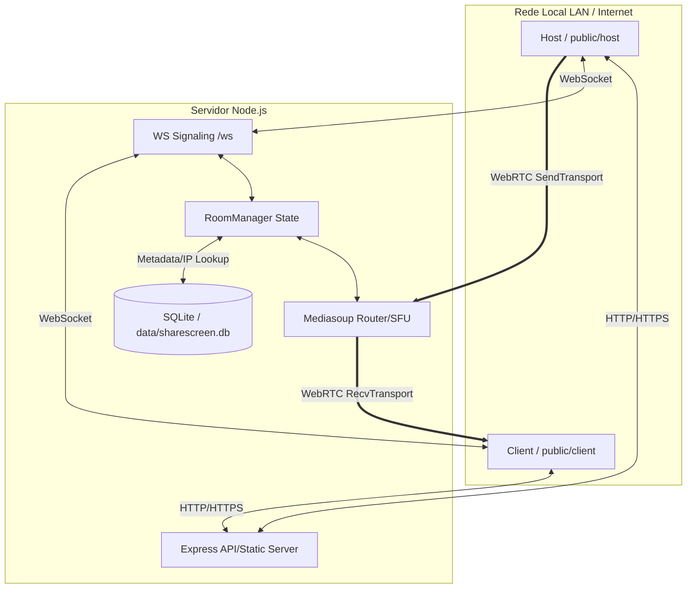
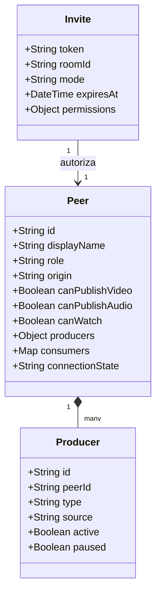

# Relatório Técnico do Sistema Screen Share

## 1. Resumo executivo
Este documento apresenta uma análise técnica profunda do sistema de compartilhamento de tela e áudio em tempo real **ShareScreen LAN**. O sistema é baseado em uma arquitetura SFU (Selective Forwarding Unit) utilizando **mediasoup** no Node.js, com sinalização via WebSockets e frontend construído em JavaScript Vanilla (ES6+) empacotado pelo **esbuild**. 

A auditoria cobriu a estrutura de pastas do projeto, a implementação dos fluxos de mídia, sinalização, gravação local, autenticação e link externo, além de aspectos críticos de infraestrutura de rede (STUN/TURN, HTTPS e portas de rede local). Foram detectados gargalos arquiteturais e falhas de projeto que afetam a estabilidade do fluxo de áudio, a integridade da gravação, a segurança do acesso externo e a experiência geral do usuário.

---

## 2. Objetivo do sistema
O sistema foi concebido para permitir que um **Host** (Apresentador principal) ou **Clients** (Computadores da LAN) compartilhem suas telas e áudios de sistema/microfone com baixíssima latência na rede local (LAN). O Host gerencia a exibição e seleciona qual client será retransmitido para os demais. 

Além do uso local, o sistema gera links externos para visualização/participação de usuários fora da rede interna (via Internet) e oferece suporte a recursos de gravação de mídia e exibição de overlays estáticos/dinâmicos em formato de legendas com Chroma Key (*Lower Thirds*).

---

## 3. Estrutura do projeto
O projeto está organizado na seguinte estrutura de diretórios e arquivos:

*   `/.cursor/` e `/.git/`: Pastas de configuração do editor e controle de versão.
*   `/certs/`: Certificados TLS/SSL locais (`server.key`, `server.crt`) essenciais para viabilizar APIs seguras no navegador (ex. `getDisplayMedia`) em conexões LAN de IP privado.
*   `/config/`: Centraliza as configurações do sistema no arquivo [default.js](file:///e:/Projetos/Trabalho/Screen%20Share/config/default.js).
*   `/data/`: Diretório de persistência contendo o banco de dados SQLite (`sharescreen.db`), arquivos do diário do banco (`sharescreen.db-shm` e `sharescreen.db-wal`) e a pasta `lower-thirds/` com vídeos WebM.
*   `/docs/`: Documentação técnica e relatórios de modificações (como [SYSTEM_MAP.md](file:///e:/Projetos/Trabalho/Screen%20Share/docs/SYSTEM_MAP.md)).
*   `/nginx/`: Arquivos de configuração de proxy reverso e TLS para Nginx e Caddy.
*   `/node_modules/`: Dependências de terceiros instaladas localmente.
*   `/public/`: Diretórios públicos contendo HTML, CSS e bundles JS compilados:
    *   `/public/admin/`: Painel de administração de usuários (`index.html`, `admin.js`).
    *   `/public/client/`: Páginas HTML/CSS destinadas ao Client (`index.html`, `style.css`, `app.bundle.js`).
    *   `/public/host/`: Páginas HTML/CSS destinadas ao Host (`index.html`, `style.css`, `app.bundle.js`).
    *   `/public/shared/`: Estilos visuais comuns (`theme.css`, `components.css`), imagens e o controle `build-id.json`.
    *   `/public/vendor/`: Bibliotecas empacotadas estaticamente (como `mediasoup-client.js`).
*   `/scripts/`: Scripts utilitários de compilação, geração de certificados, liberação de portas e bridge auxiliar.
*   `/server/`: Código-fonte JavaScript ES Modules do backend.
*   `/src/`: Código-fonte JavaScript ES Modules original do frontend.
*   `/turn/`: Configurações do servidor de relay TURN (`turnserver.conf`).
*   `/users.json`: Banco de sementes inicial para cadastro de usuários.

### Diferenciação de arquivos
*   **Código-Fonte Backend:** Localizado em [server/](file:///e:/Projetos/Trabalho/Screen%20Share/server) (ex. `index.js`, `signaling.js`, `room-manager.js`).
*   **Código-Fonte Frontend:** Localizado em [src/](file:///e:/Projetos/Trabalho/Screen%20Share/src) (ex. `src/client/app.js`, `src/host/app.js`, `src/shared/media-client.js`).
*   **Arquivos Compilados / Bundles:** Localizados em `/public/*/app.bundle.js` (gerados a partir de `/src/` pelo script `scripts/build-client.js`). *Nota: Nenhuma alteração direta deve ser feita neles.*
*   **Configurações:** [config/default.js](file:///e:/Projetos/Trabalho/Screen%20Share/config/default.js), [turn/turnserver.conf](file:///e:/Projetos/Trabalho/Screen%20Share/turn/turnserver.conf) e arquivos em `/nginx/`.
*   **Estáticos/Públicos:** Elementos em `/public/` e vídeos em `data/lower-thirds/`.

*Identificação:* Não existem arquivos-fonte ausentes. A estrutura original está completa e organizada.

---

## 4. Arquitetura atual
A arquitetura do sistema segue o modelo cliente-servidor em tempo real baseado em um SFU WebRTC (mediasoup).

*   **Papel do Backend:** Inicializa o Express, serve arquivos estáticos (HTML/CSS/Bundles), fornece APIs REST de configuração/registro e hospeda o servidor WebSocket de sinalização e o worker do mediasoup.
*   **Papel do Host:** Atua como moderador da sala. Captura a própria tela e áudio, gerencia qual fluxo de client será retransmitido, aciona e controla o estado da gravação local e envia os chunks de vídeo salvos para o servidor.
*   **Papel do Client:** Consome a transmissão selecionada e retransmitida pelo servidor mediasoup. Se autorizado, pode iniciar sua própria publicação de tela e áudio para a sala.
*   **Sinalização WebSocket:** Lida com o ciclo de vida da sala através da troca de mensagens JSON de formato `{ type, payload }` em `/ws` (gerenciado por [server/signaling.js](file:///e:/Projetos/Trabalho/Screen%20Share/server/signaling.js)).
*   **Uso do mediasoup/WebRTC:** Utilizado como roteador de mídia. Em vez de conexões P2P diretas entre múltiplos usuários, as mídias passam por um servidor centralizado (SFU). Isso economiza banda no lado transmissor.
*   **Salas, Peers, Producers, Consumers e Transports:**
    *   **Sala:** Entidade lógica única (`RoomManager`).
    *   **Peer:** Representa uma conexão ativa. Mantém referências aos transports, producers e consumers de um usuário.
    *   **Transport:** Canal WebRTC estabelecido (`sendTransport` para enviar, `recvTransport` para receber).
    *   **Producer:** Representa uma track de mídia enviada ao servidor (vídeo da tela ou áudio mixado).
    *   **Consumer:** Representa uma track de mídia recebida do servidor (uma cópia do producer de outro peer).

### Diferenças de Fluxo e Papéis
*   **Host:** Entra declarando `papel: 'host'`. Recebe controle total e visualiza a lista de todos os produtores de vídeo ativos para seleção.
*   **Client Local:** Conecta-se declarando `papel: 'client'`. Por padrão, executa um fluxo bidirecional, no qual consome a retransmissão selecionada do Host e pode publicar sua própria tela.
*   **Client Externo:** Utiliza o link gerado com token. Autorizado a entrar, mas forçado no frontend a atuar como espectador passivo devido à lógica de onboarding.
*   **Viewer/Espectador:** Um peer que entra na sala com a propriedade `viewerOnly: true` (seja ativando o checkbox `chkViewerOnly` ou fornecendo o token no link). Ele é configurado no frontend para ocultar botões de transmissão e apenas consumir mídias e áudio.

---

## 5. Fluxo de host
1.  **Acesso e Segurança:** O host acessa `/host`. O sistema verifica no `localStorage` se a aba tem a trava de exclusividade (`sharescreen-host-lock`). Se outra aba estiver ativa, exibe uma mensagem de bloqueio para evitar múltiplas instâncias concorrentes.
2.  **Autenticação:** Caso o servidor possua `roomPin` ativado, abre-se o modal [host-entry-modal](file:///e:/Projetos/Trabalho/Screen%20Share/public/host/index.html). O Host informa seu nome e o PIN da sala. O servidor valida a entrada em `validateJoinAuth` e devolve um `hostToken`.
3.  **Sinalização:** O Host envia o evento WebSocket `entrar` com payload `papel: 'host'`.
4.  **Associação de Mídia:** O Host carrega as capacidades RTP do roteador e cria um `recvTransport` para assistir mídias consumíveis. Ele não costuma transmitir tela própria, exceto quando configurado como co-host que também publica.

---

## 6. Fluxo de client local
1.  **Registro Prévio:** Ao carregar a página `/client`, o navegador executa uma requisição `GET /api/registro-cliente`. Se o IP do cliente for encontrado no banco de dados SQLite (`sharescreen.db`), o nome do computador é resolvido e o onboarding é ignorado.
2.  **Onboarding:** Se não registrado, o usuário informa seu nome e seleciona as preferências de áudio (microfone, áudio do sistema) no painel de identificação.
3.  **Sinalização:** Estabelece conexão WebSocket e envia o evento `entrar` com `papel: 'client'`.
4.  **Criação de Canais de Mídia:** O frontend do cliente chama o servidor para criar o `recvTransport` padrão (`tag: 'default'`) e o `sendTransport` (caso pretenda transmitir).
5.  **Transmissão (opcional):** Se o cliente acionar o botão de compartilhamento de tela, chama `navigator.mediaDevices.getDisplayMedia`. O vídeo é enviado pelo `sendTransport` e registrado no servidor como um `video` producer.

---

## 7. Fluxo de client externo
1.  **Entrada com Token:** O cliente externo acessa o link contendo os parâmetros de URL `token` e `nome`.
2.  **Detecção no Frontend:** O código do frontend detecta `viewerAccessToken` (do parâmetro `token`).
3.  **Forçamento de Papel (Espectador):** A lógica no arquivo [src/client/app.js](file:///e:/Projetos/Trabalho/Screen%20Share/src/client/app.js) detecta o token e força `autoExternalGuestEntry = true`, o que executa a função `configureExternalViewerUi()`. Esta função força `viewerOnly = true` e marca o checkbox de somente-leitura.
4.  **Criação de Transportes:** O cliente externo conecta ao WebSocket informando o token de espectador. Ele cria apenas o `recvTransport` e consome mídias. Ele **não consegue** transmitir sua própria tela ou áudio, agindo exclusivamente como um espectador (*viewer*).

---

## 8. Fluxo de compartilhamento de tela
1.  **Início:** Iniciado no frontend (`src/shared/media-client.js`) através do método `startScreenShare`.
2.  **APIs de Captura:** Utiliza `navigator.mediaDevices.getDisplayMedia(constraints)`.
3.  **Envio ao Servidor:** A trilha de vídeo obtida é acoplada ao `sendTransport.produce()` com a tag de vídeo. O roteador mediasoup recebe esse tráfego e registra o `video` producer no escopo do `Peer`.
4.  **Consumo de Vídeo:** Quando o Host seleciona o peer transmissor ativo através de `selectClient(peerId)`, o servidor envia o evento `transmissaoAtiva` com o ID do producer de vídeo. Cada cliente conectado escuta esse evento e executa a chamada `media.consume(producerId)`. O vídeo consumido é injetado no elemento HTML `<video id="video-remoto">`.
5.  **Couplagem de Tela e Áudio:** Existe um acoplamento inadequado. Quando o compartilhamento de tela é interrompido ou alterado no navegador, a captura de áudio associada ao microfone/sistema sofre impactos diretos de reinicialização no evento `sharescreen-ended`, o que gera instabilidade na publicação e recepção.

---

## 9. Fluxo de áudio
O tratamento de áudio da aplicação está estruturado em múltiplos canais capturados e mixados em tempo real:

*   **Áudio do Microfone do Host:** Capturado caso o Host ative o microfone local.
*   **Áudio do Microfone do Client:** Capturado via `getUserMedia` com restrições de cancelamento de eco, ganho e ruído.
*   **Áudio do Sistema:** Obtido juntamente com a captura de tela (`getDisplayMedia`) se o usuário marcar a opção de compartilhar áudio nas caixas de diálogo do navegador.
*   **Áudio Recebido / Remoto:** Entregue através de consumers individuais no cliente e monitorado no Host pelo componente `HostAudioMonitor`.
*   **Mixer / Monitor de Áudio:** No Host, o `HostAudioMonitor` (de [src/shared/host-audio-monitor.js](file:///e:/Projetos/Trabalho/Screen%20Share/src/shared/host-audio-monitor.js)) cria uma instância de `AudioContext` para centralizar as trilhas de áudio dos clientes, aplicar DSP (filtros de ganho, EQ ou compressão) e fornecer leituras de níveis (VUs) por canal.

### Detalhes de Tratamento de Áudio
*   **Independência de Producers:** No nível do mediasoup (servidor), o áudio e o vídeo são producers independentes (`audio` e `video` no objeto `Peer.producers`). No entanto, no frontend, a inicialização e renovação do producer de áudio dependem do estado e da captura de tela (método `refreshPublishedAudio` é invocado passando o `displayStream`).
*   **Diferença de Tratamento:** O áudio local que está sendo publicado pelo peer é silenciado no próprio alto-falante por padrão para evitar microfonia. O áudio remoto recebido do mediasoup é acoplado a um elemento de áudio oculto no cliente ou mixado no Host.
*   **Cenários de Falha e Causas Prováveis:**
    *   *Host ouve client, mas client não ouve host:* O Host não publica áudio adequadamente (ou não possui microfone ativo/compartilhado) ou o client teve a reprodução bloqueada pela política de autoplay do navegador.
    *   *Client ouve host, mas host não ouve client:* O client falhou em publicar o producer de áudio por falta de permissão do microfone ou o mediasoup falhou em anunciar o IP correto para tráfego UDP na LAN.
    *   *Áudio some após troca de tela:* O evento `sharescreen-ended` é disparado e interrompe todas as mídias, mas a reinicialização automática do microfone no método `refreshPublishedAudio` falha ou sofre timeout.
    *   *Bloqueio de Autoplay:* O navegador impede a reprodução automática de áudio remoto se o usuário não interagiu com a página. O sistema tenta contornar exibindo um aviso de "Ativar áudio" (`clientMicAutoplayNeeded`).
    *   *Microfone publicado, mas não consumido:* Ocorre quando a sinalização falha em atualizar a lista de fontes de áudio (`fontesAudio`) ou os clientes não disparam o consumo ao receber o evento de novo participante de áudio.
    *   *Áudio ser consumido, mas não reproduzido:* Trilha de áudio consumida não é anexada ao elemento de áudio correto ou o elemento está mutado/sem volume.

### Identificação de Arquivos e Funções Envolvidas
*   [src/shared/audio-manager.js](file:///e:/Projetos/Trabalho/Screen%20Share/src/shared/audio-manager.js): `collectAudioForPublish`, `acquireMicrophoneTrack`, classe `AudioMixer` e VU `VuMeter`.
*   [src/shared/media-client.js](file:///e:/Projetos/Trabalho/Screen%20Share/src/shared/media-client.js): `refreshPublishedAudio`, `_publishAudioTrack`, `ensureAudioPublished`.
*   [src/shared/host-audio-monitor.js](file:///e:/Projetos/Trabalho/Screen%20Share/src/shared/host-audio-monitor.js): `HostAudioMonitor`, método `_refreshDirectOutput`.
*   [server/room-manager.js](file:///e:/Projetos/Trabalho/Screen%20Share/server/room-manager.js): `broadcastAudioSources`, `getAudioSources`.

---

## 10. Fluxo de gravação
1.  **Abordagem Atual (Client-side):** A gravação de mídia ocorre no navegador do **Host**.
2.  **API de Gravação:** O Host utiliza a API `MediaRecorder` para gravar a trilha combinada de vídeo/áudio da tela que ele está visualizando (a retransmissão consumida).
3.  **Fluxo de Armazenamento:** Os dados gravados são capturados em pedaços temporários (chunks). O frontend do Host envia esses chunks sequencialmente para o servidor através de chamadas HTTP POST em `/api/gravacao/chunk` (tratadas por [server/recording-chunk-store.js](file:///e:/Projetos/Trabalho/Screen%20Share/server/recording-chunk-store.js)). Ao finalizar, envia uma requisição para `/api/gravacao/complete` para o servidor remontar e salvar o arquivo final WebM no diretório de rede.
4.  **Trilhas Incluídas:** A gravação inclui o vídeo da tela consumida pelo Host. O áudio depende do mixer local do Host (incluindo áudios recebidos dos clientes).
5.  **Riscos da Abordagem Atual:**
    *   *Perda de Gravação:* Se o navegador do Host travar, a aba for fechada ou a internet oscilar no meio do upload, a gravação é corrompida.
    *   *Dessincronização:* Perda de frames de vídeo devido a lag na recepção WebRTC no Host, causando dessincronização progressiva entre áudio e vídeo no arquivo WebM final.
    *   *Uso de CPU:* Processamento pesado no navegador do Host ao gerenciar a mixagem e compressão em tempo real do arquivo gravado.

### Comparação com Gravação Server-Side
Uma abordagem robusta com mediasoup + FFmpeg/GStreamer no lado do servidor eliminaria a fragilidade do navegador:
*   **Mecanismo:** O mediasoup criaria um `PlainTransport` no roteador RTP que encaminharia os fluxos brutos de áudio e vídeo selecionados diretamente para uma instância do FFmpeg rodando em background no servidor.
*   **Vantagens:** Gravação garantida mesmo se o Host cair; sincronização perfeita dos pacotes RTP nativos no servidor; menor sobrecarga de CPU no Host.
*   **Desvantagens:** Maior consumo de processamento e recursos no servidor.

---

## 11. Sinalização WebSocket
As comunicações de controle e WebRTC trafegam via WebSocket na rota `/ws` usando as seguintes mensagens:

### Mensagens Recebidas pelo Servidor (Tratadas em `handleMessage`):
*   `entrar`: Payload `{ papel, nome, maquina, pin, hostToken, viewerToken }`. Autentica e ingressa o peer na sala.
*   `atualizarNome`: Payload `{ nome }`. Altera o nome de exibição do peer.
*   `criarTransporte`: Payload `{ direction, tag }`. Solicita criação de transportes WebRTC (send/recv).
*   `conectarTransporte`: Payload `{ transportId, dtlsParameters, direction }`. Conecta o transporte WebRTC no mediasoup.
*   `produzir`: Payload `{ transportId, kind, rtpParameters, appData }`. Publica mídia do cliente no servidor.
*   `pararProducao`: Interrompe a publicação de mídia do peer.
*   `consumir`: Payload `{ producerId, rtpCapabilities, consumerTag }`. Consome uma mídia disponível.
*   `retomarConsumer`, `fecharConsumer`: Pausa ou retoma o tráfego do consumer de mídia.
*   `status`: Payload `{ status, erro }`. Notifica o estado de conexão do cliente ao painel do Host.
*   `selecionarClient`: Payload `{ peerId }`. O Host seleciona qual cliente exibir.
*   `definirControleExibicao`: Payload `{ peerId, ativo }`. Concede controle de troca de tela a um cliente.
*   `definirCoHost`: Payload `{ peerId, ativo }`. Promove ou remove permissões de co-host de um peer.
*   `selecionarFonte`: Usado por co-hosts/clientes delegados para alternar a exibição da tela.
*   `pausarTransmissao`, `retomarTransmissao`, `limparTransmissao`: Controles do Host sobre a exibição selecionada.
*   `abrirClientRemoto`, `abrirTodosRemotos`: Comandos do Host para invocar automações locais via bridge/agente.
*   `listarAgentes`: Lista robôs Python ativos na LAN.
*   `clientTrace`: Logs de depuração enviados do frontend para o arquivo de log do servidor.

---

## 12. WebRTC/mediasoup
O ciclo completo de negociação WebRTC ocorre da seguinte forma:
1.  **Carregar dispositivo:** O cliente conecta via WebSocket, recebe as capacidades do roteador do servidor e executa `device.load({ routerRtpCapabilities })`.
2.  **Obter router RTP capabilities:** Recebe os codecs suportados pelo mediasoup (padrão `video/H264` e `audio/opus`).
3.  **Criar sendTransport:** O cliente envia `criarTransporte` (direção `send`), o servidor cria o transporte no mediasoup e devolve as chaves DTLS e candidatos ICE. O cliente instancia `device.createSendTransport`.
4.  **Criar recvTransport:** Semelhante ao passo anterior, com direção `recv`.
5.  **Produzir mídia:** O cliente captura tela/áudio, e chama `sendTransport.produce()`. O transporte dispara o evento local `produce`, enviando a sinalização `produzir` ao servidor, que cria o `Producer` do mediasoup correspondente.
6.  **Consumir mídia:** O cliente recebe um evento de sinalização informando o `producerId` a ser consumido. Ele dispara `media.consume(producerId)`, o servidor cria o `Consumer` no mediasoup e devolve as chaves de decodificação.
7.  **Pausar/retomar/remover producers:** Modificações ocorrem através de chamadas de controle DTLS diretas no transporte ou sinalizações de controle.
8.  **Desconectar peer:** Limpa todos os transports, producers e consumers associados no método `cleanupPeerMedia` de `RoomManager`.

---

## 13. Rotas e APIs
O Express configura as seguintes rotas HTTP em [server/index.js](file:///e:/Projetos/Trabalho/Screen%20Share/server/index.js):

### APIs REST públicas:
*   `GET /api/health`: Status básico de integridade.
*   `GET /api/registro-cliente`: Retorna IP e nome associado do cliente.
*   `POST /api/registro-cliente`: Associa nome, IP e computador do cliente no banco.
*   `GET /api/lower-third/:clientName`: Configurações de overlay do cliente.
*   `POST /api/lower-third`: Upload do WebM de lower third (requer token de host no header).
*   `GET /lt-videos/:filename`: Download dos vídeos de overlays.
*   `GET /api/info`: Status geral do servidor e configurações ativas.
*   `GET /api/agentes`: Retorna a lista de robôs Python auxiliares ativos.
*   `POST /api/gravacao`: Envio direto do WebM de gravação completo (Host).
*   `POST /api/gravacao/chunk`: Envio de chunk de gravação (Upload segmentado).
*   `POST /api/gravacao/complete`: Solicita remontagem de chunks enviados.
*   `GET /api/diagnostico`: Status técnico e codec de rede.

### APIs de administração (Somente em modo DEV: `SHARESCREEN_DEV=1`):
*   `GET /api/admin/users`: Retorna lista completa de clientes cadastrados no banco.
*   `POST /api/admin/users`: Permite salvar/alterar manualmente registros de clientes.
*   `POST /api/admin/users/resolve-ips`: Dispara resolução DNS para atualizar IPs dos computadores.
*   `POST /api/admin/seed`: Popula banco a partir de `users.json`.

### Rotas de arquivos estáticos:
*   `app.use('/host', ...)` -> `/public/host/`
*   `app.use('/client', ...)` -> `/public/client/`
*   `app.use('/vendor', ...)` -> `/public/vendor/`
*   `app.use('/shared', ...)` -> `/public/shared/`
*   `app.get('/', ...)` -> Redireciona para `/host`

### Rotas quebradas/inconsistentes:
*   **Ausência de rota `/meet`:** O endpoint `/api/link-externo` gera um link que usa o caminho `/meet/` caso `PUBLIC_URL` esteja configurado. Entretanto, a rota `/meet` **não existe** no Express. O Express apenas mapeia `/client` e `/host`. Se o link externo for aberto sem um proxy reverso fazendo a tradução de `/meet/` para `/client/`, a requisição retornará `HTTP 404 Not Found`.

---

## 14. Tokens e links externos
1.  **Geração:** O Host dispara uma chamada `POST /api/link-externo` passando `{ nome }` para o convidado.
2.  **Token:** O servidor executa `createViewerLinkToken()`, gerando um token aleatório em base64 e salvando-o em um `Map` na memória do servidor com expiração padrão de 24 horas (`VIEWER_LINK_TTL_MS`).
3.  **Persistência:** O token fica armazenado **apenas em memória**. Se o servidor reiniciar, todos os convites ativos expiram imediatamente.
4.  **Destino do link:** Como apontado na seção anterior, o link gerado usa o caminho `/meet/` caso `PUBLIC_URL` esteja ativo, o qual não é servido nativamente pelo Express.
5.  **viewer vs client:** O token concede papel de espectador (`viewerOnly: true`), impossibilitando o cliente externo de interagir enviando sua própria tela.
6.  **Motivo provável do não funcionamento:** O link externo aponta para a rota inexistente `/meet/`. Caso caia em `/client/`, a validação do frontend ativa a interface de somente visualização e impede a captura de mídias do usuário convidado, impedindo-o de atuar como um client completo pela internet.

---

## 15. Rede, HTTPS, STUN e TURN
*   **STUN/TURN:** Configurados em [config/default.js](file:///e:/Projetos/Trabalho/Screen%20Share/config/default.js). O sistema consome servidores STUN padrão (`stun:stun.l.google.com:19302`) e busca configurações de TURN em variáveis de ambiente (`TURN_SERVERS`, `TURN_USERNAME`, `TURN_PASSWORD`).
*   **Portas Necessárias:**
    *   `3443` (HTTPS - Express/WS)
    *   `3080` (HTTP - Redirecionamento)
    *   `3478` (TURN/STUN padrão UDP/TCP)
    *   `5349` (TURNS seguro TCP)
    *   `40000-40100` (mediasoup WebRTC UDP/TCP)
    *   `49160-49252` (Faixa de relay de portas do TURN coturn)
*   **Rede Local vs Internet:** Na rede local, o WebRTC pode conectar via IP privado direto (candidatos ICE host). Na internet, devido a NATs restritivos e firewalls corporativos, a conexão falha se não houver um servidor TURN configurado e ativo.
*   **Uso simultâneo de IP local e público:** O mediasoup-manager tenta escutar em `0.0.0.0` e anunciar o IP da LAN e o IP público (`publicAnnouncedIp`). Se o IP público não for resolvido ou configurado incorretamente nas variáveis de ambiente do ICE, conexões externas não completarão a fase de handshake ICE.
*   **Importância de HTTPS:** Sem HTTPS (`Secure Context`), navegadores modernos desativam APIs de mídia cruciais como `getDisplayMedia` e `getUserMedia` para qualquer endereço que não seja `localhost` ou `127.0.0.1`.
*   **Validações na infraestrutura:** Verificar se o Nginx/Proxy Reverso está repassando os cabeçalhos de WebSocket (`Upgrade`, `Connection`), se o roteador/firewall está direcionando a faixa de portas UDP 40000-40100 para o IP do servidor e se o coturn está ativo e acessível externamente nas portas do firewall.

---

## 16. Segurança
*   **Autenticação e Autorização:** O Host requer o `hostToken` ou o preenchimento do PIN da sala. Os endpoints REST de gravação e lower-third exigem o cabeçalho `x-host-token`.
*   **Expiração de links:** Links externos expiram após 24h na memória do backend.
*   **Controle de Acesso à Sala:** Sem autenticação integrada de usuários, qualquer um com o PIN da sala ou o link externo pode se conectar e consumir a mídia disponível.
*   **Controle de Papéis:** Há diferenciação básica na sinalização, mas o client externo é forçado para `viewer` no frontend, uma proteção fraca que pode ser contornada por inspeção de código ou scripts no console do navegador.
*   **Exposição de Credenciais:** Há credenciais em texto claro no arquivo de configuração do TURN (`turnserver.conf`: `user=sharescreen:ShareScreenTurn2026!`).
*   **CORS e Headers de Segurança:** O Express define alguns headers de segurança (`X-Content-Type-Options`, `X-Frame-Options`, `Referrer-Policy`), mas há falta de uma Content Security Policy (CSP) robusta e permissões explícitas de recursos de mídia para conexões externas.

---

## 17. Performance e escalabilidade
*   **1 Host e 1 Client:** Consumo desprezível de CPU e banda. Latência menor que 100ms.
*   **1 Host e vários Clients:** Como o mediasoup atua como SFU, o tráfego do cliente que compartilha a tela é enviado uma única vez para o servidor. O servidor replica esse tráfego para os consumidores. O Host de gravação consome banda para receber a retransmissão e processar a gravação local.
*   **Vários Clients compartilhando tela:** O servidor suporta múltiplos produtores simultâneos, mas a banda de upload nos clientes e a CPU do servidor para gerenciar as portas do mediasoup escalam linearmente.
*   **Gravação ativa:** Como a gravação é feita no lado do cliente (Host), consome processamento significativo do navegador do Host para codificar o fluxo em WebM.
*   **mediasoup como escolha:** O mediasoup é uma excelente escolha devido a sua implementação em C++ de alta performance e baixo overhead, ideal para baixa latência.

### Comparativo de Alternativas
*   *WebRTC P2P Puro:* Inviável para múltiplos clientes, pois exigiria que o cliente transmissor enviasse sua tela de forma independente para cada espectador, esgotando sua banda de upload.
*   *mediasoup SFU:* Melhor opção para o controle fino de conexões de LAN e baixa latência, exigindo pouca banda do publicador.
*   *Janus / LiveKit:* Excelentes alternativas. O LiveKit abstrai toda a complexidade de sinalização, gerenciamento de tokens e reconexões automáticas, mas exige uma infraestrutura mais pesada ou serviços na nuvem.
*   *SaaS Externo:* Elimina problemas de infraestrutura de rede e TURN, mas introduz custos recorrentes e dependência de internet para transmissões internas da LAN.

*Veredito:* Manter o **mediasoup** com ajustes finos de arquitetura é a melhor opção custo-benefício para este projeto devido ao foco principal em baixa latência dentro de redes LAN corporativas.

---

## 18. Problemas identificados

### 1. Rota `/meet/` inexistente no Express
*   **Gravidade:** Crítica
*   **Arquivos relacionados:** [server/index.js](file:///e:/Projetos/Trabalho/Screen%20Share/server/index.js) (Linha 335), [src/client/app.js](file:///e:/Projetos/Trabalho/Screen%20Share/src/client/app.js)
*   **Evidência no código:** O link externo aponta para `/meet/?token=...`. Contudo, em `index.js` não há definição de rota `app.get('/meet', ...)` ou static middleware para `/meet`.
*   **Impacto prático:** Links de convite gerados que usem `PUBLIC_URL` falham com erro 404, impossibilitando conexões externas.
*   **Causa provável:** O deploy legado contava com regras de roteamento externas no Nginx que remapeavam `/meet/` para `/client/`, mas essa dependência de infraestrutura não foi documentada nem implementada no backend do Express.
*   **Risco de corrigir:** Baixíssimo (basta registrar a rota `/meet` no Express ou padronizar os links com `/client/`).
*   **Prioridade:** Crítica (Fase 2)

### 2. Cliente externo forçado a espectador
*   **Gravidade:** Alta
*   **Arquivos relacionados:** [src/client/app.js](file:///e:/Projetos/Trabalho/Screen%20Share/src/client/app.js) (Linhas 746-750)
*   **Evidência no código:** `if (autoExternalGuestEntry) { configureExternalViewerUi(); viewerOnly = true; ... }`
*   **Impacto prático:** Clientes externos convidados pelo link não conseguem compartilhar tela ou áudio, pois a interface e o status na conexão os limitam a meros espectadores.
*   **Causa provável:** Decisão de design antiga para priorizar o modo de visualização em links externos, sem opção de permissões dinâmicas para transmissão de convidados.
*   **Risco de corrigir:** Médio (requer alterar o onboarding e o payload de entrada WebSocket).
*   **Prioridade:** Alta (Fase 3)

### 3. Acoplamento de Áudio e Vídeo no Compartilhamento de Tela
*   **Gravidade:** Alta
*   **Arquivos relacionados:** [src/shared/media-client.js](file:///e:/Projetos/Trabalho/Screen%20Share/src/shared/media-client.js) (Linhas 478-480), [src/client/app.js](file:///e:/Projetos/Trabalho/Screen%20Share/src/client/app.js) (Linhas 1509-1528)
*   **Evidência no código:** O método `refreshPublishedAudio` depende do stream de tela. Quando a captura de tela é encerrada (evento `sharescreen-ended`), a trilha de áudio é resetada e renegociada de forma abrupta.
*   **Impacto prático:** Falhas intermitentes de áudio sumindo após a troca de tela ou interrupção do compartilhamento; dificuldade em manter o microfone ativo de forma independente.
*   **Causa provável:** O microfone e o áudio de sistema foram modelados para rodar de forma síncrona com o ciclo de vida do stream de captura de tela.
*   **Risco de corrigir:** Alto (exige refatoração das funções de captura em `media-client.js`).
*   **Prioridade:** Alta (Fase 4)

### 4. Armazenamento de Tokens de Acesso Apenas em Memória
*   **Gravidade:** Média
*   **Arquivos relacionados:** [server/auth-dev.js](file:///e:/Projetos/Trabalho/Screen%20Share/server/auth-dev.js) (Linha 7)
*   **Evidência no código:** `const viewerLinkTokens = new Map();`
*   **Impacto prático:** Qualquer reinicialização ou queda do servidor de sinalização invalida todos os links de convite ativos gerados anteriormente, forçando a criação de novos links pelo Host.
*   **Causa provável:** Implementação simplificada de autenticação rápida em memória para desenvolvimento.
*   **Risco de corrigir:** Baixo (pode ser persistido na tabela do SQLite existente).
*   **Prioridade:** Média (Fase 7)

### 5. Fragilidade da Gravação Client-Side (Navegador)
*   **Gravidade:** Média
*   **Arquivos relacionados:** [src/shared/recording-client.js](file:///e:/Projetos/Trabalho/Screen%20Share/src/shared/recording-client.js), [src/host/app.js](file:///e:/Projetos/Trabalho/Screen%20Share/src/host/app.js)
*   **Evidência no código:** O `MediaRecorder` grava mídias em nível de DOM no navegador do Host e faz POST de chunks em background para o servidor.
*   **Impacto prático:** Travamentos de aba, oscilações na rede ou gargalos na gravação causam perda total ou arquivos corrompidos de gravações de reuniões longas.
*   **Causa provável:** Decisão de design para evitar processamento pesado de transcoding de mídia no servidor.
*   **Risco de corrigir:** Muito alto se mudado para o servidor.
*   **Prioridade:** Baixa/Média (Fase 8)

---

## 19. Informações necessárias para o plano de implementação
Antes de avançar com o plano de implementação e correções, as seguintes questões comerciais e técnicas precisam ser esclarecidas:

1.  **Perfil de uso dos clients externos:** Os convidados que acessam de fora da rede interna precisam compartilhar tela e áudio, ou o tráfego de transmissão deles será apenas de visualização passiva (espectador)?
2.  **Topologia de rede local vs internet:** O Host sempre operará em ambiente LAN (dentro da rede corporativa)? Há servidores TURN adicionais ou redundantes disponíveis além do coturn local?
3.  **Persistência de tokens:** Qual o tempo máximo desejado para validade de um link de convite externo (TTL)? É aceitável armazenar no SQLite local com expiração automática?
4.  **Escopo da gravação:** O foco deve se manter na otimização da gravação client-side (otimizando buffer de chunks, reconexão e alertas visuais de falha) ou o projeto exige uma migração para gravação nativa no servidor com FFmpeg?
5.  **Ambiente de produção:** Existe um domínio oficial configurado com certificados SSL válidos emitidos por autoridade certificadora (CA) para acesso externo, ou continuará rodando com certificados autoassinados e bypass no navegador?
6.  **Interação entre plataformas:** O sistema precisa rodar estritamente no ecossistema Windows Server para produção, ou deve manter compatibilidade para deployments em Linux (devido aos binários nativos do mediasoup)?

---

## 20. Arquitetura ideal recomendada
Para solucionar os problemas de instabilidade de áudio, segurança e permissões de convidados, propõe-se a seguinte especificação de arquitetura:

*   **Separação Completa de Fluxos (Microfone e Tela):** O microfone deve ser publicado como um Producer independente com seu próprio ciclo de vida. O compartilhamento de tela não deve interromper, acoplar ou silenciar a publicação do microfone.
*   **Controle de Permissões via Banco/Sinalização:** Implementar modelo de dados dinâmico para Peers e Convites no banco SQLite, controlando dinamicamente quem pode falar e quem pode transmitir.

*   **Peer (Estado de Conexão):** Define a identidade do participante, sua origem (local/external) e suas permissões explícitas na sala.
*   **Producer (Mídias Ativas):** Mapeia individualmente cada trilha publicada, identificando se a origem do áudio é `microphone` (independente) ou `system` (vinculada à tela).
*   **Invite (Tokens de Convite):** Tabela persistida no banco SQLite com controle de validade e permissões herdadas para o cliente convidado (ex. se ele pode ou não transmitir mídias pela internet).

---

## 21. Base para o plano de implementação

### Fase 1 — Backup, organização e recuperação dos fontes
*   **Objetivo:** Garantir um ponto de restauração seguro de todo o código atual antes de qualquer alteração de arquivos.
*   **Arquivos prováveis a alterar:** Nenhum (apenas cópias de segurança).
*   **Riscos:** Perda de estados de desenvolvimento locais.
*   **Testes obrigatórios:** Execução de scripts de build originais para validar integridade de compilação pós-cópia.
*   **Critério de conclusão:** Arquivo compactado ou pasta de backup criada e isolada.

### Fase 2 — Correção das rotas públicas e link externo
*   **Objetivo:** Registrar a rota `/meet/` no Express apontando para a tela de visualização do cliente e corrigir o mapeamento de URLs.
*   **Arquivos prováveis a alterar:** [server/index.js](file:///e:/Projetos/Trabalho/Screen%20Share/server/index.js)
*   **Riscos:** Quebrar o fluxo de redirecionamento de conexões legadas no Nginx.
*   **Testes obrigatórios:** Acesso direto ao link `/meet/?token=...` sem passar pelas regras adicionais do Nginx e validar se a página carrega corretamente.
*   **Critério de conclusão:** Rota `/meet/` respondendo com a página de cliente de forma limpa.

### Fase 3 — Reestruturação dos papéis: host/client/viewer
*   **Objetivo:** Permitir que o link externo diferencie se o convidado entra como espectador ou cliente ativo baseado nas permissões do token.
*   **Arquivos prováveis a alterar:** [src/client/app.js](file:///e:/Projetos/Trabalho/Screen%20Share/src/client/app.js), [server/signaling.js](file:///e:/Projetos/Trabalho/Screen%20Share/server/signaling.js)
*   **Riscos:** Ingressar participantes externos sem as devidas restrições de segurança ou PIN.
*   **Testes obrigatórios:** Conectar dois navegadores usando tokens distintos (um com flag client e outro viewer) e verificar a presença/ausência de botões de compartilhamento.
*   **Critério de conclusão:** Interface e sinalização separadas para cada papel dinamicamente.

### Fase 4 — Refatoração do áudio como producers independentes
*   **Objetivo:** Desacoplar a trilha do microfone do ciclo de vida do vídeo de captura de tela.
*   **Arquivos prováveis a alterar:** [src/shared/media-client.js](file:///e:/Projetos/Trabalho/Screen%20Share/src/shared/media-client.js), [src/client/app.js](file:///e:/Projetos/Trabalho/Screen%20Share/src/client/app.js)
*   **Riscos:** Introduzir problemas de sincronia inicial em navegadores móveis ou falha no handshake DTLS de áudio.
*   **Testes obrigatórios:** Iniciar compartilhamento de tela com microfone ativo, interromper a tela e validar se o áudio do microfone permanece ativo e ouvível na recepção.
*   **Critério de conclusão:** Trilha de microfone e de áudio de sistema trafegando de forma assíncrona.

### Fase 5 — Correção do consumo de mídia e sincronização de estado
*   **Objetivo:** Sincronizar o estado da sala no WebSocket após quedas rápidas (reconexões automáticas).
*   **Arquivos prováveis a alterar:** [server/room-manager.js](file:///e:/Projetos/Trabalho/Screen%20Share/server/room-manager.js), [src/shared/signaling-client.js](file:///e:/Projetos/Trabalho/Screen%20Share/src/shared/signaling-client.js)
*   **Riscos:** Loops de reconexão infinita no cliente em redes instáveis.
*   **Testes obrigatórios:** Forçar refresh (F5) no cliente transmissor e validar se o receptor recupera o fluxo de vídeo sem travar a tela.
*   **Critério de conclusão:** Remoção de producers órfãos imediata e reconexão automática estável.

### Fase 6 — Configuração robusta de STUN/TURN/HTTPS
*   **Objetivo:** Validar e garantir a injeção correta de credenciais do coturn nos candidatos ICE de mídia.
*   **Arquivos prováveis a alterar:** [config/default.js](file:///e:/Projetos/Trabalho/Screen%20Share/config/default.js), [server/mediasoup-manager.js](file:///e:/Projetos/Trabalho/Screen%20Share/server/mediasoup-manager.js)
*   **Riscos:** Perda de conectividade na rede local por bloqueio de DNS ou candidatos ICE inválidos.
*   **Testes obrigatórios:** Validar o tráfego WebRTC passando por redes celulares (4G/5G) simulando acesso fora da rede LAN corporativa.
*   **Critério de conclusão:** Handshake de mídia WebRTC completando via TURN com sucesso.

### Fase 7 — Persistência de tokens e segurança
*   **Objetivo:** Migrar o armazenamento de tokens dinâmicos para a base SQLite e implementar regras de expiração periódica persistida.
*   **Arquivos prováveis a alterar:** [server/auth-dev.js](file:///e:/Projetos/Trabalho/Screen%20Share/server/auth-dev.js), [server/client-db.js](file:///e:/Projetos/Trabalho/Screen%20Share/server/client-db.js)
*   **Riscos:** Overhead de leitura/escrita no banco de dados SQLite.
*   **Testes obrigatórios:** Reiniciar o servidor Node.js e tentar conectar um cliente externo usando um link pré-gerado válido.
*   **Critério de conclusão:** Tokens sobrevivendo a reinicializações e expirando conforme o TTL definido no SQLite.

### Fase 8 — Revisão da gravação
*   **Objetivo:** Otimizar a estabilidade do buffer de gravação do navegador e tratar falhas de rede durante o upload de chunks.
*   **Arquivos prováveis a alterar:** [src/shared/recording-client.js](file:///e:/Projetos/Trabalho/Screen%20Share/src/shared/recording-client.js), [server/recording-chunk-store.js](file:///e:/Projetos/Trabalho/Screen%20Share/server/recording-chunk-store.js)
*   **Riscos:** Maior consumo de memória RAM na aba do navegador.
*   **Testes obrigatórios:** Iniciar gravação, desconectar o cabo de rede por 5 segundos, reconectar e validar se o arquivo final WebM foi gravado e enviado sem corromper.
*   **Critério de conclusão:** Gravações enviadas de forma íntegra e sem perda de chunks.

### Fase 9 — Testes locais, LAN e internet
*   **Objetivo:** Execução da matriz completa de testes integrados.
*   **Arquivos prováveis a alterar:** Todo o projeto.
*   **Riscos:** Descoberta de bugs residuais de sincronização.
*   **Testes obrigatórios:** Execução de testes manuais em múltiplos dispositivos (Windows, Linux, Mobile).
*   **Critério de conclusão:** 100% dos testes da matriz com status "Aprovado".

### Fase 10 — Otimização, logs e monitoramento
*   **Objetivo:** Minimização de pacotes de log de trace desnecessários e otimização dos bitrates de transmissão de tela para evitar atrasos na reprodução.
*   **Arquivos prováveis a alterar:** [config/default.js](file:///e:/Projetos/Trabalho/Screen%20Share/config/default.js), [server/logger.js](file:///e:/Projetos/Trabalho/Screen%20Share/server/logger.js)
*   **Riscos:** Falha em coletar logs cruciais de erro.
*   **Testes obrigatórios:** Verificar volumetria dos arquivos de log sob uso intenso.
*   **Critério de conclusão:** Logs rotacionados e bitrates adaptados às limitações de rede.

---

## 22. Matriz de testes obrigatórios

Esta matriz define os cenários mínimos necessários para homologação do sistema:

| ID | Cenário de Teste | Objetivo | Passos | Resultado Esperado |
| --- | --- | --- | --- | --- |
| **01** | Compartilhamento Local | Validar vídeo na LAN | Host inicia visualização, Client local compartilha tela. | Tela do cliente exibida com baixa latência no Host e demais. |
| **02** | Microfone Host | Validar áudio do apresentador | Host fala ao microfone. | Clients locais reproduzem áudio do Host sem ecos. |
| **03** | Microfone Client | Validar áudio do convidado | Client ativa microfone e fala. | Host e outros clients ouvem a voz do client com clareza. |
| **04** | Conversação Simultânea | Validar bidirecionalidade | Host e Client falam ao mesmo tempo. | Ambos os áudios são ouvidos em tempo real sem interrupções. |
| **05** | Independência de Trilha | Validar desacoplamento | Client para o compartilhamento de tela mas mantém mic ativo. | Trilha de vídeo desaparece, mas a chamada de voz permanece ativa. |
| **06** | Link Externo Rota | Validar rota do convite | Clicar no link externo gerado pelo Host. | Página de onboarding do espectador carrega corretamente (HTTP 200). |
| **07** | Convidado Internet | Validar acesso externo | Acessar o link via rede móvel 4G/5G com TURN ativo. | Conexão WebRTC se estabelece; usuário assiste à transmissão. |
| **08** | Convidado Transmite | Validar permissões de convidado | Cliente externo promovido tenta compartilhar tela/mic. | Fluxo de mídia externa enviado ao servidor e retransmitido. |
| **09** | Integridade da Gravação | Validar gravação | Iniciar gravação, alternar telas dos clients, parar e salvar. | Arquivo WebM final possui áudio e vídeo sincronizados. |
| **10** | Tolerância a Falhas | Validar reconexão | Desconectar a sinalização (WebSocket) de um cliente ativamente transmitindo. | O servidor remove o peer antigo; o cliente reconecta em < 3s. |
| **11** | Autoplay Block | Validar bypass de autoplay | Acessar cliente em aba sem foco, receber áudio remoto. | Exibição correta do botão de consentimento para desbloquear áudio. |
| **12** | Persistência de Tokens | Validar banco de dados | Gerar token de convite, reiniciar servidor, conectar convidado. | O convidado entra na sala usando o mesmo link gerado antes da queda. |
| **13** | Segurança de Acesso | Validar token expirado | Tentar conectar na sala com token gerado há mais de 24 horas. | Conexão rejeitada com erro de credencial inválida/expirada. |
| **14** | Restrição de Porta | Validar TURN Server | Bloquear tráfego UDP direto na porta 40000 no firewall. | Conexão estabelecida com sucesso usando relay TCP/UDP do coturn. |

---

## 23. Conclusão
A análise profunda do projeto **ShareScreen LAN** demonstrou que o sistema adota tecnologias robustas e modernas (mediasoup/SFU) para viabilizar compartilhamento em tempo real com excelente desempenho e baixíssima latência. Contudo, as falhas de áudio relatadas e a inoperabilidade do link externo decorrem diretamente de problemas de implementação de software — nomeadamente, a ausência da rota `/meet/` no Express, o acoplamento excessivo das trilhas de microfone à captura de tela no frontend, e o forçamento incondicional dos clientes externos ao papel de espectador de visualização exclusiva.

A execução sequencial do plano de implementação delineado neste relatório técnico fornecerá ao sistema a robustez e estabilidade necessárias para operar de forma eficiente e segura tanto em ambientes de rede local quanto na internet.
